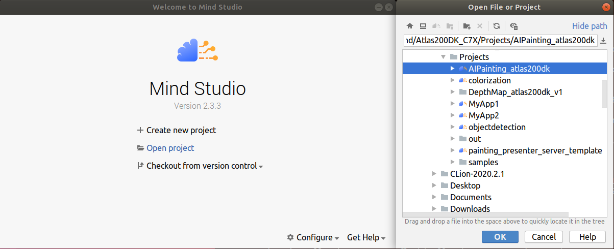
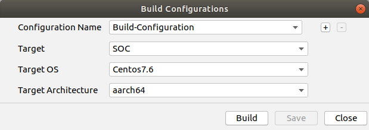
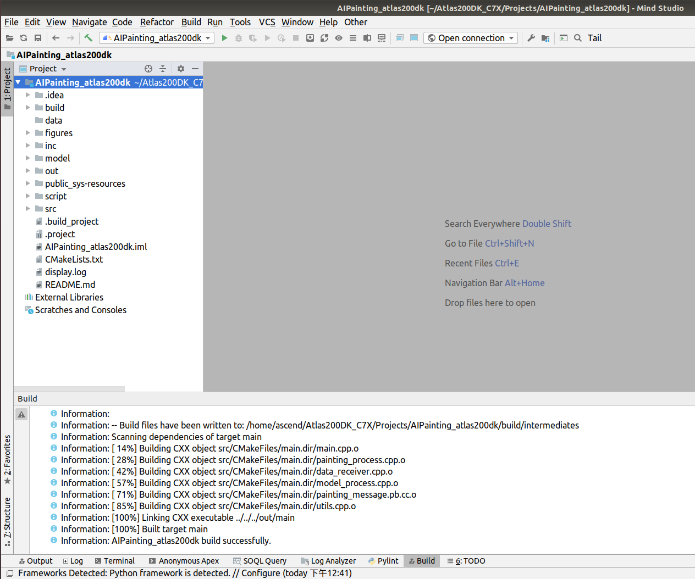
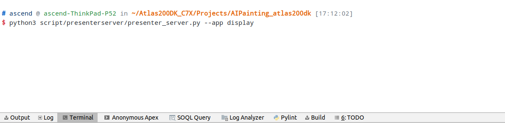
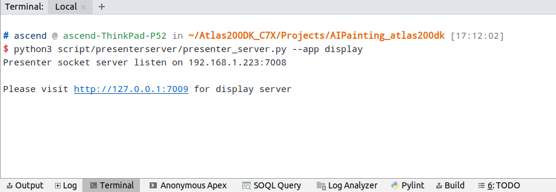

# 田园诗秒变风景画（C++）  

本项目支持运行在Atlas 200 DK上，实现了从前端获取用户画面布局，模型推理生成并输出AI风景图。 

## 软件准备

运行此Sample前，需要按照此章节获取源码包。

1.  获取源码包。

    **cd $HOME/AscendProjects**  

    **wget https://c7xcode.obs.cn-north-4.myhuaweicloud.com/code_Ascend/AIpainting.zip** 
              
    **unzip AIpainting.zip**  

    > **说明：**   
    >- 如果使用wget下载失败，可使用如下命令下载代码。  
    **curl -OL https://c7xcode.obs.cn-north-4.myhuaweicloud.com/code_Ascend/AIpainting.zip** 
    >- 如果curl也下载失败，可复制下载链接到浏览器，手动下载至Host端。
    
2.  本项目已转换好的模型文件（.om文件）已打包在model目录下，跳过模型转换步骤。

## 环境配置   

**注：服务器上已安装交叉编译工具可跳过此步骤。**   
      
- 安装编译工具  
  **sudo apt-get install -y g++\-aarch64-linux-gnu g++\-5-aarch64-linux-gnu** 

- 安装PresenterAgent    
  请参考 https://gitee.com/ascend/samples/tree/master/common/install_presenteragent/for_atlas200dk
  

## 编译

1.  打开对应的工程。

    以Mind Studio安装用户在命令行进入安装包解压后的“MindStudio-ubuntu/bin”目录，如：$HOME/MindStudio-ubuntu/bin。执行如下命令启动Mind Studio。

    **./MindStudio.sh**

    启动成功后，打开**AIPainting**工程，如[图1 打开AIPainting工程](#zh-cn_topic_0228461902_zh-cn_topic_0203223265_fig11106241192810)所示。

    **图 1**  打开AIPainting工程  
    

2.  开始编译，打开Mind Studio工具，在工具栏中点击**Build \> Edit Build Configuration**。  
    选择Target OS 为Centos7.6，Target Architecture 为aarch64如[图2 配置编译](#zh-cn_topic_0203223265_fig17414647130)所示。

    **图 2**  配置编译  
      
    
    之后点击**Build \> Build \> Build Configuration**，如[图3 编译操作及生成文件](#zh-cn_topic_0203223265_fig1741464713019)所示，会在目录下生成build和out文件夹。

    **图 3**  编译操作及生成文件  
    

    > **须知：**   
    >首次编译工程时，**Build \> Build**为灰色不可点击状态。需要点击**Build \> Edit Build Configuration**，配置编译参数后再进行编译。 

3.  启动Presenter Server。

    打开Mind Studio工具的Terminal，在应用代码存放路径下，执行如下命令在后台启动AIPainting应用的Presenter Server主程序。如[图4 启动PresenterServer](#zh-cn_topic_0228461904_zh-cn_topic_0203223294_fig423515251067)所示。

    **

    **图 4**  启动PresenterServer  
    
    
    如[图5 启动PresenterServer](#zh-cn_topic_0228461904_zh-cn_topic_0203223294_fig423)所示，表示presenter_server的服务启动成功。  
    **图 5**  启动PresenterServer    
    
  

## 运行

1.  单击  **Run \> Run 'AIPainting'**，如[图6 程序已执行示意图](#zh-cn_topic_0203223265_fig93931954162719)所示，可执行程序已经在开发者板执行。  

    **图 6**  程序已执行示意图  
    

2.  使用启动Presenter Server服务时提示的URL登录 Presenter Server 网站。

    等待Presenter Agent传输数据给服务端，单击“Refresh“刷新，当有数据时相应的Channel 的Status变成绿色，如[图7 Presenter-Server界面](#zh-cn_topic_0203223265_fig93931954155519)所示。

    **图 7**  Presenter Server界面  
     

3.  单击右侧对应的View Name链接，比如上图的“AIPainting”，查看结果。
 
## 结束应用

命令行执行以下命令登陆开发板（密码：Mind@123）。

**ssh HwHiAiUser@192.168.1.2**

执行以下指令查找仍在运行的进程。

**ps -ef | grep ./workspace_mind_studio_AIPainting**

打印如下：

*HwHiAiU+  2417  2415  7 08:05 ?        00:00:05 ./workspace_mind_studio_AIPainting*

杀死进程：

kill -9 2417

## 命令行运行

1. Mindstudi运行问题
    
   Mindstudio中运行样例可能会有失败或样例运行卡顿现象。
    
   这是Mindstudio版本导致的问题。当前解决办法为Mindstudio运行出问题后登录开发板，在命令行运行样例。

   **注：必须要在Mindstudio中先运行一次，否则二进制文件等数据不会传到开发板上**    

2. 在开发环境命令行中以普通用户执行以下命令登录开发者板（默认USB连接）。

    **ssh HwHiAiUser@192.168.1.2**

     

3. 进入案例对应可执行文件路径。
    
    **cd HIAI_PROJECTS/workspace_mind_studio/AIPainting_xxx/out**

    其中xxx需要根据自己编译出来的文件夹名称自行替换。

     

 4. 启动程序。（需要在开发环境中已经启动presentserver并且已经按照编译和运行章节操作过一次）

    **bash run.sh**

 5. 按**ctrl\+c**即可结束程序。

