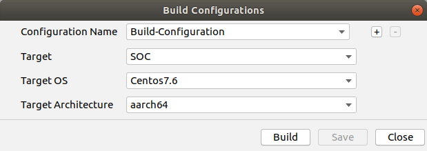
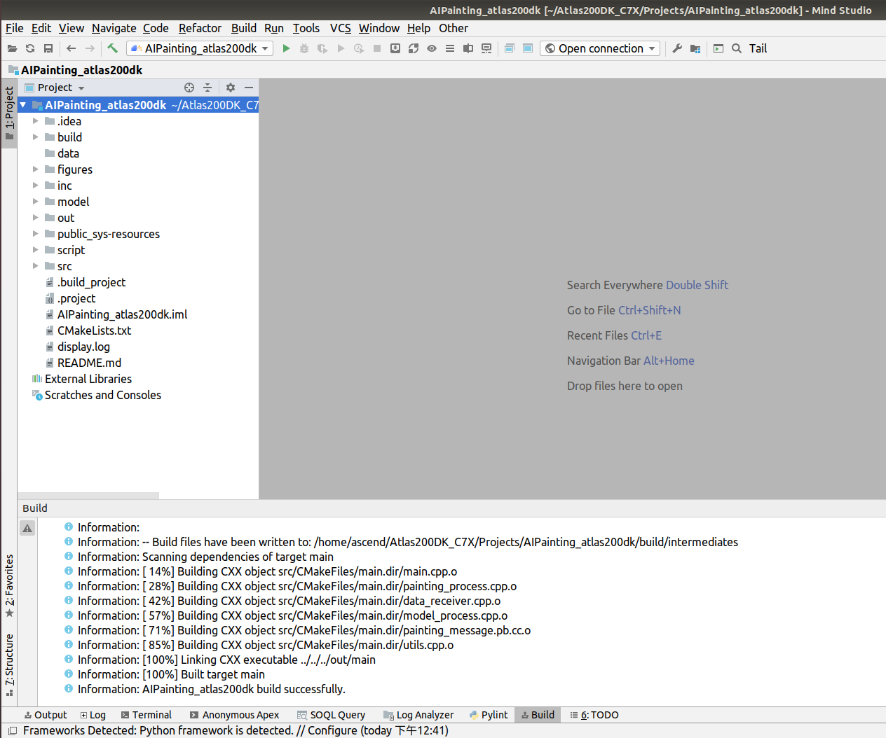
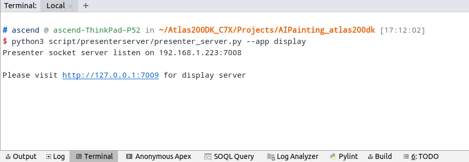
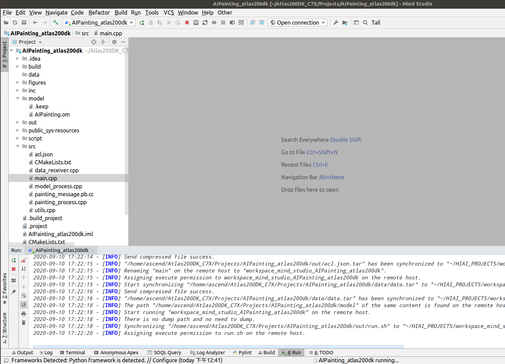
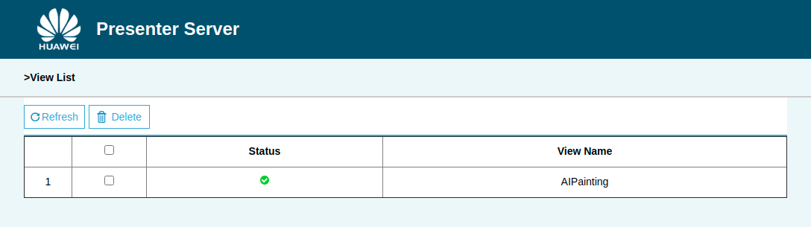
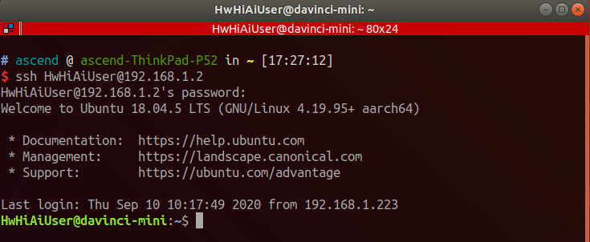
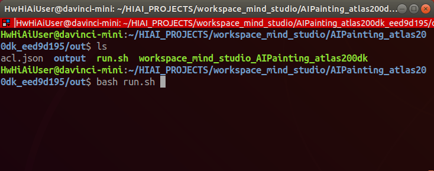

# 田园诗秒变风景画（C++）  

本应用支持运行在AI云上加速环境(Atlas300)，实现了从前端获取用户画面布局，模型推理生成并输出AI风景图。  

**注1：本指导是合设操作指导。开发环境与运行环境均为云端申请的插有300加速卡的环境。**

**注2：运行环境可以存在多种架构（如arm架构下的Centos系统、arm架构下的Euleros系统、x86架构下的Ubuntu系统等），本指导中只以ai1环境（x86架构下的Ubuntu系统）为例说明** 

## 软件准备

运行此Sample前，需要按照此章节获取源码包。

1.  获取源码包。

    **cd $HOME/AscendProjects**  

    **wget https://c7xcode.obs.cn-north-4.myhuaweicloud.com/code_Ascend/AIpainting.zip** 
              
    **unzip AIpainting.zip**  

    > **说明：**   
    >- 如果使用wget下载失败，可使用如下命令下载代码。  
    **curl -OL https://c7xcode.obs.cn-north-4.myhuaweicloud.com/code_Ascend/AIpainting.zip** 
    >- 如果curl也下载失败，可复制下载链接到浏览器，手动下载至Host端。
    
2. 获取此应用中所需要的网络模型。  
     **wget https://c7xcode.obs.cn-north-4.myhuaweicloud.com/models/AIpainting/AIPainting_v2.pb** 

3. 将原始网络模型转换为适配昇腾AI处理器的模型。  

    1.  在Mind Studio操作界面的顶部菜单栏中选择**Tools \> Model Converter**，进入模型转换界面。
    2.  在弹出的**Model Conversion**操作界面中，进行模型转换配置。
    3.  参照以下图片进行参数配置。    
        -   Model File选择步骤2中下载的模型文件。

    
    
    

4.  将转换好的模型文件（.om文件）上传到[步骤1](#zh-cn_topic_0228757084_section8534138124114)中源码所在路径下的“**AIpainting/model**”目录下。
    
     **cp \\$HOME/modelzoo/AIPainting_v2/device/AIPainting_v2.om \\$HOME/AscendProjects/AIpainting/model/**  

## 环境配置   

**注：已安装opencv库、ffmpeg库和Presenter Agent可跳过此步骤。**  

- 安装opencv和ffmpeg  
    请参考 **https://gitee.com/ascend/samples/tree/master/common/install_opencv/for_atlas300**

  
- 安装PresenterAgent    
    请参考 **https://gitee.com/ascend/samples/tree/master/common/install_presenteragent/for_atlas300**
  

## 编译

1.  打开对应的工程。

    以Mind Studio安装用户在命令行进入安装包解压后的“MindStudio-ubuntu/bin”目录，如：$HOME/MindStudio-ubuntu/bin。  
    执行如下命令启动Mind Studio。

    **./MindStudio.sh**

    启动成功后，打开**AIPainting**工程，如[图1 打开AIPainting工程](#zh-cn_topic_0228461902_zh-cn_topic_0203223265_fig11106241192810)所示。

    **图 1**  打开AIPainting工程  
    

2.  修改Presenter Server的ip。  
    -  将**script/presenterserver/display/config/config.conf**中的**presenter_server_ip**修改为AI云上加速环境(Atlas300)的内网可用ip，例如192.168.1.161。  

    如[图 presenter_server_ip](#zh-cn_topic_0228461902_zh-cn_topic_0203223265_fig1110624110)所示。

       **图 2**  修改presenter_server_ip  
             
    -  将**src/painting_process.cpp**中的 **param.host_ip** 修改为AI云上加速环境(Atlas300)的内网可用ip，例如192.168.1.161。  
    如[图 param_host_ip](#zh-cn_topic_0228461902_zh-cn_topic_0203223265_fig11)所示。

       **图 3**  修改param_host_ip  
           

    > **说明：**    
    >-  ip地址请通过ifconfig命令查看。    

3.  开始编译，打开Mind Studio工具，在工具栏中点击**Build \> Edit Build Configuration**。  
    选择Target OS 为Centos7.6，Target Architecture 为aarch64如[图2 配置编译](#zh-cn_topic_0203223265_fig17414647130)所示。

    **图 2**  配置编译  
      
    
    之后点击**Build \> Build \> Build Configuration**，如[图3 编译操作及生成文件](#zh-cn_topic_0203223265_fig1741464713019)所示，会在目录下生成build和out文件夹。

    **图 3**  编译操作及生成文件  
    

    > **须知：**   
    >首次编译工程时，**Build \> Build**为灰色不可点击状态。需要点击**Build \> Edit Build Configuration**，配置编译参数后再进行编译。 

4.  启动Presenter Server。

    打开Mind Studio工具的Terminal，在应用代码存放路径下，执行如下命令在后台启动AIPainting应用的Presenter Server主程序。如[图4 启动PresenterServer](#zh-cn_topic_0228461904_zh-cn_topic_0203223294_fig423515251067)所示。

    
     **python3 script/presenterserver/presenter_server.py --app=display &**   
    **图 4**  启动PresenterServer  
    
    
    如[图5 启动PresenterServer](#zh-cn_topic_0228461904_zh-cn_topic_0203223294_fig423)所示，表示presenter_server的服务启动成功。  
    **图 5**  启动PresenterServer    
    
  

## 运行

1.  单击  **Run \> Run 'AIPainting'**，如[图6 程序已执行示意图](#zh-cn_topic_0203223265_fig93931954162719)所示，可执行程序已经在开发者板执行。  

    **图 6**  程序已执行示意图  
    

2.  使用启动Presenter Server服务时提示的URL登录 Presenter Server 网站。

    等待Presenter Agent传输数据给服务端，单击“Refresh“刷新，当有数据时相应的Channel 的Status变成绿色，如[图7 Presenter-Server界面](#zh-cn_topic_0203223265_fig93931954155519)所示。

    **图 7**  Presenter Server界面  
     

3.  单击右侧对应的View Name链接，比如上图的“AIPainting”，查看结果。
 
## 结束应用

命令行执行以下命令登陆开发板（密码：Mind@123）。

**ssh HwHiAiUser@192.168.1.2**

执行以下指令查找仍在运行的进程。

**ps -ef | grep ./workspace_mind_studio_AIPainting**

打印如下：

*HwHiAiU+  2417  2415  7 08:05 ?        00:00:05 ./workspace_mind_studio_AIPainting*

杀死进程：

kill -9 2417

## 命令行运行

1. Mindstudi运行问题
    
   Mindstudio中运行样例可能会有失败或样例运行卡顿现象。
    
   这是Mindstudio版本导致的问题。当前解决办法为Mindstudio运行出问题后登录开发板，在命令行运行样例。

   **注：必须要在Mindstudio中先运行一次，否则二进制文件等数据不会传到开发板上**    

2. 在开发环境命令行中以普通用户执行以下命令登录开发者板（默认USB连接）。

    **ssh HwHiAiUser@192.168.1.2**

     

3. 进入案例对应可执行文件路径。
    
    **cd HIAI_PROJECTS/workspace_mind_studio/AIPainting_xxx/out**

    其中xxx需要根据自己编译出来的文件夹名称自行替换。

     

 4. 启动程序。（需要在开发环境中已经启动presentserver并且已经按照编译和运行章节操作过一次）

    **bash run.sh**

 5. 按**ctrl\+c**即可结束程序。

