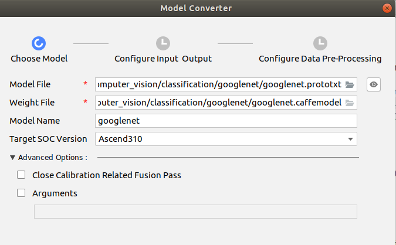
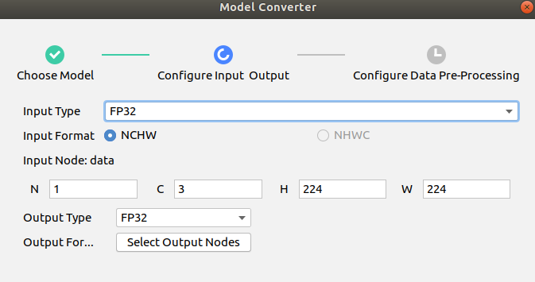
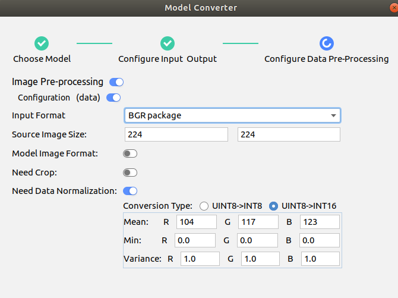
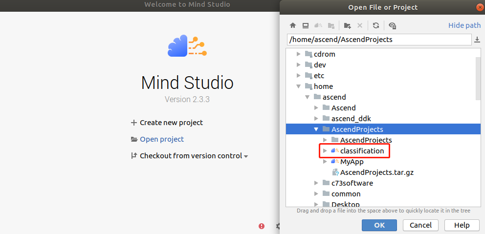
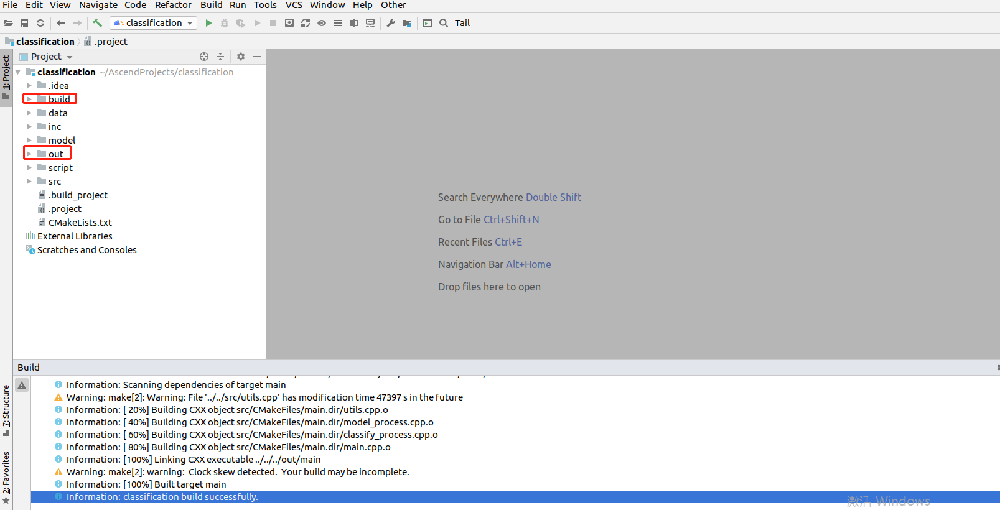
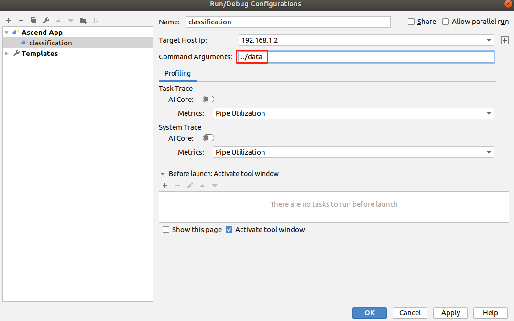
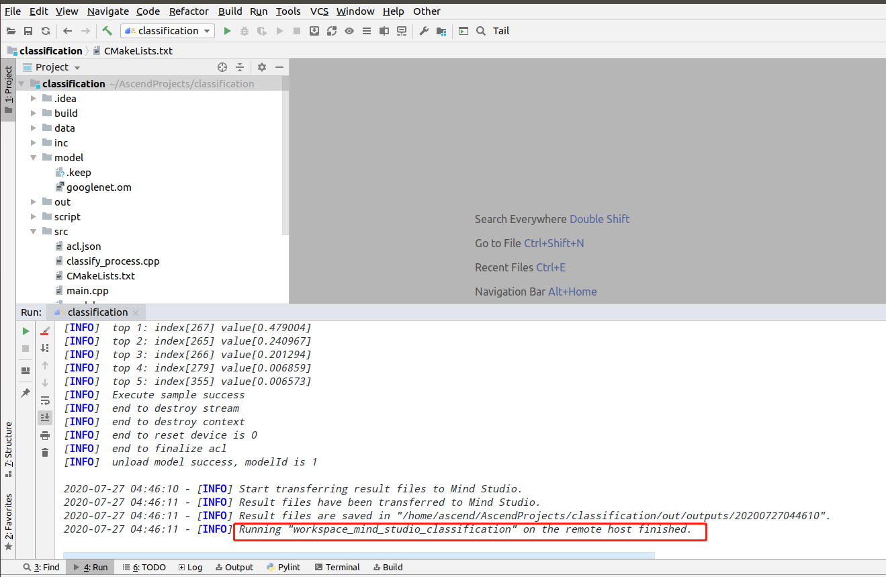

中文|[English](Readme_EN.md)

# 分类网络应用（C++）  

本Application支持运行在Atlas 200 DK上，实现了googlenet网络的推理功能并输出带有推理结果标签的图片。 

## 软件准备

运行此Sample前，需要按照此章节获取源码包。

1.  获取源码包。

    **cd $HOME/AscendProjects**  

    **wget https://c7xcode.obs.cn-north-4.myhuaweicloud.com/code_Ascend/classification.zip** 
              
    **unzip classification.zip**  
    
    > **说明：**   
    >- 如果使用wget下载失败，可使用如下命令下载代码。  
    **curl -OL https://c7xcode.obs.cn-north-4.myhuaweicloud.com/code_Ascend/classification.zip** 
    >- 如果curl也下载失败，可复制下载链接到浏览器，手动上传至服务器。
    
2.  获取此应用中所需要的原始网络模型。

    参考[表 分类网络应用使用模型](#zh-cn_topic_0219108795_table19942111763710)获取此应用中所用到的原始网络模型及其对应的权重文件，并将其存放到Mind Studio所在Ubuntu服务器的任意目录。

    **表 1**  分类网络应用使用模型

<table><thead align="left"><tr id="zh-cn_topic_0219108795_row611318123710"><th class="cellrowborder" valign="top" width="11.959999999999999%" id="mcps1.2.4.1.1">
模型名称

</th>
<th class="cellrowborder" valign="top" width="8.07%" id="mcps1.2.4.1.2">
模型说明

</th>
<th class="cellrowborder" valign="top" width="79.97%" id="mcps1.2.4.1.3">
模型下载路径

</th>
</tr>
</thead>
<tbody><tr id="zh-cn_topic_0219108795_row1119187377"><td class="cellrowborder" valign="top" width="11.959999999999999%" headers="mcps1.2.4.1.1 ">
googlenet

</td>
<td class="cellrowborder" valign="top" width="8.07%" headers="mcps1.2.4.1.2 ">
图片分类推理模型。

是基于Caffe的GoogLeNet模型。

</td>
<td class="cellrowborder" valign="top" width="79.97%" headers="mcps1.2.4.1.3 ">
请参考<a href="https://gitee.com/HuaweiAscend/models/tree/master/computer_vision/classification/googlenet" target="_blank" rel="noopener noreferrer">https://gitee.com/HuaweiAscend/models/tree/master/computer_vision/classification/googlenet</a>目录中README.md下载原始网络模型文件及其对应的权重文件。

</td>
</tr>
</tbody>
</table>

3.  将原始网络模型转换为适配昇腾AI处理器的模型。  

    1.  在Mind Studio操作界面的顶部菜单栏中选择**Tools \> Model Convert**，进入模型转换界面。
    2.  在弹出的**Model Conversion**操作界面中，进行模型转换配置。
    3.  参照以下图片进行参数配置。    
        -   Model File选择[步骤2](#zh-cn_topic_0219108795_li2074865610364)中下载的模型文件，此时会自动匹配到权重文件并填写在Weight File中。

      
      
    

    
5.  将转换好的模型文件（.om文件）上传到[步骤1](#zh-cn_topic_0228757084_section8534138124114)中源码所在路径下的“**classification/model**”目录下。
    
     **cp \\$HOME/modelzoo/googlenet/device/googlenet.om \\$HOME/AscendProjects/classification/model/**  
  

## 环境配置   

**注：服务器上已安装OpenCV、PresenterAgent、交叉编译工具可跳过此步骤。**   
      
- 安装编译工具  
  **sudo apt-get install -y g++\-aarch64-linux-gnu g++\-5-aarch64-linux-gnu** 

- 安装OpenCV 
      
    请参考 **https://gitee.com/ascend/common/blob/master/install_opencv/for_atlas200dk/README.md**   
  

## 编译

1.  打开对应的工程。

    以Mind Studio安装用户在命令行进入安装包解压后的“MindStudio-ubuntu/bin”目录，如：$HOME/MindStudio-ubuntu/bin。执行如下命令启动Mind Studio。

    **./MindStudio.sh**

    启动成功后，打开**classification**工程，如[图 打开classification工程](#zh-cn_topic_0228461902_zh-cn_topic_0203223265_fig11106241192810)所示。

    **图 1**  打开classification工程  
    

2.  开始编译，打开Mind Studio工具，在工具栏中点击**Build \> Edit Build Configuration**。  
    选择Target OS 为Centos7.6，如[图 配置编译](#zh-cn_topic_0203223265_fig17414647130)所示。

    **图 2**  配置编译  
      
    
    之后点击**Build \> Build \> Build Configuration**，如[图 编译操作及生成文件](#zh-cn_topic_0203223265_fig1741464713019)所示，会在目录下生成build和out文件夹。

    **图 3**  编译操作及生成文件  
    

    > **须知：**   
    >首次编译工程时，**Build \> Build**为灰色不可点击状态。需要点击**Build \> Edit Build Configuration**，配置编译参数后再进行编译。  
## 运行
1.  在Mind Studio工具的工具栏中找到Run按钮，单击  **Run \> Edit Configurations**。  
    在Command Arguments 中添加运行参数 **../data**（输入图片的路径），之后分别点击Apply、OK。如[图 配置运行](#zh-cn_topic_0203223265_fig93931954162720)所示。   

    **图 4**  配置运行   
    
 
2.  单击  **Run \> Run 'classification'**，如[图 程序已执行示意图](#zh-cn_topic_0203223265_fig93931954162719)所示，可执行程序已经在开发者板执行。  

    **图 5**  程序已执行示意图  
    

3.  查看运行结果。

    推理结果图片保存在工程下的“output \> outputs”目录下以时间戳命名的文件夹内。
 
  

