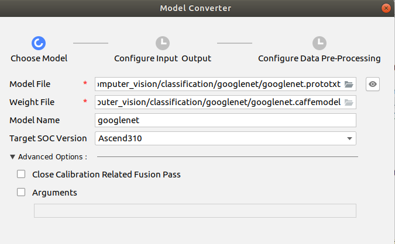
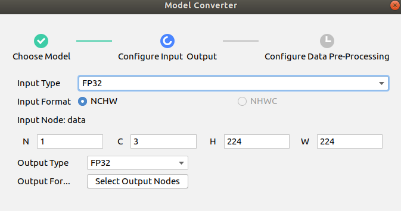
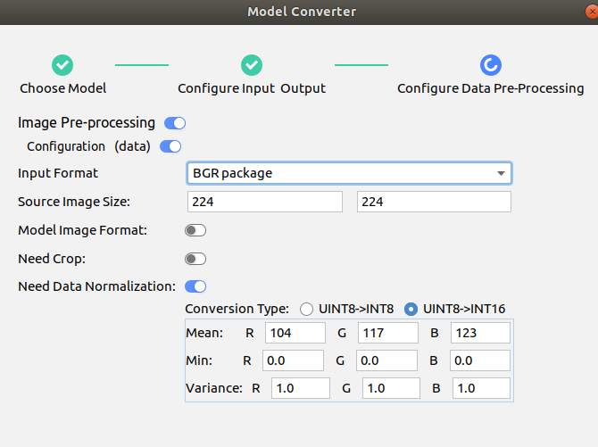
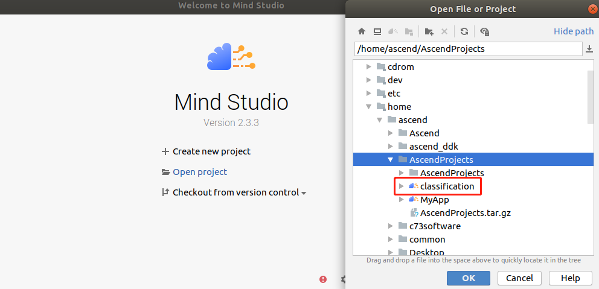
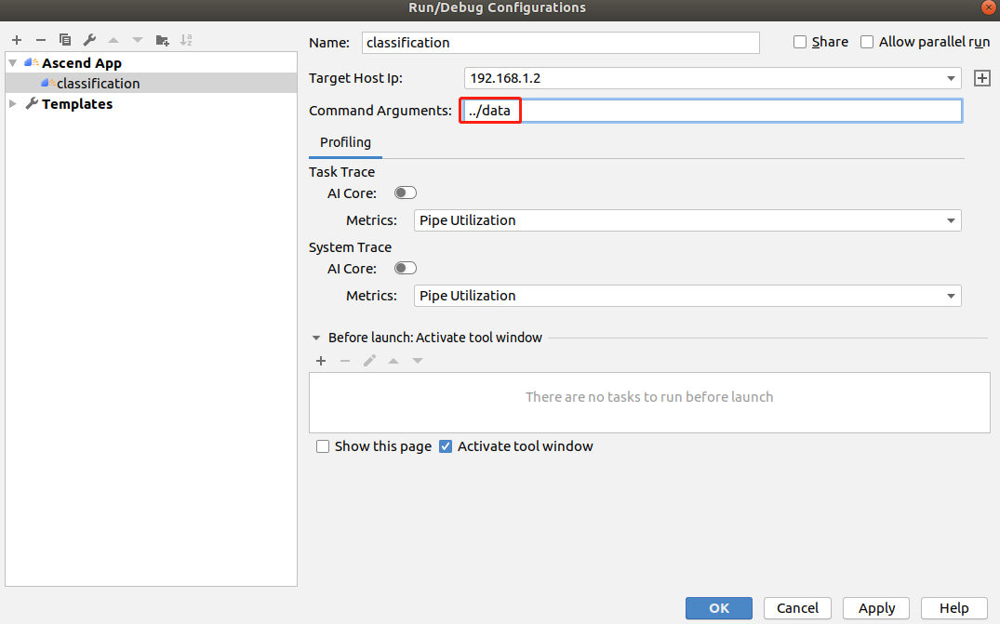
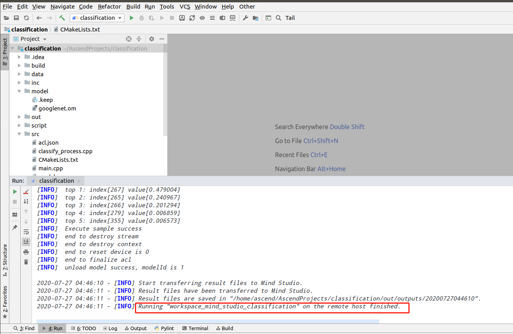
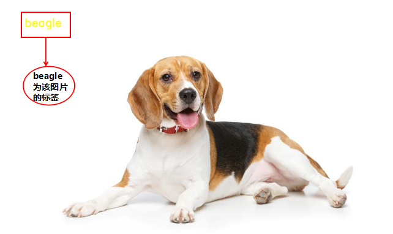

English|[中文](README.md)

# Classification Network Application (C++)  

This application can run on the Atlas 200 DK to infer images using the GoogLeNet and output images labeled with inference results. 

## Software Preparation

Before running this sample, you need to obtain the source code package.

1.  Obtain the source code package.

    **cd $HOME/AscendProjects**  

    **wget https://c7xcode.obs.cn-north-4.myhuaweicloud.com/code_Ascend/classification.zip** 
              
    **unzip classification.zip**  
    
    > **说明：**   
    >- If the download using wget fails, run the following command to download the code:  
    **curl -OL https://c7xcode.obs.cn-north-4.myhuaweicloud.com/code_Ascend/classification.zip** 
    >- If the download using curl also fails, open the download link in a browser to download the code and manually upload it to the server.
    
2.  Obtain the source network model required by the application.

    Obtain the source model and its weight file used in the application by referring to [Table 1 Model for image classification application](#zh-cn_topic_0219108795_table19942111763710), and save them to any directory on the Ubuntu server where Mind Studio is located.

    **Table 1**  Model for image classification application

<table><thead align="left"><tr id="zh-cn_topic_0219108795_row611318123710"><th class="cellrowborder" valign="top" width="11.959999999999999%" id="mcps1.2.4.1.1">
Model Name

</th>
<th class="cellrowborder" valign="top" width="8.07%" id="mcps1.2.4.1.2">
Description

</th>
<th class="cellrowborder" valign="top" width="79.97%" id="mcps1.2.4.1.3">
Download Link

</th>
</tr>
</thead>
<tbody><tr id="zh-cn_topic_0219108795_row1119187377"><td class="cellrowborder" valign="top" width="11.959999999999999%" headers="mcps1.2.4.1.1 ">
googlenet

</td>
<td class="cellrowborder" valign="top" width="8.07%" headers="mcps1.2.4.1.2 ">
Applies to image classification (Caffe)

</td>
<td class="cellrowborder" valign="top" width="79.97%" headers="mcps1.2.4.1.3 ">
Download the source model file and its weight file by referring to README.md at <a href="https://gitee.com/HuaweiAscend/models/tree/master/computer_vision/classification/googlenet" target="_blank" rel="noopener noreferrer">https://gitee.com/HuaweiAscend/models/tree/master/computer_vision/classification/googlenet</a>

</td>
</tr>
</tbody>
</table>

3.  Convert the source model to a model supported by the Ascend AI Processor.  

    1.  Choose **Tools > Model** Converter from the menu bar of Mind Studio.    
    2.  Configure model conversion settings in the displayed **Model Converter** dialog box.    
    3.  Set the parameters by referring to the following figure.     
        -   Select the model file downloaded in [Step 2](#zh-cn_topic_0219108795_li2074865610364) for Model File. The required weight file is automatically matched and filled in Weight File.
      
      
    

    
4.  Upload the converted model file (.om file) to the **classification/model directory** in the source code path in [Step 1](#zh-cn_topic_0228757084_section8534138124114).
     **cp \\$HOME/modelzoo/googlenet/device/googlenet.om \\$HOME/AscendProjects/classification/model/**  
  

## Environment Configuration   

**Note:If OpenCV, Presenter Agent, and a cross compiler have been installed on the server, skip this step.**   
      
- Install the compiler.  
  **sudo apt-get install -y g++\-aarch64-linux-gnu g++\-5-aarch64-linux-gnu** 

- Install OpenCV. 
      
    For details, see **https://gitee.com/ascend/common/blob/master/install_opencv/for_atlas200dk/README.md**   
  

## Build

1.  Open the project.

    Go to the directory of the decompressed installation package as the Mind Studio installation user in CLI mode, for example, $HOME/MindStudio-ubuntu/bin. Run the following command to launch Mind Studio:

    **./MindStudio.sh**

    After the project is successfully started, open the classification project, as shown in [Figure 1 Opening the classification project](#zh-cn_topic_0228461902_zh-cn_topic_0203223265_fig11106241192810).

    **Figure 1**  Opening the classification project  
    

2.  Start build. Choose **Build > Edit Build Configuration** from the main menu of Mind Studio.  
    Set Target OS to Centos7.6, as shown in [Figure 2 Build Configurations](#zh-cn_topic_0203223265_fig17414647130).

    **Figure 2**  Build Configurations  
      
    
    Click **Build > Build > Build Configuration**. The **build and out** folders are generated in the directory, as shown in[Figure 3 Build and files generated](#zh-cn_topic_0203223265_fig1741464713019).

    **Figure 3**  Build and files generated  
    

    > **须知：**   
    >When you build a project for the first time, **Build > Build** is unavailable. You need to choose **Build > Edit Build Configuration** to set parameters before build.  

## Run
1.  Choose **Run > Edit Configurations** from the main menu of Mind Studio.  
    Add the running parameter ../data in Command Arguments and click Apply and then click OK, as shown in [Figure 4 Run/Debug Configurations](#zh-cn_topic_0203223265_fig93931954162720).   

    **Figure 4**  Run/Debug Configurations   
    
 
2.  Click Run > Run 'classification'. The executable file has been executed on the developer board, as shown in [Figure 5 Execution finished](#zh-cn_topic_0203223265_fig93931954162719).  

    **Figure 5**  Execution finished  
    

3.  Check the execution result.

    The result images are stored in the folder named after the timestamp in the **output > outputs** directory of the project.
 
  

