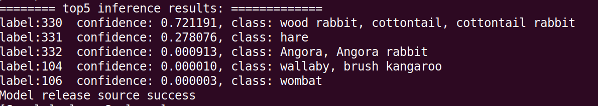

# 分类网络应用 （python）

本Application支持运行在Atlas 200 DK上，实现了googlenet网络的推理功能并输出相似度为前五的物体类别。

## 软件准备

1. 运行此Sample前，需要下载本仓中的源码包。

2. 获取此应用中所需要的原始网络模型，可以使用wget 命令下载：

   **wget** [**https://obs-model-ascend.obs.cn-east-2.myhuaweicloud.com/googlenet/googlenet.caffemodel**](https://obs-model-ascend.obs.cn-east-2.myhuaweicloud.com/googlenet/googlenet.caffemodel) **--no-check-certificate**

   **wget** [**https://obs-model-ascend.obs.cn-east-2.myhuaweicloud.com/googlenet/googlenet.prototxt**](https://obs-model-ascend.obs.cn-east-2.myhuaweicloud.com/googlenet/googlenet.prototxt) **--no-check-certificate**

3. 设置环境变量

   **vim ~/.bashrc**

   添加如下环境变量以使模型准换命令 atc 可以使用：

   **export install_path=\\${HOME}/Ascend/ascend-toolkit/20.0.RC1**

   **export PATH=/usr/local/python3.7.5/bin:\\${install_path}/atc/ccec_compiler/bin:\\${install_path}/atc/bin:\\${HOME}/MindStudio-ubuntu/bin:\\$PATH**

   **export PYTHONPATH=\\${install_path}/atc/python/site-packages/te:\\${install_path}/atc/python/site-packages/topi:\\$PYTHONPATH**

   **export LD_LIBRARY_PATH=\\${install_path}/atc/lib64:\\$LD_LIBRARY_PATH**

   **export ASCEND_OPP_PATH=\\${install_path}/opp**

   输入:**wq!**保存退出。

   执行如下命令使环境变量生效。

   **source ~/.bashrc**  

4. 将原始网络模型转换为适配昇腾AI处理器的模型。

   **atc --model=googlenet.prototxt --weight=googlenet.caffemodel --framework=0 --output=googlenet_yuv --soc_version=Ascend310 --input_shape="data:1,3,224,224" --insert_op_conf=aipp.cfg**

5. 将转换好的模型放到工程文件中的model 目录下。

6. 拷贝acl.so到开发板的/home/HwHiAiUser/Ascend/ 目录下

   **${HOME}/Ascend/ascend-toolkit/20.0.RC1/arm64-linux_gcc7.3.0/pyACL/python/site-packages/acl/acl.so HwHiAiUser@192.168.1.2:/home/HwHiAiUser/Ascend/**

7. 登录开发板，添加环境变量

   **vim ${HOME}/.bashrc**
   **export PYTHONPATH=/home/HwHiAiUser/Ascend/:${PYTHONPATH}**
   **source ${HOME}/.bashrc**

8. 配置开发板的环境可以参考

   https://blog.csdn.net/Hello_yes112/article/details/107546041 此链接中的运行环境安装

   

## 运行

1. 将包含有模型文件的工程传到开发板任意目录下

   **scp -r pyacl_classification/ HwHiAiUser@192.168.1.2:~/**

2. 登录到开发板上，进入工程目录下，执行如下命令运行程序

   python3.7.5 classify.py ./data/

3. 推理结果在终端中显示

   