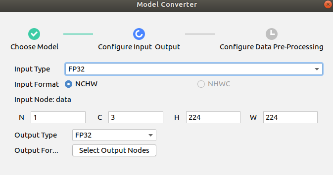
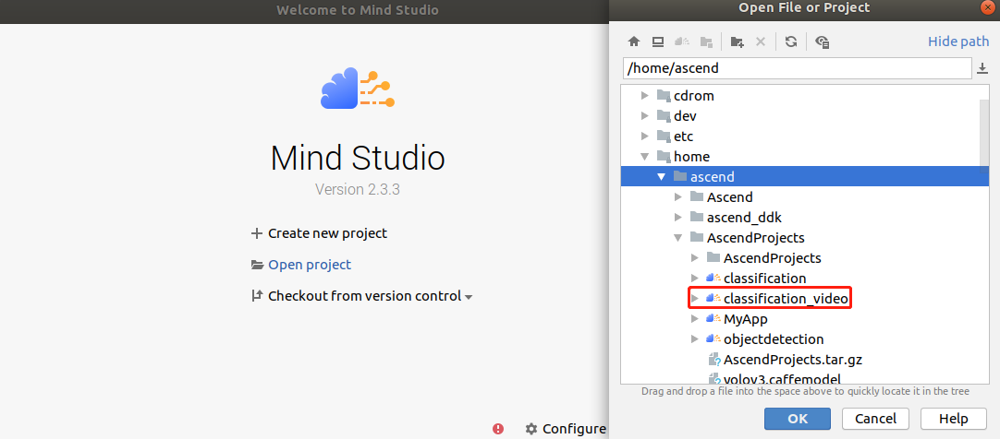
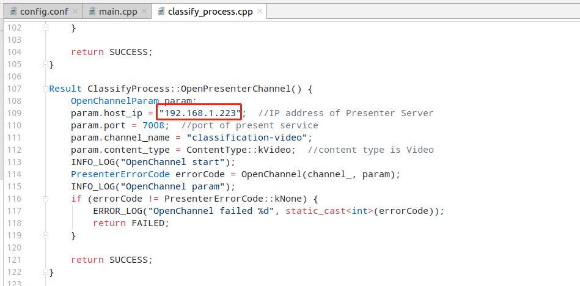
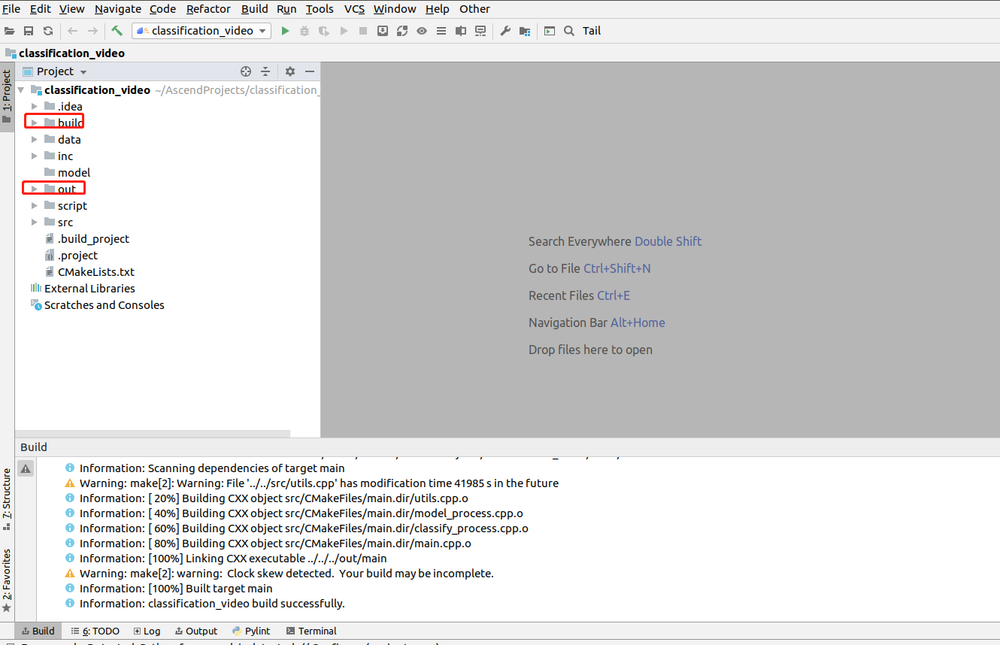
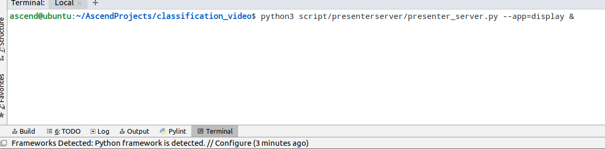
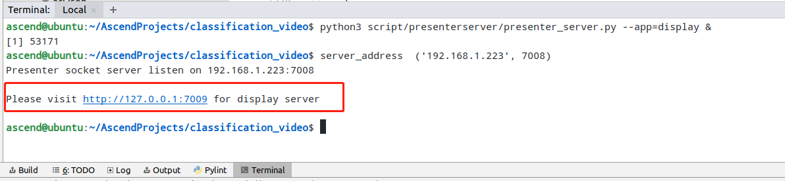
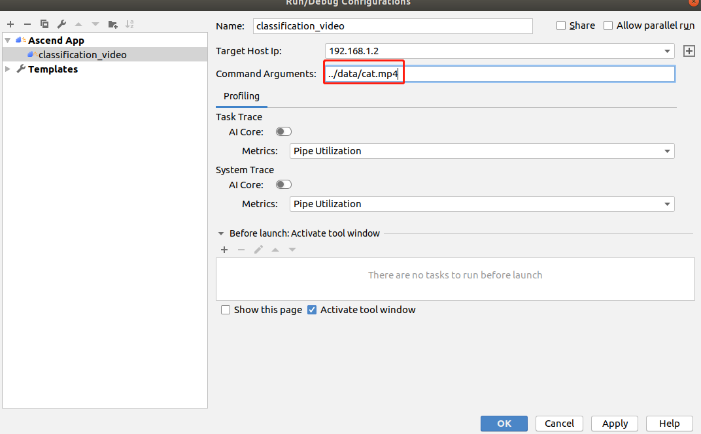
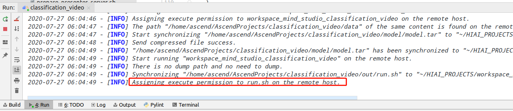

English|[中文](README.md)

# Video Object Classification Network Application (C++)

This application can run on the Atlas 200 DK to classify objects in videos using the GoogLeNet network and output videos labeled with inference result.

## Software Preparation

Before running this sample, obtain the source code package.

1. Obtain the source code package.
   
   **cd $HOME/AscendProjects**
   
   **wget https://c7xcode.obs.cn-north-4.myhuaweicloud.com/code_Ascend/classification_video.zip**
   
   **unzip classification_video.zip**
   
   >  NOTE
   > - If the download using **wget** fails, run the following command to download the code:   
   **curl -OL https://c7xcode.obs.cn-north-4.myhuaweicloud.com/code_Ascend/classification_video.zip**
   > - If the download using **curl** also fails, open the download link in a browser to download the code and manually upload it to the server.
    
2. Obtain the original model required by the application.

   tain the original model file and weight file by referring to [Table 1 Model for a video classification application](#zh-cn_topic_0219108795_table19942111763710) and store them to the **$HOME/AscendProjects/classification_video/caffe_model/** directory.

     **Table 1** Model for an image classification application

    
    
    <table><thead align="left"><tr id="zh-cn_topic_0219108795_row611318123710"><th class="cellrowborder" valign="top" width="11.959999999999999%" id="mcps1.2.4.1.1">
Model name

    </th>
    <th class="cellrowborder" valign="top" width="8.07%" id="mcps1.2.4.1.2">
Model description

    </th>
    <th class="cellrowborder" valign="top" width="79.97%" id="mcps1.2.4.1.3">
Model download link

    </th>
    </tr>
    </thead>
    <tbody><tr id="zh-cn_topic_0219108795_row1119187377"><td class="cellrowborder" valign="top" width="11.959999999999999%" headers="mcps1.2.4.1.1 ">
googlenet

    </td>
    <td class="cellrowborder" valign="top" width="8.07%" headers="mcps1.2.4.1.2 ">
Image classification model
    It is a GoogLeNet model based on Caffe.

    
    </td>
    <td class="cellrowborder" valign="top" width="79.97%" headers="mcps1.2.4.1.3 ">
Download the original model file and weight file by referring to README_en.md at <a href="https://gitee.com/HuaweiAscend/models/blob/master/computer_vision/classification/googlenet/README_en.md" target="_blank" rel="noopener noreferrer">https://gitee.com/HuaweiAscend/models/blob/master/computer_vision/classification/googlenet/README_en.md</a>. 

    </td>
    </tr>
    </tbody>
    </table>
3. Convert the original model to an offline model adapted to the Ascend AI Processor.
   
   1. Choose **Tools \> Model Converter** from the menu bar of Mind Studio.
   2. Configure the model conversion settings in the displayed **Model Converter** dialog box.
   3. Set the parameters by referring to the following figure.
      - Select the model file downloaded in [Step 2](#zh-cn_topic_0219108795_li2074865610364) in **Model File**, and **Weight File** is automatically filled in.
   
       
       
     

4. Upload the converted model file (.om) to the **classification_video/model** directory under the path of the source code downloaded in [Step 1](#zh-cn_topic_0228757084_section8534138124114).
   
   **cp \\$HOME/modelzoo/googlenet/device/googlenet.om \\$HOME/AscendProjects/classification_video/model/**

## Environment Configuration

**Note: If OpenCV, Presenter Agent, and a cross compiler have been installed on the server, skip this step.**

- Install the compiler.  
  **sudo apt-get install -y g++\-aarch64-linux-gnu g++\-5-aarch64-linux-gnu** 

- Install OpenCV.
  
  For details, see **https://gitee.com/ascend/samples/tree/master/common/install_opencv/for_atlas200dk**.

- Install Presenter Agent  
   For details, see **https://gitee.com/ascend/samples/tree/master/common/install_presenteragent/for_atlas200dk**.

## Build

1. Open the project.
   
   Go to the directory of the decompressed installation package as the Mind Studio installation user in CLI mode, for example, **$HOME/MindStudio-ubuntu/bin**. Launch Mind Studio.
   
   **./MindStudio.sh**
   
   Open the **classification_video** project, as shown in [Figure 1 Opening the classification_video project](#zh-cn_topic_0228461902_zh-cn_topic_0203223265_fig11106241192810).
   
   **Figure 1** Opening the classification_video project  
   

2. Change the IP address of Presenter Server.
   
   - Change the value of **presenter_server_ip** in **script/presenterserver/display/config/config.conf** to the virtual NIC IP address of the Ubuntu server where Mind Studio is installed, as shown in [Figure 2 Modifying presenter_server_ip](#zh-cn_topic_0228461902_zh-cn_topic_0203223265_fig1110624110).
   
     **Figure 2** Modifying presenter_server_ip  
     
   
   - Change the value of **param.host_ip** in **src/classify_process.cpp** to the virtual NIC IP address of the Ubuntu server where Mind Studio is installed, as shown in [Figure 3 Modifying param_host_ip](#zh-cn_topic_0228461902_zh-cn_topic_0203223265_fig11).
   
     **Figure 3** Modifying param_host_ip  
     
   
   >  NOTE
   > 
   > - Run the **ifconfig** command to view the IP address of the virtual NIC.

3. Start the build. Choose **Build \> Edit Build Configuration** on the toolbar of Mind Studio.   
Set **Target OS** to **Centos7.6**, as shown in [Figure 4 Build configuration](#zh-cn_topic_0203223265_fig17414647130).
   
   **Figure 4** Build configuration  
   
   
   Click **Build \> Build \> Build Configuration**. The **build** and **out** folders are generated in the directory, as shown in [Figure 5 Build operations and generated files](#zh-cn_topic_0203223265_fig1741464713019).
   
   **Figure 5** Build operations and generated files  
   
   
   >  NOTE   
   When you build a project for the first time, **Build \> Build** is unavailable. You need to choose **Build \> Edit Build Configuration** to set parameters before the build.

4. Start Presenter Server.
   
   Open the Terminal window of Mind Studio. Run the following command in the path where the application code is stored to start Presenter Server in the background, as shown in [Figure 6 Starting Presenter Server.](#zh-cn_topic_0228461904_zh-cn_topic_0203223294_fig423515251067)
   
   **python3 script/presenterserver/presenter_server.py --app=display &**
   
   **Figure 6** Starting Presenter Server  
   
   
   Presenter Server is started successfully, as shown in [Figure 7 Presenter Server started successfully](#zh-cn_topic_0228461904_zh-cn_topic_0203223294_fig423).   
   **Figure 7** Presenter Server started successfully  
   

## Run

1. Choose **Run \> Edit Configurations** from the toolbar of Mind Studio.   
   Add the run parameter **../data/cat.mp4** (path of the input video) in **Command Arguments**, and click **Apply** and **OK** in sequence, as shown in [Figure 8 Run/Debug Configurations](#zh-cn_topic_0203223265_fig93931954162720).
   
   **Figure 8** Run/Debug Configurations  
   

2. Click **Run \> Run **'classification_video’****. The executable file has been executed on the developer board, as shown in [Figure 9 Execution finished](#zh-cn_topic_0203223265_fig93931954162719).
   
   **Figure 9** Execution finished  
   

3. Use the URL displayed upon the start of Presenter Server service to log in to Presenter Server.
   
   Wait for Presenter Agent to transmit data to the server and click **Refresh**. When there is data, the icon in the **Status** column for the corresponding channel turns green, as shown in the following figure.
   
   **Figure 10** Presenter Server page  
   

4. Click a link in the **View Name** column, for example, **"video"** in the preceding figure to view the result.

