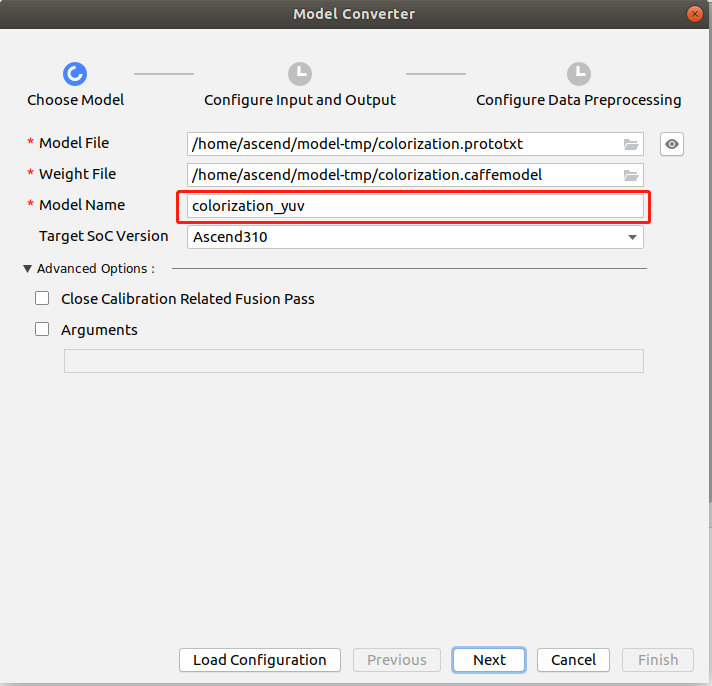
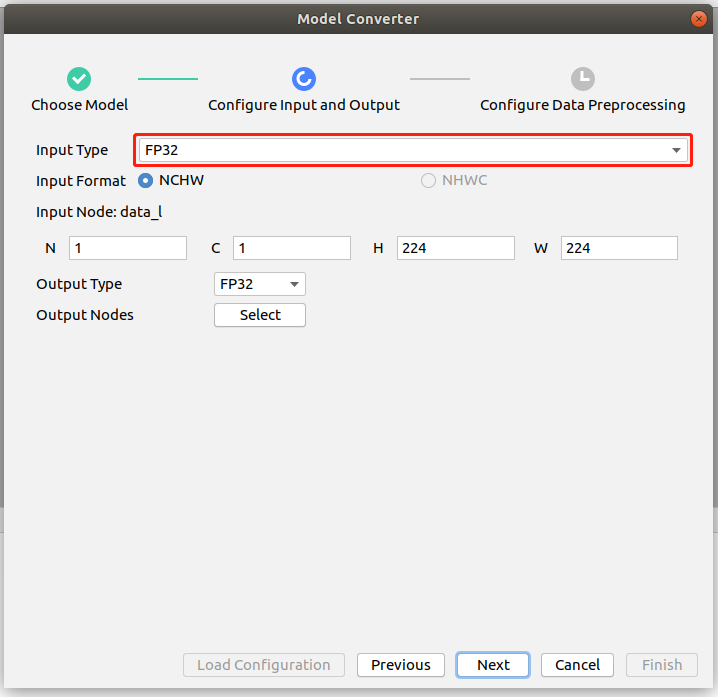
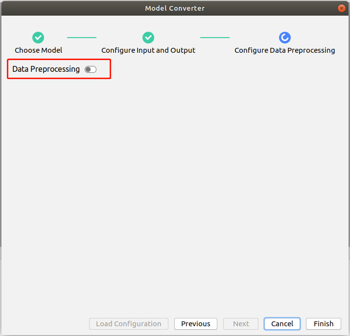
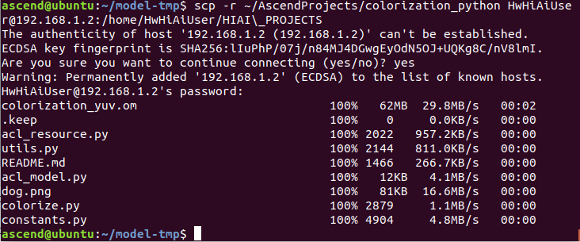
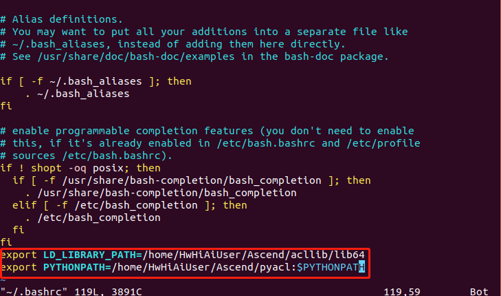
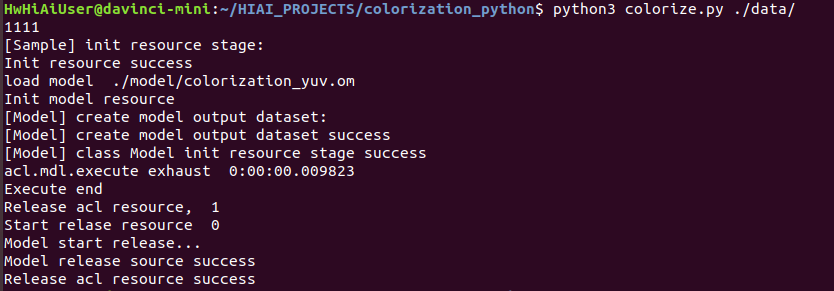

# 黑白图像上色 （python）

本Application支持运行在Atlas 200 DK上，实现了对黑白图像自动上色的功能。

## 软件准备

运行此Sample前，需要下载本仓中的源码包。

1. 获取源码包。  
    **mkdir -p $HOME/AscendProjects**

    **cd $HOME/AscendProjects**  

    **wget https://c7xcode.obs.cn-north-4.myhuaweicloud.com/code_Ascend/colorization_python.zip --no-check-certificate** 
              
    **unzip colorization_python.zip**  
    
    > **说明：**   
    >- 如果使用wget下载失败，可使用如下命令下载代码。  
    **curl -OL https://c7xcode.obs.cn-north-4.myhuaweicloud.com/code_Ascend/colorization_python.zip** 
    >- 如果curl也下载失败，可复制下载链接到浏览器，手动上传至服务器。

2.  获取此应用中所需要的原始网络模型。

    参考[表 黑白图像上色应用使用模型](#zh-cn_topic_0219108795_table19942111763710)获取此应用中所用到的原始网络模型及其对应的权重文件，并将其存放到Ubuntu服务器的任意目录，例如：$HOME/models/colorization。

    **表 1**  黑白图像上色应用使用模型

    
    <table><thead align="left"><tr id="zh-cn_topic_0219108795_row611318123710"><th class="cellrowborder" valign="top" width="11.959999999999999%" id="mcps1.2.4.1.1">
模型名称

    </th>
    <th class="cellrowborder" valign="top" width="8.07%" id="mcps1.2.4.1.2">
模型说明

    </th>
    <th class="cellrowborder" valign="top" width="79.97%" id="mcps1.2.4.1.3">
模型下载路径

    </th>
    </tr>
    </thead>
    <tbody><tr id="zh-cn_topic_0219108795_row1119187377"><td class="cellrowborder" valign="top" width="11.959999999999999%" headers="mcps1.2.4.1.1 ">
colorization

    </td>
    <td class="cellrowborder" valign="top" width="8.07%" headers="mcps1.2.4.1.2 ">
黑白图像上色模型

    </td>
    <td class="cellrowborder" valign="top" width="79.97%" headers="mcps1.2.4.1.3 ">
请参考<a href="https://gitee.com/HuaweiAscend/models/tree/master/computer_vision/object_detect/colorization" target="_blank" rel="noopener noreferrer">https://gitee.com/HuaweiAscend/models/tree/master/computer_vision/object_detect/colorization</a>目录中README.md下载原始网络模型文件及其对应的权重文件。

    </td>
    </tr>
    </tbody>
    </table>

3. 将原始网络模型转换为适配昇腾AI处理器的模型。

    1.  在Mind Studio操作界面的顶部菜单栏中选择**Tools \> Model Converter**，进入模型转换界面。
    2.  在弹出的**Model Conversion**操作界面中，进行模型转换配置。
    3.  参照以下图片进行参数配置。    
        -   Model File选择[步骤2](#zh-cn_topic_0219108795_li2074865610364)中下载的模型文件，此时会自动匹配到权重文件并填写在Weight File中。  
        -   修改模型的名字为colorization_yuv，若修改模型名称，需对应修改colorize.py文件中的MODEL_PATH。
        -   Input Type 选择FP32。  
        -   关闭AIPP即Data Preprocessing。
      
      
    

4. 将转换好的模型放到工程文件中的model 目录下。  
	**cp ~/modelzoo/colorization_yuv/device/colorization_yuv.om ~/AscendProjects/colorization_python/model/**   

## 环境部署

1.  应用代码拷贝到开发板。

    以Mind Studio安装用户进入分类网络应用\(python\)代码所在根目录，如：AscendProjects/classification_python，执行以下命令将应用代码拷贝到开发板。
    
    **scp -r ~/AscendProjects/colorization_python HwHiAiUser@192.168.1.2:/home/HwHiAiUser/HIAI\_PROJECTS**
    
     提示password时输入开发板密码，开发板默认密码为**Mind@123**，如[图 应用代码拷贝](#zh-cn_topic_0228757083_zh-cn_topic_0198304761_fig1660453512014)。
    
     **图** **应用代码拷贝**  
    

    
    

    
2. acl.so拷贝到开发板。

   **scp ~/Ascend/ascend-toolkit/20.0.RC1/arm64-linux_gcc7.3.0/pyACL/python/site-packages/acl/acl.so HwHiAiUser@192.168.1.2:/home/HwHiAiUser/Ascend/**  

   > **说明：**   
            **请将X.X.X替换为Ascend-Toolkit开发套件包的实际版本号。**   
            **例如：Toolkit包的包名为Ascend-Toolkit-20.0.RC1-x86_64-linux_gcc7.3.0.run，则此Toolkit的版本号为20.0.RC1。**

3. 登录开发板，添加环境变量。  

   **ssh HwHiAiUser@192.168.1.2**  
   **vim ~/.bashrc**   
   在最后添加两行    
   **export LD_LIBRARY_PATH=/home/HwHiAiUser/Ascend/acllib/lib64**   
   **export PYTHONPATH=/home/HwHiAiUser/Ascend/:\\${PYTHONPATH}**  
      
   执行如下命令，使环境变量生效   
   **source ~/.bashrc**  

4. 安装环境依赖。 
   - 安装numpy、pillow   
       请参考 https://gitee.com/ascend/common/blob/master/install_python3env/for_atlas200dk/README.md 进行安装。 
   
## 运行

1. 登录到开发板上，进入工程目录下，执行如下命令运行程序。  

   **cd ~/HIAI_PROJECTS/colorization_python/**   
   **python3 colorize.py ./data/**

2. 在终端可看到推理结果。

    

3. 查看推理图片。  

   推理产生的结果图片保存在out文件夹，可传到Mindstudio安装用户的家目录中查看。 （此命令不是在开发板一侧使用，而是在MindStudio的安装用户这边使用） 
   **scp -r username@host\_ip:/home/username/HIAI\_PROJECTS/colorization_python/out \~**

    -   username：开发板用户名，默认为HwHiAiUser。
    -   host\_ip：开发板ip，USB连接一般为192.168.1.2.网线连接时一般为192.168.0.2。

    **命令示例：**  
    **scp -r HwHiAiUser@192.168.1.2:/home/HwHiAiUser/HIAI\_PROJECTS/colorization_python/outputs \~** 