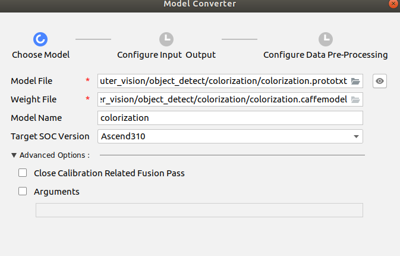
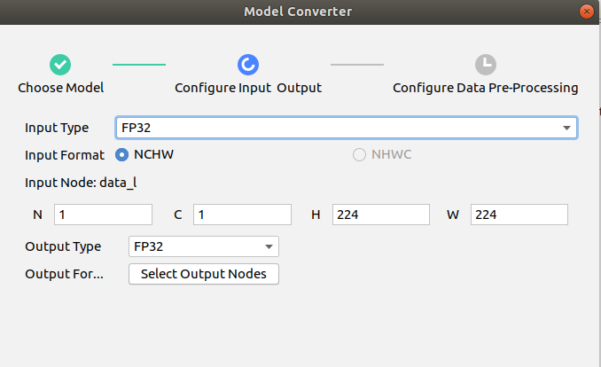
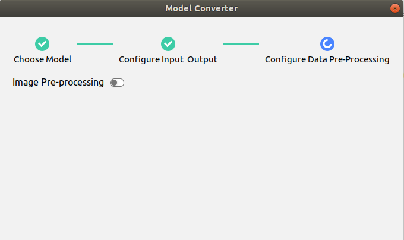
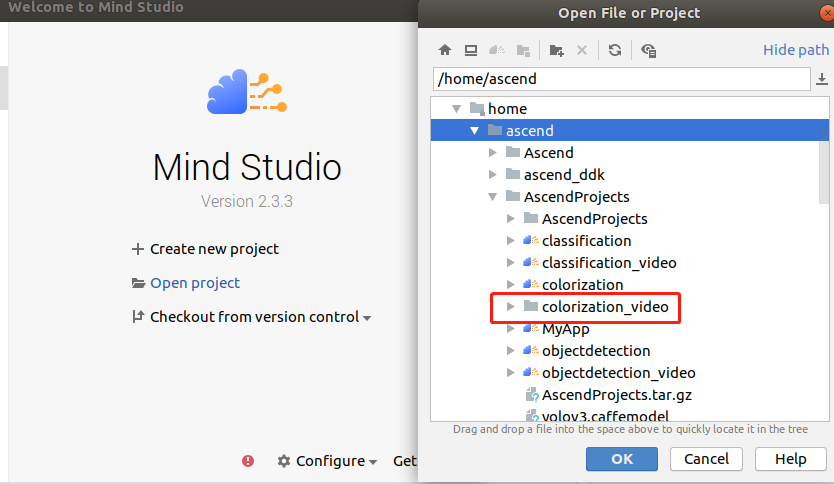
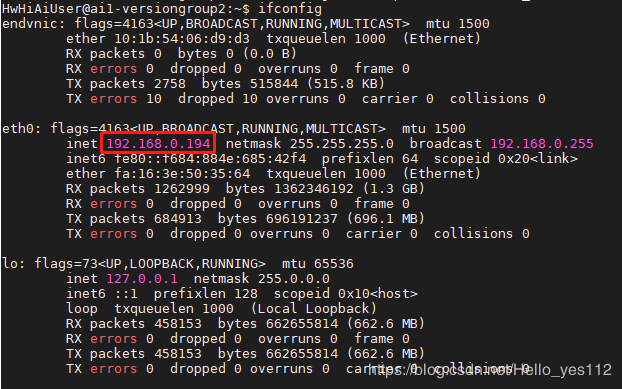
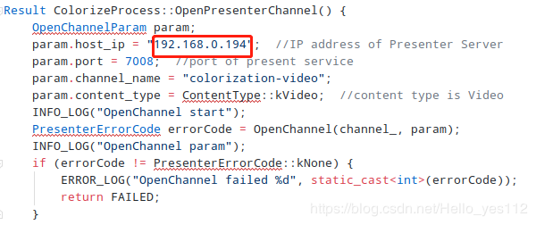
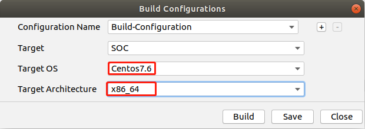
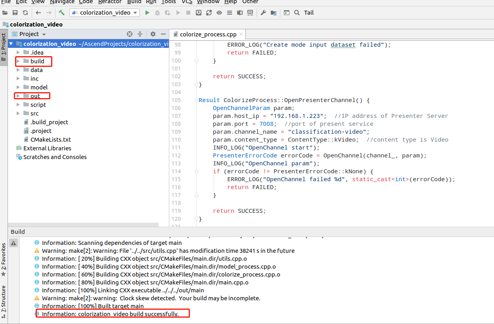
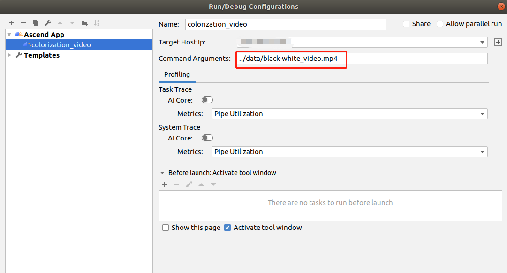

中文|[English](Readme_EN.md)

# 黑白图像上色视频版

本应用支持运行在AI云上加速环境(Atlas300)，实现了对黑白图像自动上色的功能。  
  
**注1：本指导是分设操作指导。开发环境为Mindstudio安装在的本地虚拟机环境，运行环境为云端申请的插有300加速卡的环境。**

**注2：运行环境可以存在多种架构（如arm架构下的Centos系统、arm架构下的Euleros系统、x86架构下的Ubuntu系统等），本指导中只以ai1环境（x86架构下的Ubuntu系统）为例说明**

## 软件准备

运行此Sample前，需要按照此章节获取源码包。

1.  获取源码包。

    **cd $HOME/AscendProjects**    

    **wget https://c7xcode.obs.cn-north-4.myhuaweicloud.com/code_Ascend/colorization_video_300.zip**  
 
    **unzip colorization_video_300**  
    > **说明：**   
    >- 如果使用wget下载失败，可使用如下命令下载代码。  
    **curl -OL https://c7xcode.obs.cn-north-4.myhuaweicloud.com/code_Ascend/colorization_video_300.zip** 
    >- 如果curl也下载失败，可复制下载链接到浏览器，手动上传至服务器。
    
2.  获取此应用中所需要的原始网络模型。

    参考[表 黑白图像上色应用使用模型](#zh-cn_topic_0219108795_table19942111763710)获取此应用中所用到的原始网络模型及其对应的权重文件，并将其存放到Ubuntu服务器的任意目录，例如：$HOME/models/colorization_video。

    **表 1**  黑白图像上色应用使用模型

    
    <table><thead align="left"><tr id="zh-cn_topic_0219108795_row611318123710"><th class="cellrowborder" valign="top" width="11.959999999999999%" id="mcps1.2.4.1.1">
模型名称

    </th>
    <th class="cellrowborder" valign="top" width="8.07%" id="mcps1.2.4.1.2">
模型说明

    </th>
    <th class="cellrowborder" valign="top" width="79.97%" id="mcps1.2.4.1.3">
模型下载路径

    </th>
    </tr>
    </thead>
    <tbody><tr id="zh-cn_topic_0219108795_row1119187377"><td class="cellrowborder" valign="top" width="11.959999999999999%" headers="mcps1.2.4.1.1 ">
colorization

    </td>
    <td class="cellrowborder" valign="top" width="8.07%" headers="mcps1.2.4.1.2 ">
黑白图像上色模型

    </td>
    <td class="cellrowborder" valign="top" width="79.97%" headers="mcps1.2.4.1.3 ">
请参考<a href="https://gitee.com/HuaweiAscend/models/tree/master/computer_vision/object_detect/colorization" target="_blank" rel="noopener noreferrer">https://gitee.com/HuaweiAscend/models/tree/master/computer_vision/object_detect/colorization</a>目录中README.md下载原始网络模型文件及其对应的权重文件。

    </td>
    </tr>
    </tbody>
    </table>

3.  将原始网络模型转换为适配昇腾AI处理器的模型。  

    1.  在Mind Studio操作界面的顶部菜单栏中选择**Tools \> Model Convert**，进入模型转换界面。
    2.  在弹出的**Model Conversion**操作界面中，进行模型转换配置。
    3.  参照以下图片进行参数配置。    
        -   Model File选择[步骤2](#zh-cn_topic_0219108795_li2074865610364)中下载的模型文件，此时会自动匹配到权重文件并填写在Weight File中。  
        -   关闭Image Pre-processing。

      
      
    

4.  将转换好的模型文件（.om文件）上传到[步骤1](#zh-cn_topic_0228757084_section8534138124114)中源码所在路径下的“**colorization_video/model**”目录下。   
    **cp \\$HOME/modelzoo/colorization/device/colorization.om \\$HOME/AscendProjects/colorization_video/model/**  

## 环境配置   

**注：已安装opencv库、ffmpeg库和Presenter Agent可跳过此步骤。**  

- 安装opencv和ffmpeg  
    请参考 **https://gitee.com/ascend/common/blob/master/install_opencv/for_atlas300/README.md**

  
- 安装PresentAgent    
    请参考 **https://gitee.com/ascend/common/blob/master/install_presenteragent/for_atlas300/README.md**

## 编译

1.  打开对应的工程。

    以Mind Studio安装用户在命令行进入安装包解压后的“MindStudio-ubuntu/bin”目录，如：$HOME/MindStudio-ubuntu/bin。执行如下命令启动Mind Studio。

    **./MindStudio.sh**

    启动成功后，打开**colorization_video**工程，如[图 打开colorization_video工程](#zh-cn_topic_0228461902_zh-cn_topic_0203223265_fig11106241192810)所示。

    **图 1**  打开colorization_video工程  
    

2.  修改Presenter Server的ip。  
    -  将**script/presentserver/display/config/config.conf**中的**presenter_server_ip**和 **web_server_ip** 修改为ai1环境的上网端口（一般为eth0）的ip地址，如下图所示，如[图 presenter_server_ip](#zh-cn_topic_0228461902_zh-cn_topic_0203223265_fig1110624110)所示。

      **图 2**  修改presenter_server_ip  
              
      
    -  将 **src/colorize_process.cpp** 中的  **param.host_ip**  修改为ai1环境的上网端口（一般为eth0）的ip地址，和上面步骤的ip一致，如[图 param_host_ip](#zh-cn_topic_0228461902_zh-cn_topic_0203223265_fig11)所示。

      **图 3**  修改param_host_ip  
          

    > **说明：**    
    >-  ai1环境的上网端口（一般为eth0）的ip地址，请通过ifconfig命令查看。    
3.  开始编译，打开Mind Studio工具，在工具栏中点击**Build \> Edit Build Configuration**。  
    选择**Target OS** 为**Centos7.6**，如[图 配置编译](#zh-cn_topic_0203223265_fig17414647130)所示。

    **图 4**  配置编译  
      
    
    之后点击**Build \> Build \> Build Configuration**，如[图 编译操作及生成文件](#zh-cn_topic_0203223265_fig1741464713019)所示，会在目录下生成build和out文件夹。

    **图 5**  编译操作及生成文件  
    

    > **须知：**   
    >首次编译工程时，**Build \> Build**为灰色不可点击状态。需要点击**Build \> Edit Build Configuration**，配置编译参数后再进行编译。  

4.  给公网ip开端口。

    请参考 https://bbs.huaweicloud.com/forum/thread-61588-1-1.html 。

5.  启动Presenter Server。

    打开Mind Studio工具的Terminal，在应用代码存放路径下，执行如下命令在后台启动colorization-video应用的Presenter Server主程序。如[图 启动PresenterServer](#zh-cn_topic_0228461904_zh-cn_topic_0203223294_fig423515251067)所示。

    **python3 script/presenterserver/presenter_server.py --app=display &**

    **图 6**  启动PresenterServer  
    
   
  
    如[图 启动PresenterServer](#zh-cn_topic_0228461904_zh-cn_topic_0203223294_fig423)所示，表示presenter_server的服务启动成功。  
    **图 7**  启动PresenterServer    
    

## 运行
1.  在Mind Studio工具的工具栏中找到Run按钮，单击  **Run \> Edit Configurations**。  
    点击右侧的+号按钮，添加Target Host Ip,此ip为Ai1云端环境ip，用户请根据自己申请的ip填写。  
    在Command Arguments 中添加运行参数 **../data/black-white_video.mp4**（输入视频的路径），之后分别点击Apply、OK。如[图 配置运行](#zh-cn_topic_0203223265_fig93931954162720)所示。   

    **图 8**  配置运行   
    
 
2.  单击  **Run \> Run 'colorization_video'**，如[图 程序已执行示意图](#zh-cn_topic_0203223265_fig93931954162719)所示，可执行程序已经在开发者板执行。  

    **图 9**  程序已执行示意图  
        

3.  登录Presenter Server网页。  
    启动Presenter Server服务时提示的URL是ai1环境内网的ip。此时我们只要将ip替换为ai1环境的公网ip，就可以在windows的浏览器中直接打开网页了。比如，本ai1环境的显示内容如下Please visit http://192.168.0.194:7009 for display server只需要将192.168.0.194替换为Ai1环境的公网ip，如124.70.8.192。  

    在浏览器中输入 **http://124.70.8.192:7009** 即可打开Presenter Server网页。

    等待Presenter Agent传输数据给服务端，单击“Refresh“刷新，当有数据时相应的Channel 的Status变成绿色，如下图所示。

    **图 10**  Presenter Server界面  
     

4.  单击右侧对应的View Name链接，比如上图的“colorization-video”，查看结果。

