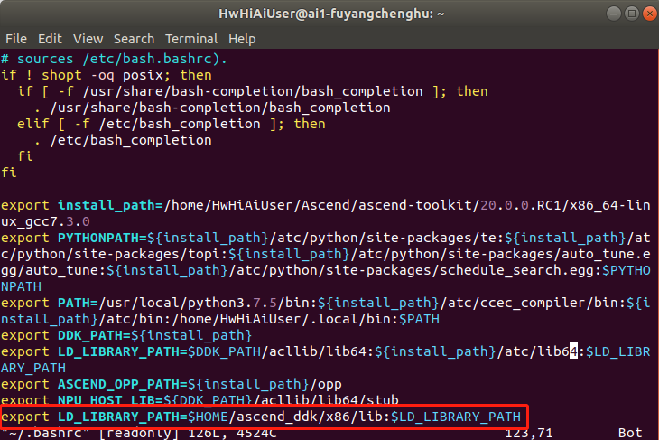

# 安装ffmpeg+opencv<a name="ZH-CN_TOPIC_0228768065"></a>
**注1：本指导是合设操作指导。开发环境与运行环境均为云端申请的插有300加速卡的环境。**  
**注2：运行环境可以存在多种架构（如arm架构下的Centos系统、arm架构下的Euleros系统、x86架构下的Ubuntu系统等），本指导中只以ai1环境（x86架构下的Ubuntu系统）为例说明**  
**注3：在合设环境中python3有python3.6和python3.7.5两个版本，其中python3.6是Ubuntu系统自带的，python3.7.5是安装开发环境时所安装的。在安装opencv时，为了同时编译出python3-opencv，需要指定具体的python版本，由于难以源码编译出python3.7.5版本的opencv，本指导使用的python3版本为python3.6。**
  
本文以普通用户为HwHiAiUser为例，请根据实际情况进行修改。  

1.  安装相关依赖。  
    在命令行中以普通用户执行以下命令，安装ffmpeg+opencv所需要的第三方依赖。  
    **sudo apt-get install build-essential libgtk2.0-dev libavcodec-dev libavformat-dev libjpeg-dev libtiff5-dev libswscale-dev git cmake**  
    **python3.6 -m pip install --upgrade pip**  
    **python3.6 -m pip install Cython numpy --user**

2.  安装ffmpeg。  
    1. 创建文件夹，用于存放编译后的文件。  
        **mkdir -p /home/HwHiAiUser/ascend_ddk/x86**

    2. 下载ffmpeg。  
        **cd $HOME**  
        **wget http://www.ffmpeg.org/releases/ffmpeg-4.1.3.tar.gz**  
        **tar -zxvf ffmpeg-4.1.3.tar.gz**  
        **cd ffmpeg-4.1.3**

    3. 安装ffmpeg。  
        **./configure --enable-shared --enable-pic --enable-static --disable-x86asm  --prefix=/home/HwHiAiUser/ascend_ddk/x86**  
        **make -j8**    
        **make install**

    4. 将ffmpeg添加到系统环境变量中，使得其他程序能够找到ffmpeg环境。  
        切换为root用户。  
        **su root**  
        打开conf配置文件。  
        **vim /etc/ld.so.conf.d/ffmpeg.conf**  
        在末尾添加一行。  
        **/home/HwHiAiUser/ascend_ddk/x86/lib**  
        使配置生效。  
        **ldconfig**   

    5. 配置profile系统文件。  
        **vim /etc/profile**  
        在末尾添加一行。  
        **export PATH=$PATH:/home/HwHiAiUser/ascend_ddk/x86/bin**  
        使配置文件生效。  
        **source /etc/profile**  
    
    6. 使opencv能找到ffmpeg。  
        **cp /home/HwHiAiUser/ascend_ddk/x86/lib/pkgconfig/\* /usr/share/pkgconfig**  
       切换回普通用户。  
        **exit**

3.  安装opencv。  
    1.  下载opencv。  
        **cd \$HOME**    
        **git clone -b 4.3.0 https://gitee.com/mirrors/opencv.git**  
        **git clone -b 4.3.0 https://gitee.com/mirrors/opencv_contrib.git**   
        **cd opencv**  
        **mkdir build**  
        **cd build**  

    2.  安装opencv。  
        ```
        cmake -D BUILD_SHARED_LIBS=ON  -D BUILD_opencv_python3=YES -D BUILD_TESTS=OFF -D CMAKE_BUILD_TYPE=RELEASE -D  CMAKE_INSTALL_PREFIX=/home/HwHiAiUser/ascend_ddk/x86 -D WITH_LIBV4L=ON -D OPENCV_EXTRA_MODULES=../../opencv_contrib/modules -D PYTHON3_LIBRARIES=/usr/lib/python3.6/config-3.6m-x86_64-linux-gnu/libpython3.6m.so  -D PYTHON3_NUMPY_INCLUDE_DIRS=/home/HwHiAiUser/.local/lib/python3.6/site-packages/numpy/core/include/ -D OPENCV_SKIP_PYTHON_LOADER=ON ..
        ```   
        **make -j8**  
        **make install**  

    3.  配置opencv。  
        更新系统库  
        **sudo ldconfig** 
 
4.   使python3.6-opencv生效。   
     **cp  /home/HwHiAiUser/ascend_ddk/x86/lib/python3.6/dist-packages/cv2.cpython-36m-x86_64-linux-gnu.so
 /home/HwHiAiUser/.local/lib/python3.6/site-packages**   
 

5.  修改环境变量。  
    程序编译时会链接LD_LIBRARY_PATH环境变量地址中的库文件，所以要将ffmpeg和opencv安装的库文件地址加到ai1环境的该环境变量中。  
   
    普通用户下执行以下命令进入配置文件。  
     **vi ~/.bashrc**   
    在最后添加  
    **export LD_LIBRARY_PATH=\\$HOME/ascend_ddk/x86/lib\:\\$LD_LIBRARY_PATH**
       
    
    执行以下命令使环境变量生效。  
    **source ~/.bashrc**