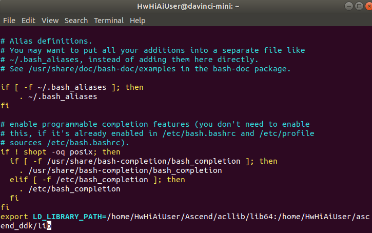

中文|[English](README_EN.md)

# 安装presenteragent
1.  下载PresentAgent。  
    **cd $HOME**  
    **wget https://c7xcode.obs.cn-north-4.myhuaweicloud.com/presenteragent/presenteragent.zip --no-check-certificate**  
    **unzip presenteragent.zip** 
2.  安装autoconf、automake、libtool依赖。  
    **sudo apt-get install autoconf automake libtool python3-pip**
3.  安装python库。  
    **python3 -m pip install pip --user**  
    **python3 -m pip install --upgrade pip --user**    
    **python3 -m pip install tornado==5.1.0 protobuf==3.5.1 numpy==1.14.2 --user**  
    **python3.7.5 -m pip install tornado==5.1.0 --user**  
4.  安装protobuf（按照如下命令一步步执行即可，由于需要交叉编译，所以需要编译两遍）。  
    **git clone -b 3.8.x https://gitee.com/mirrors/protobufsource.git protobuf**  
    **cd protobuf**  
    **git submodule update --init --recursive**  
    **./autogen.sh**  
    **bash configure**  
    **make -j8**  
    **sudo make install**  
    **make distclean**  
    **./configure --build=x86_64-linux-gnu --host=aarch64-linux-gnu --with-protoc=protoc**  
    **make -j8**  
    **sudo make install**    
    **su root**  
    **ldconfig**
5.  编译并安装PresenterAgent。  
    切换回普通用户。  
    **exit**    
    设置下环境变量，在命令行内执行。  
    **export DDK_PATH=$HOME/Ascend/ascend-toolkit/X.X.X/acllib_centos7.6.aarch64**   
    > **说明：**  
        **请将X.X.X替换为Ascend-Toolkit开发套件包的实际版本号。  
        例如：Toolkit包的包名为Ascend-Toolkit-20.0.RC1-x86_64-linux_gcc7.3.0.run，则此Toolkit的版本号为20.0.RC1。**   

    安装Presenteragent。  
    **cd $HOME/presenteragent/**   
    **make -j8**   
    **make install**  
    将编译好的so传到开发板上。  
    **scp $HOME/ascend_ddk/arm/lib/libpresenteragent.so HwHiAiUser@192.168.1.2:/home/HwHiAiUser**    
    **ssh HwHiAiUser@192.168.1.2**   
    **cp /home/HwHiAiUser/libpresenteragent.so /home/HwHiAiUser/ascend_ddk/arm/lib**  

6.  添加环境变量。（如已添加，请跳过本步骤）  
    程序编译时会链接LD_LIBRARY_PATH环境变量地址中的库文件，所以要将presenteragent的库文件地址加到该环境变量中。  
    **vi ~/.bashrc**  
    在最后添加  
    **export LD_LIBRARY_PATH=/home/HwHiAiUser/Ascend/acllib/lib64:/home/HwHiAiUser/ascend_ddk/arm/lib**
       
    执行以下命令使环境变量生效。  
    **source ~/.bashrc**  
 
