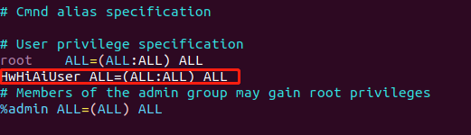

English|[中文](README.md)

# Python 3 Operating Environment Installation<a name="ZH-CN_TOPIC_0228768065"></a>

Perform the following operations on the developer board.

1. Switch to the **root** user.   
   **su root**   
   Grant the write permission on the **sudoers** file and open the file.   
   **chmod u+w /etc/sudoers**  
   **vi /etc/sudoers**   
   Add the following content below "# User privilege specification" in the **sudoers** file.   
   **HwHiAiUser ALL=(ALL:ALL) ALL**
   
   

2. Connect the developer board to the Internet (the password of the **root** user is **Mind@123**).   
   **vi /etc/netplan/01-netcfg.yaml**   
   Set the following parameters:   
   **Note: The configuration of both netplan and Python is indentation-sensitive.**
   
   ```
   network:
     version: 2
   #  renderer: NetworkManager
     renderer: networkd
     ethernets:
       eth0:
         dhcp4: yes 
   
       usb0:
         dhcp4: no 
         addresses: [192.168.1.2/24] 
         gateway4: 192.168.0.1
   ```
   
   
   
   Run the following command for the configuration to take effect and connect the ETH port of the developer board to an ETH cable.   
   **netplan apply**  
   **exit**

3. Replace the Ubuntu 18.04 (Arm) sources.   
   **sudo vi /etc/apt/sources.list**   
   Replace the content in the file with sources provided in the following link.   
   https://bbs.huaweicloud.com/forum/thread-69663-1-1.html
   
   Update the sources.   
   **sudo apt-get update**

4. Install pip3.   
   **sudo apt install python3-pip**

5. Install the dependencies   
   **sudo apt-get install libtiff5-dev libjpeg8-dev zlib1g-dev libfreetype6-dev liblcms2-dev libwebp-dev tcl8.6-dev tk8.6-dev python-tk**

6. Install Python.   
   **pip3 install --upgrade pip**  
   **pip3 install pillow --user**  
   **pip3 install protobuf --user**  
   **pip3 install Cython --user**    
   **pip3 install numpy --user**