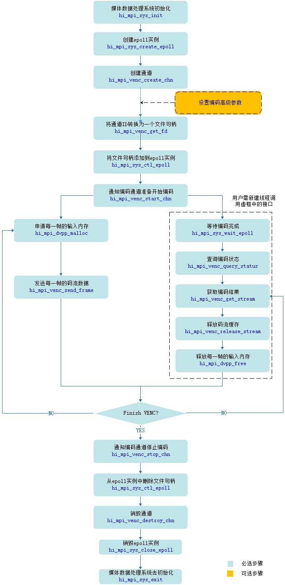

# readme<a name="ZH-CN_TOPIC_0000001072980318"></a>

### 本样例为大家学习昇腾软件栈提供参考，非商业目的！
### 本样例适配5.0.3及以上版本，支持产品为310P设备。


## 功能描述<a name="section09679311389"></a>

DVPP 中的VENC功能模块，实现将YUV420SP、YVU420SP格式的视频编码成H264、H265格式的码流。

## 原理介绍<a name="section19985135703818"></a>

样例中的主要接口调用流程如下：



## 目录结构<a name="section86232112399"></a>

```
├──————CMakeLists.txt        // 编译脚本
├──————libHisiSdkCodec       // 示例代码文件所在的目录
```

## 环境要求<a name="section10528164623911"></a>

-   操作系统及架构：Ubuntu 18.04 x86\_64、Ubuntu 18.04 aarch64、EulerOS aarch64
-   编译器：

    EP标准形态编译器：g++

-   芯片：Ascend310P
-   已完成昇腾AI软件栈在开发环境、运行环境上的部署。

## 准备测试数据<a name="section13765133092318"></a>

请从[https://github.com/Ascend/tools/tree/master/dvpp_sample_input_data](https://github.com/Ascend/tools/tree/master/dvpp_sample_input_data)获取该样例的输入图片、视频数据。

如果使用wget方式下载图片或视频，请先进入[https://github.com/Ascend/tools/tree/master/dvpp_sample_input_data](https://github.com/Ascend/tools/tree/master/dvpp_sample_input_data)页面，单击对应的图片或视频，进入查看图片或视频的页面后，单击页面右侧的“原始数据”，在浏览器的地址栏中才是获取图片或视频的地址，再使用wget命令从该地址中获取图片或视频。

## 编译运行<a name="section3789175815018"></a>

1. 以运行用户登录开发环境，编译代码。

   1. 设置环境变量，编译脚本CMakeLists.txt通过环境变量所设置的头文件、库文件的路径来编译代码。

      如下为示例，$HOME/Ascend表示runtime标准形态安装包的安装路径，请根据实际情况替换。

      ```
      export DDK_PATH=$HOME/Ascend
      export NPU_HOST_LIB=$HOME/Ascend/runtime/lib64/stub/
      ```

    2. 切换到venc\_sample所在目录，依次执行如下命令执行编译。

       ```
       mkdir build
       cd build
       cmake .. -DCMAKE_CXX_COMPILER=g++ -DCMAKE_SKIP_RPATH=TRUE
       make
       ```

       在“venc\_sample/build“目录下会生成可执行程序venc\_demo。


2. 以运行用户将开发环境的“venc\_sample/build“目录下的可执行程序venc\_demo以及[准备测试数据](#section13765133092318)中测试数据上传到运行环境（Host）的同一目录下，例如“$HOME/dvpp/venc\_sample“。

3. 运行应用。

   1. 切换到可执行文件venc\_demo所在的目录，例如“$HOME/dvpp/venc\_sample“，给该目录下的venc\_demo文件加执行权限。

      ```
      chmod +x  venc_demo
      ```

   2. 设置环境变量。“$HOME/Ascend“表示runtime标准形态安装包的安装路径，请根据实际情况替换。

      ```
      export LD_LIBRARY_PATH=$HOME/Ascend/runtime/lib64
      ```

   3. <a name="li163081446764"></a>运行应用。

      - 示例描述：本命令用于调用VENC编码NV12格式的yuv，得到h265格式的码流。

      - 输入视频：宽128像素、高128像素、名称为“dvpp\_venc\_128x128\_nv12.yuv”的yuv。

      - 输出码流：宽128像素、高128像素、格式为h265的码流。

      - 运行应用的命令示例如下：

        ```
        ./venc_demo --ImgWidth 128 --ImgHeight 128 --ChnNum 1 --CodecType 1 --InputFileName ./dvpp_venc_128x128_nv12.yuv --OutputFileName ./output_%d.265 --PixelFormat 1
        ```

      - 运行可执行文件的通用参数说明如下所示：

        - ImgWidth：输入视频的宽度，范围\[128, 4096\]。对于h264格式，最大分辨率的宽高乘积不超过4096 \* 2304。

        - ImgHeight：输入视频的高度，范围\[128, 4096\]。对于h264格式，最大分辨率的宽高乘积不超过4096 \* 2304。

        - ImgStride：输入视频的跨度（用户不设置默认等于宽度，一帧NV12/NV21数据大小为:跨度x高度x3/2）。

        - ChnNum：创建编码通道的数目,范围\[1, 256\]。

        - CodecType：编码协议类型

          - 0：h264
          - 1：h265

        - BitRate：编码的码率。

          用户不主动设置码率时，样例内部会根据分辨率和帧率设置一个匹配的码率，具体如下:

          根据宽x高大小匹配分辨率区间：

          小于等于640x360:           BitRate = 1024 \* 1 + 1024 \* FrameRate / 30;

          640x360-1280x720:       BitRate = 1024 \* 2 + 1024 \* FrameRate / 30;

          1280x720-1920x1080:   BitRate = 1024 \* 2 + 2048 \* FrameRate / 30;

          1920x1080-2880x1856: BitRate = 1024 \* 3 + 3072 \* FrameRate / 30;

          2880x1856-3840x2160: BitRate = 1024 \* 5 + 5120 \* FrameRate / 30;

          大于3840x2160:               BitRate = 1024 \* 10 + 5120 \* FrameRate / 30;

        - FrameRate：编码的帧率（用户不主动设置帧率时，默认值为30fps）。

        - HighPriority：编码通道的优先级：

          - 0：普通
          - 非0：高优先级

        - InputFileName：输入视频文件的路径，包含文件名。

        - OutputFileName：输出码流文件的路径，包含文件名，建议使用格式:xxx\_%d.265 %d区分不同通道。

        - PixelFormat：输入yuv的格式。

          - 1：NV12
          - 2：NV21

        - SaveOutData：是否保存输出解码结果。

          - 0：不保存
          - 非0：保存

        - Profile：编码profile等级，如果编码输出H.264码流，该参数的取值范围为\[0,2\]；如果编码输出H.265码流，该参数只能设置为0。

        - IFrameGop：I帧间隔\[1, 65536‬\]，1为全I帧，默认65536。

        - StartChnlId：多进程测试指定每个进程起始通道号，范围\[0, 255\]，默认为0。

        - PerfTest：指定功能测试还是性能测试：

          - 0：功能测试（输入YUV文件所有帧读取一遍，编码完成后结束流程）；
          - 非0：性能测试（考虑读取YUV文件耗时，对性能有影响，性能测试只读取一帧，循环发送，指定帧数编码完成后结束流程）。

        - PerfFrameNum：性能测试输入帧数，默认为300。

   


