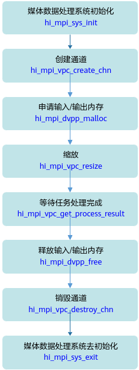

# readme<a name="ZH-CN_TOPIC_0000001073131184"></a>

### 本样例为大家学习昇腾软件栈提供参考，非商业目的！
### 本样例适配5.0.3及以上版本，支持产品为310P设备。


## 功能描述<a name="section09679311389"></a>

DVPP中的VPC功能模块，实现图片的抠图、缩放、边界填充、色域转换、金字塔、色彩重映射、直方图统计等功能。

## 原理介绍<a name="section19985135703818"></a>

样例中的关键接口调用流程如下：




## 目录结构<a name="section86232112399"></a>


```
├──————CMakeLists.txt        // 编译脚本
├──————common                // 示例代码文件所在的目录
├──————sample_vpc.cpp        // 示例代码文件所在的目录
```

## 环境要求<a name="section10528164623911"></a>

- 操作系统及架构：Ubuntu 18.04 x86\_64、Ubuntu 18.04 aarch64、EulerOS aarch64

-   编译器：

    EP标准形态编译器：g++

- 芯片：Ascend310P

- 已完成昇腾AI软件栈在开发环境、运行环境上的部署。


## 准备测试数据<a name="section13765133092318"></a>

请从[https://github.com/Ascend/tools/tree/master/dvpp_sample_input_data](https://github.com/Ascend/tools/tree/master/dvpp_sample_input_data)获取该样例的输入图片、视频数据。

如果使用wget方式下载图片或视频，请先进入[https://github.com/Ascend/tools/tree/master/dvpp_sample_input_data](https://github.com/Ascend/tools/tree/master/dvpp_sample_input_data)页面，单击对应的图片或视频，进入查看图片或视频的页面后，单击页面右侧的“原始数据”，在浏览器的地址栏中才是获取图片或视频的地址，再使用wget命令从该地址中获取图片或视频。

## 编译运行

1. 以运行用户登录开发环境，编译代码。

   1. 设置环境变量，编译脚本CMakeLists.txt通过环境变量所设置的头文件、库文件的路径来编译代码。

      如下为示例，$HOME/Ascend表示runtime标准形态安装包的安装路径，请根据实际情况替换。

      ```
      export DDK_PATH=$HOME/Ascend
      export NPU_HOST_LIB=$HOME/Ascend/runtime/lib64/stub/
      ```
   2. 切换到vpc sample所在目录，依次执行如下命令执行编译。

      ```
      mkdir build
      cd build
      cmake .. -DCMAKE_CXX_COMPILER=g++ -DCMAKE_SKIP_RPATH=TRUE
      make
      ```

      在“vpc\_sample/build/src“目录下会生成可执行程序vpc\_demo。


2. 以运行用户将开发环境的“vpc\_sample/build/src“目录下的可执行程序vpc\_demo以及[准备测试数据](#section13765133092318)中测试数据拷贝到运行环境（Host）的同一目录下，例如“$HOME/dvpp/vpc\_sample“。

3. 运行应用。

   1. 切换到可执行文件vpc\_demo所在的目录，例如“$HOME/dvpp/vpc\_sample“，给该目录下的vpc\_demo文件加执行权限。

      ```
      chmod +x vpc_demo
      ```

   2. 设置环境变量，请根据实际情况替换。

      ```
      export LD_LIBRARY_PATH=$HOME/Ascend/runtime/lib64
      ```

   3. <a name="li163081446761"></a>运行应用。

      运行应用的命令示例参见[抠图](#section56911075516)~[多图抠图+缩放+边界填充](#section2082361014539)。

      运行可执行文件的通用参数说明如下所示：

      -   img\_width：输入图像的宽度。
      -   img\_height：输入图像的高度。
      -   in\_format：VPC输入图像的格式如下，输入对应数字即可。

          ```
          HI_PIXEL_FORMAT_YUV_400 = 0,            // YUV400 8bit
          HI_PIXEL_FORMAT_YUV_SEMIPLANAR_420 = 1, // YUV420SP NV12 8bit
          HI_PIXEL_FORMAT_YVU_SEMIPLANAR_420 = 2, // YUV420SP NV21 8bit
          HI_PIXEL_FORMAT_YUV_SEMIPLANAR_422 = 3, // YUV422SP NV12 8bit
          HI_PIXEL_FORMAT_YVU_SEMIPLANAR_422 = 4, // YUV422SP NV21 8bit
          HI_PIXEL_FORMAT_YUV_SEMIPLANAR_444 = 5, // YUV444SP NV12 8bit
          HI_PIXEL_FORMAT_YVU_SEMIPLANAR_444 = 6, // YUV444SP NV21 8bit
          HI_PIXEL_FORMAT_YUYV_PACKED_422 = 7,    // YUV422P YUYV 8bit
          HI_PIXEL_FORMAT_UYVY_PACKED_422 = 8,    // YUV422P UYVY 8bit
          HI_PIXEL_FORMAT_YVYU_PACKED_422 = 9,    // YUV422P YVYU 8bit
          HI_PIXEL_FORMAT_VYUY_PACKED_422 = 10,   // YUV422P VYUY 8bit
          HI_PIXEL_FORMAT_YUV_PACKED_444 = 11,    // YUV444P 8bit
          HI_PIXEL_FORMAT_RGB_888 = 12,           // RGB888
          HI_PIXEL_FORMAT_BGR_888 = 13,           // BGR888
          HI_PIXEL_FORMAT_ARGB_8888 = 14,         // ARGB8888
          HI_PIXEL_FORMAT_ABGR_8888 = 15,         // ABGR8888
          HI_PIXEL_FORMAT_RGBA_8888 = 16,         // RGBA8888
          HI_PIXEL_FORMAT_BGRA_8888 = 17,         // BGRA8888
          HI_PIXEL_FORMAT_YUV_SEMIPLANAR_440 = 1000, // YUV440SP NV12 8bit
          HI_PIXEL_FORMAT_YVU_SEMIPLANAR_440 = 1001, // YUV440SP NV21 8bit
          ```

      -   out\_format：VPC输出图像的格式如下，输入对应数字即可。

          ```
          HI_PIXEL_FORMAT_YUV_400 = 0,            // YUV400 8bit
          HI_PIXEL_FORMAT_YUV_SEMIPLANAR_420 = 1, // YUV420SP NV12 8bit
          HI_PIXEL_FORMAT_YVU_SEMIPLANAR_420 = 2, // YUV420SP NV21 8bit
          HI_PIXEL_FORMAT_YUV_SEMIPLANAR_422 = 3, // YUV422SP NV12 8bit
          HI_PIXEL_FORMAT_YVU_SEMIPLANAR_422 = 4, // YUV422SP NV21 8bit
          HI_PIXEL_FORMAT_YUV_PACKED_444 = 11,    // YUV444P 8bit
          HI_PIXEL_FORMAT_RGB_888 = 12,           // RGB888
          HI_PIXEL_FORMAT_BGR_888 = 13,           // BGR888
          HI_PIXEL_FORMAT_ARGB_8888 = 14,         // ARGB8888
          HI_PIXEL_FORMAT_ABGR_8888 = 15,         // ABGR8888
          HI_PIXEL_FORMAT_RGBA_8888 = 16,         // RGBA8888
          HI_PIXEL_FORMAT_BGRA_8888 = 17,         // BGRA8888
          ```

      -   out\_width：输出图像宽度。
      -   out\_height：输出图像高度。
      -   in\_image\_file：输入图像文件的路径，包含文件名。
      -   out\_image\_file：输出图像文件的路径，包含文件名。
      -   thread\_num：线程数
      -   queue_len：通道任务队列深度
      -   test\_type，该参数表示测试的功能类型，各取值的含义如下：
          -   1：抠图
          -   2：缩放
          -   3：抠图+缩放
          -   4：单图抠图+缩放+贴图
          -   5：单图抠图+缩放+边界填充
          -   6：色域转换
          -   7：边界填充
          -   8：金字塔
          -   9：直方图统计
          -   10：色彩重映射
          -   11：多图抠图+缩放+贴图
          -   12：多图抠图+缩放+边界填充
          -   20：图片宽/高对齐预处理


## 抠图<a name="section56911075516"></a>

```
./vpc_demo --test_type 1 --in_image_file dvpp_vpc_1920x1080_nv12.yuv --out_image_file crop.yuv --img_width 1920 --img_height 1080 --crop_x 0 --crop_y 0 --crop_width 960 --crop_height 540 --out_width 960 --out_height 540 --in_format 1 --out_format 1 --multi_count 1 --queue_len 32
```

-   示例描述：使用VPC从分辨率1920\*1080的原图中抠出以左上角为原点、分辨率960\*540的图片。
-   输入图像：宽1920像素、高1080像素、格式为yuv420nv12，名称为dvpp\_vpc\_1920x1080\_nv12.yuv的图片。
-   输出图像：宽960像素、高540像素、格式为yuv420nv12，名称为crop.yuv的图片。
-   本示例的通用参数说明请参见[3](#li163081446761)，关键参数说明如下：
    -   crop\_x：裁剪图片的左偏移。
    -   crop\_y：裁剪图片的上偏移。
    -   crop\_width：裁剪图片的宽度。
    -   crop\_height：裁剪图片的高度。
    -   multi\_count 1：剪裁图片数量。支持剪裁多张图片。


## 缩放<a name="section15497132717511"></a>

```
./vpc_demo --test_type 2 --in_image_file dvpp_vpc_1920x1080_nv12.yuv --out_image_file resize.yuv --img_width 1920 --img_height 1080 --out_width 960 --out_height 540  --fx 0 --fy 0 --interpolation 0 --in_format 1 --out_format 1 --queue_len 32
```

-   示例描述：优先根据输出文件大小进行缩放，当输出宽高都为0时，根据fx和fy进行配置。
-   输入图像：宽1920像素、高1080像素、格式为yuv420nv12的图片。
-   输出图像：宽960像素、高540像素、格式为yuv420nv12，名称为resize.yuv的图片。
-   本示例的通用参数说明请参见[3](#li163081446761)，关键参数说明如下：
    -   fx：x方向的缩放比例。
    -   fy：y方向的缩放比例。
    -   interpolation：缩放算法。
        -   0：bilinear
        -   1：nearest neighbor


## 抠图+缩放<a name="section325163225117"></a>

```
./vpc_demo --test_type 3 --in_image_file dvpp_vpc_1920x1080_nv12.yuv --out_image_file cropResize.yuv --img_width 1920 --img_height 1080--crop_x 0 --crop_y 0 --crop_width 960 --crop_height 540 --resize_width 1920 --resize_height 1080 --interpolation 0  --out_width 1920 --out_height 1080 --in_format 1 --out_format 1 --multi_count 1 --queue_len 32
```

-   示例描述：先抠图，后缩放。
-   输入图像：宽1920像素、高1080像素、格式为yuv420nv12的图片。
-   输出图像：宽1920像素、高1080像素、格式为yuv420nv12，名称为cropResize.yuv的图片。
-   本示例的通用参数说明请参见[3](#li163081446761)，关键参数说明如下：
    -   crop\_x：裁剪图片的左偏移。
    -   crop\_y：裁剪图片的上偏移。
    -   crop\_width：裁剪图片的宽度。
    -   crop\_height：裁剪图片的高度。
    -   resize\_width：缩放输出宽度。
    -   resize\_height：缩放输出高度。
    -   interpolation：缩放算法。
        -   0：bilinear
        -   1：nearest neighbor

    -   multi\_count：剪裁缩放图片数量。支持多张图片。


## 单图抠图+缩放+贴图<a name="section11644204213518"></a>

```
./vpc_demo --test_type 4 --in_image_file dvpp_vpc_1920x1080_nv12.yuv --out_image_file cropResizePaste.yuv --img_width 1920 --img_height 1080 --out_width 1920 --out_height 1080 --crop_x 0 --crop_y 0 --crop_width 960 --crop_height 540 --resize_width 1280 --resize_height 720 --dest_left_offset 320 --dest_top_offset 320 --interpolation 0 --in_format 1 --out_format 1 --multi_count 1 --queue_len 32
```

-   示例描述：单张输入图片先抠图，后缩放，再贴图。
-   输入图像：宽1920像素、高1080像素、格式为yuv420nv12的图片。
-   输出图像：宽1920像素、高1080像素、格式为yuv420nv12，名称为cropResizePaste.yuv的图片。
-   本示例的通用参数说明请参见[3](#li163081446761)，关键参数说明如下：
    -   crop\_x：裁剪图片的左偏移。
    -   crop\_y：裁剪图片的上偏移。
    -   crop\_width：裁剪图片的宽度。
    -   crop\_height：裁剪图片的高度。
    -   resize\_width：缩放输出宽度。
    -   resize\_height：缩放输出高度。
    -   interpolation：缩放算法。
        -   0：bilinear
        -   1：nearest neighbor

    -   dest\_left\_offset：在目标图片贴图的左上角的x坐标。
    -   dest\_top\_offset：在目标图片贴图的左上角的y坐标。
    -   multi\_count：剪裁缩放图片数量。支持多张图片。


## 单图抠图+缩放+边界填充<a name="section5854252115115"></a>

```
./vpc_demo --test_type 5 --in_image_file dvpp_vpc_1920x1080_nv12.yuv --out_image_file cropResizePadding.yuv --img_width 1920 --img_height 1080 --out_width 1920 --out_height 1080 --crop_x 0 --crop_y 0 --crop_width 1280 --crop_height 720 --resize_width 960 --resize_height 540 --dest_left_offset 320 --dest_top_offset 320 --interpolation 0 --in_format 1 --out_format 1 --padding_val_r 255 --padding_val_g 255 --padding_val_b 255 --padding_mode 0 --multi_count 1 --queue_len 32
```

-   示例描述：先抠图，后缩放，再边界填充。
-   输入图像：宽1920像素、高1080像素、格式为yuv420nv12的图片。
-   输出图像：宽1920像素、高1080像素、格式为yuv420nv12，名称为cropResizePadding.yuv的图片。
-   本示例的通用参数说明请参见[3](#li163081446761)，关键参数说明如下：
    -   crop\_x：裁剪图片的左偏移。
    -   crop\_y：裁剪图片的上偏移。
    -   crop\_width：裁剪图片的宽度。
    -   crop\_height：裁剪图片的高度。
    -   resize\_width：缩放输出宽度。
    -   resize\_height：缩放输出高度。
    -   interpolation：缩放算法。
        -   0：bilinear
        -   1：nearest neighbor

    -   dest\_left\_offset：在目标图片贴图的左上角的x坐标。
    -   dest\_top\_offset：在目标图片贴图的左上角的y坐标。
    -   padding\_val\_r：填充的像素的r分量。
    -   padding\_val\_g：填充的像素的g分量。
    -   padding\_val\_b：填充的像素的b分量。
    -   padding\_mode：填充模式。
        -   0：添加有颜色的常数值边界。设置该模式时，可以通过padding\_val\_r、padding\_val\_g、padding\_val\_b参数设置颜色。
        -   1：重复最后一个元素。举例: aaaaaa|abcdefgh|hhhhhhh。
    -   multi\_count：剪裁缩放图片数量。支持多张图片。


## 色域转换<a name="section5722112135213"></a>

```
./vpc_demo --test_type 6 --in_image_file dvpp_vpc_1920x1080_nv12.yuv --out_image_file cvtColor.bgra --img_width 1920 --img_height 1080 --out_width 1920 --out_height 1080 --in_format 1 --out_format 14 --queue_len 32
```

-   示例描述：色域转换。
-   输入图像：宽1920像素、高1080像素、格式为yuv420nv12的图片。
-   输出图像：宽1920像素、高1080像素、格式为argb8888的，名为cvtColor.bgra的图片
-   本示例的通用参数说明请参见[3](#li163081446761)。

## 边界填充<a name="section379513130524"></a>

```
./vpc_demo --test_type 7 --in_image_file dvpp_vpc_1920x1080_nv12.yuv --out_image_file padding.yuv --img_width 1920 --img_height 1080 --out_width 1924 --out_height 1084 --in_format 1 --out_format 1 --padding_mode 0 --top_padding_size 2 --bottom_padding_size 2 --left_padding_size 2 --right_padding_size 2 --padding_val_r 255 --padding_val_g 255 --padding_val_b 255 --queue_len 32
```

-   示例描述：边界填充。
-   输入图像：宽1920像素、高1080像素、格式为yuv420nv12的图片。
-   输出图像：宽1924像素、高1084像素、格式为yuv420nv12，名为padding.yuv的图片。
-   本示例的通用参数说明请参见[3](#li163081446761)，关键参数说明如下：
    -   padding\_mode：填充模式。
        -   0：添加有颜色的常数值边界。设置该模式时，可以通过padding\_val\_r、padding\_val\_g、padding\_val\_b参数设置颜色。
        -   1：重复最后一个元素。举例: aaaaaa|abcdefgh|hhhhhhh。
        -   2：带边界元素的镜像。举例：ba|abcde-fgh|hg。
        -   3：不带边界元素的镜像。举例：cb|abcde-fgh|gf。

    -   top\_padding\_size：图片上方填充宽度。
    -   bottom\_padding\_size：图片下方填充宽度。
    -   left\_padding\_size：图片左边填充宽度。
    -   right\_padding\_size：图片右边填充宽度。
    -   padding\_val\_r：填充的像素的r分量。当padding\_mode为0时，需要设置该参数。
    -   padding\_val\_g：填充的像素的g分量。当padding\_mode为0时，需要设置该参数。
    -   padding\_val\_b：填充的像素的b分量。当padding\_mode为0时，需要设置该参数。


## 金字塔<a name="section3994172425214"></a>

```
./vpc_demo --test_type 8 --in_image_file dvpp_vpc_1920x1080_yuv400.yuv --out_image_file pyramid.yuv400 --img_width 1920 --img_height 1080 --in_format 0 --filter_level 4 --divisor 256 --pyramid_padding_mode 0 --queue_len 32
```

-   示例描述：图像金字塔功能，其中滤波器参数、输出图片数等已在代码中配置。
-   输入图像：宽1920像素、高1080像素、格式为yuv400的图片。
-   输出图像：对应的滤波后的yuv400格式的图片。
-   本示例的通用参数说明请参见[3](#li163081446761)，关键参数说明如下：
    -   pyramid\_padding\_mode：金字塔边界填充模式。
        -   0：添加常数值边界。
        -   1：重复最后一个元素。举例: aaaaaa|abcdefgh|hhhhhhh。
        -   2：带边界元素的镜像。举例：ba|abcde-fgh|hg。
    -   filter\_level：金字塔层数，取值范围1-4。
    -   divisor：滤波器除数，取值范围2的幂次方。


## 直方图统计<a name="section145662380524"></a>

```
./vpc_demo --test_type 9 --in_image_file dvpp_vpc_1920x1080_nv12.yuv --out_image_file histogram --img_width 1920 --img_height 1080 --in_format 1 --queue_len 32
```

-   示例描述：直方图统计，即对输入图片的每个分量的像素个数进行统计。
-   输入图像：宽1920像素、高1080像素、格式为yuv420nv12的图片。
-   输出：histogram.txt文件
-   本示例的通用参数说明请参见[3](#li163081446761)。

## 色彩重映射<a name="section187344910524"></a>

```
./vpc_demo --test_type 10 --in_image_file dvpp_vpc_1920x1080_nv12.yuv --out_image_file remap.yuv --img_width 1920 --img_height 1080 --in_format 1 --out_format 1 --queue_len 32
```

-   示例描述：LUT重映射，其中重映射值已在代码中配置。
-   输入图像：宽1920像素、高1080像素、格式为yuv420nv12的图片。
-   输出图像：宽1920像素、高1080像素、格式为yuv420nv12的重映射后的图片，名称为remap.yuv。
-   本示例的通用参数说明请参见[3](#li163081446761)。

## 多图抠图+缩放+贴图<a name="section14440521531"></a>

```
./vpc_demo --test_type 11 --in_image_file dvpp_vpc_1920x1080_nv12.yuv --out_image_file batchCropResizePaste.yuv --img_width 1920 --img_height 1080 --out_width 1920 --out_height 1080 --crop_x 0 --crop_y 0 --crop_width 960 --crop_height 540 --resize_width 1280 --resize_height 720 --dest_left_offset 320 --dest_top_offset 320 --interpolation 0 --in_format 1 --out_format 1 --in_image_num 1 --multi_count 2 --queue_len 32
```

-   示例描述：多张输入图片先抠图，后缩放，再贴图。
-   输入图像：宽1920像素、高1080像素、格式为yuv420nv12的图片。其中多张输入图像名称以下标进行区分，如第一张图为dvpp_vpc_1920x1080_nv12.yuv_0，用户需自行拷贝示例图像并进行重命名。
-   输出图像：宽1920像素、高1080像素、格式为yuv420nv12，名为batchCropResizePaste.yuv的两张图片。
-   本示例的通用参数说明请参见[3](#li163081446761)，关键参数说明如下：
    -   crop\_x：裁剪图片的左偏移。
    -   crop\_y：裁剪图片的上偏移。
    -   crop\_width：裁剪图片的宽度。
    -   crop\_height：裁剪图片的高度。
    -   resize\_width：缩放输出宽度。
    -   resize\_height：缩放输出高度。
    -   interpolation：缩放算法。
        -   0：bilinear
        -   1：nearest neighbor

    -   dest\_left\_offset：在目标图片贴图的左上角的x坐标。
    -   dest\_top\_offset：在目标图片贴图的左上角的y坐标。
    -   in\_image\_num：输入图片数量。支持多张图片。
    -   multi\_count：剪裁缩放图片数量。支持多张图片。


## 多图抠图+缩放+边界填充<a name="section2082361014539"></a>

```
./vpc_demo --test_type 12 --in_image_file dvpp_vpc_1920x1080_nv12.yuv --out_image_file batchCropResizePadding.yuv --img_width 1920 --img_height 1080 --out_width 1920 --out_height 1080 --crop_x 0 --crop_y 0 --crop_width 1280 --crop_height 720 --resize_width 960 --resize_height 540 --dest_left_offset 320 --dest_top_offset 320 --interpolation 0 --in_format 1 --out_format 1 --padding_val_r 255 --padding_val_g 255 --padding_val_b 255 --padding_mode 0 --in_image_num 1 --multi_count 2 --queue_len 32
```

-   示例描述：多张输入图片先抠图，后缩放，再边界填充。
-   输入图像：宽1920像素、高1080像素、格式为yuv420nv12的图片。其中多张输入图像名称以下标进行区分，如第一张图为dvpp_vpc_1920x1080_nv12.yuv_0，用户需自行拷贝示例图像并进行重命名。
-   输出图像：宽1920像素、高1080像素、格式为yuv420nv12，名为batchCropResizePadding.yuv的两张图片。
-   本示例的通用参数说明请参见[3](#li163081446761)，关键参数说明如下：
    -   crop\_x：裁剪图片的左偏移。
    -   crop\_y：裁剪图片的上偏移。
    -   crop\_width：裁剪图片的宽度。
    -   crop\_height：裁剪图片的高度。
    -   resize\_width：缩放输出宽度。
    -   resize\_height：缩放输出高度。
    -   interpolation：缩放算法。
        -   0：bilinear
        -   1：nearest neighbor

    -   dest\_left\_offset：在目标图片贴图的左上角的x坐标。
    -   dest\_top\_offset：在目标图片贴图的左上角的y坐标。
    -   padding\_val\_r：填充的像素的r分量，或者y分量。若输入输出都是YUV格式，填充YUV分量的值。反之，填充RGB分量的值。
    -   padding\_val\_g：填充的像素的g分量，或者u分量。
    -   padding\_val\_b：填充的像素的b分量，或者v分量。
    -   padding\_mode：填充模式。
        -   0：添加有颜色的常数值边界。设置该模式时，可以通过padding\_val\_r、padding\_val\_g、padding\_val\_b参数设置颜色。
        -   1：重复最后一个元素。举例: aaaaaa|abcdefgh|hhhhhhh。
    -   in\_image\_num：输入图片数量。支持多张图片。
    -   multi\_count：剪裁缩放图片数量。支持多张图片。

## 图片宽/高对齐预处理<a name="section2082361014540"></a>

```
./vpc_demo --test_type 20 --in_image_file dvpp_vpc_382x300_nv12.yuv --out_image_file 384x300_nv12.yuv --img_width 382 --img_height 300 --in_width_align 1 --in_height_align 1 --out_width_align 16 --out_height_align 2  --in_format 1
```

- 示例描述：按用户指定的输出图片的宽对齐、高对齐，输出满足要求的图片。

  该示例是通过“vpc_sample/src/common/sample_comm.cpp”中的pre_process函数实现的。在该函数内，宽或高的对齐值的取值范围是(0 , 128]，且对齐值必须是2的幂次方。宽stride最小值为32。您可以参考该函数的实现，根据实际场景调整。

  pre_process函数的完整入参包括：输入图像的文件路径（inputFileName）、宽（width）、高（height）、宽对齐值（inWidthAlign）、高对齐值（inHeightAlign）、格式（format），以及输出图像的文件路径（outputFileName）、宽对齐值（outWidthAlign）、高对齐值（outHeightAlign）。pre_process函数参数配置说明如下：

  1. 场景一：用户想将原始大小图像转换成对齐图像，则只需要配置输入图像的文件路径、宽、高、格式，以及输出图像的文件路径、宽对齐值、高对齐值。
  2. 场景二：用户想将对齐图像转换为原始大小图像，则只需要配置输入图像的文件路径、宽、高、宽对齐值、高对齐值、格式，以及输出图像的文件路径。
  3. 场景三：用户想将对齐图像转换为另一种对齐的图像，则需要配置完整参数。

  pre_process函数的实现逻辑如下;

  1. 基于入参，调用configure_stride_and_buffer_size函数，计算出输入和输出图像的宽stride、高stride以及所需输入、输出内存大小；
  2. 申请输入、输出内存，向输入内存中读取输入图像数据；
  3. 基于入参所配置的对齐值，调用get_dst_stride_picture函数将输入内存中的数据拷贝到输出内存中；
  4. 将输出内存中的图像数据保存到本地。

-   输入图像：宽382像素、高300像素、格式为yuv420SP NV12的图片，图片名称为dvpp_vpc_382x300_nv12.yuv。
-   输出图像：宽384像素、高300像素、格式为yuv420SP NV12的图片，图片名称为384x300_nv12.yuv。
-   参数说明如下：
    -   test_type、in_image_file、out_image_file、img_width、img_height、in_format参数说明请参见[3](#li163081446761)。
    -   in_width_align：输入图片的宽对齐值，例如输入图片的宽为382，满足1对齐。
    -   in_height_align：输入图片的高对齐值，例如输入图片的高为300，满足1对齐。
    -   out_width_align：输出图片的宽对齐值，例如输入图片的宽为382，通过此参数设置输出图片的宽需满足16对齐，则输出图片的宽为384。
    -   out_height_align：输出图片的高对齐值，例如输入图片的高为300，通过此参数设置输出图片的高需满足2对齐，则输出图片的高为300，因为300已满足2对齐。