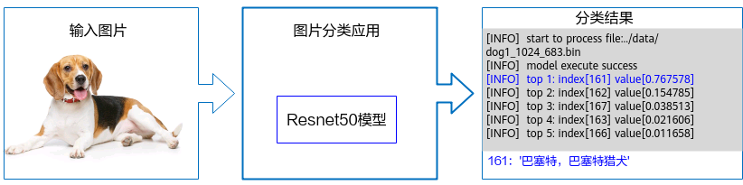

# 快速入门<a name="ZH-CN_TOPIC_0000001273703989"></a>

在本节中，您可以通过一个简单的图片分类应用了解使用AscendCL接口开发应用的基本过程以及开发过程中涉及的关键概念。

## 什么是图片分类应用？<a name="zh-cn_topic_0000001225510872_zh-cn_topic_0000001086737739_section359516351284"></a>

“图片分类应用”，从名称上，我们也能直观地看出它的作用：按图片所属的类别来区分图片。



但“图片分类应用”是怎么做到这一点的呢？当然得先有一个能做到图片分类的模型，我们可以直接使用一些训练好的开源模型，也可以基于开源模型的源码进行修改、重新训练，还可以自己基于算法、框架构建适合自己的模型。

鉴于当前我们是入门内容，此处我们直接获取已训练好的开源模型，毕竟这种最简单、最快。此处我们选择的是Caffe框架的ResNet-50模型。

ResNet-50模型的基本介绍如下：

-   输入数据：RGB格式、224\*224分辨率的输入图片
-   输出数据：图片的类别标签及其对应置信度

> **说明：** 
>-   置信度是指图片所属某个类别可能性。
>-   类别标签和类别的对应关系与训练模型时使用的数据集有关，需要查阅对应数据集的标签及类别的对应关系。

## 环境要求<a id ="zh-cn_topic_0000001225510872_section3324848134412"></a>

-   操作系统及架构：CentOS 7.6 x86\_64、CentOS aarch64、Ubuntu 18.04 x86\_64、EulerOS x86、EulerOS aarch64
-   编译器：g++ 或 aarch64-linux-gnu-g++
-   芯片：Ascend 310、Ascend 310P、Ascend 910
-   python及依赖的库：python3.7.5、Pillow库
-   已在环境上部署昇腾AI软件栈，并配置对应的的环境变量，请参见[Link](https://gitee.com/link?target=https%3A%2F%2Fwww.hiascend.com%2Fdocument)中对应版本的CANN安装指南。

请检查以下条件要求是否满足，如不满足请按照备注进行相应处理。如果CANN版本升级，请同步检查第三方依赖是否需要重新安装（5.0.4及以上版本第三方依赖和5.0.4以下版本有差异，需要重新安装）。
| 条件 | 要求 | 备注 |
|---|---|---|
| CANN版本 | >=5.0.4 | 请参考CANN样例仓介绍中的[安装步骤](https://github.com/Ascend/samples#%E5%AE%89%E8%A3%85)完成CANN安装，如果CANN低于要求版本请根据[版本说明](https://github.com/Ascend/samples/blob/master/README_CN.md#%E7%89%88%E6%9C%AC%E8%AF%B4%E6%98%8E)切换samples仓到对应CANN版本 |
| 硬件要求 | Atlas200DK/Atlas300([ai1s](https://support.huaweicloud.com/productdesc-ecs/ecs_01_0047.html#ecs_01_0047__section78423209366))  | 当前已在Atlas200DK和Atlas300测试通过，产品说明请参考[硬件平台](https://ascend.huawei.com/zh/#/hardware/product) ，其他产品可能需要另做适配|
| 第三方依赖 | 安装准备 | 需要按照第三方依赖的[安装准备](../../../environment)，完成环境变量的设置 |


## 下载样例<a name="zh-cn_topic_0000001225510872_section127115612012"></a>

请选择其中一种样例下载方式：

-   压缩包方式下载（下载时间较短，但步骤稍微复杂）

    ```
    # 1. samples仓右上角选择 【克隆/下载】 下拉框并选择 【下载ZIP】。     
    # 2. 将ZIP包上传到开发环境中的普通用户家目录中，【例如：${HOME}/ascend-samples-master.zip】。      
    # 3. 开发环境中，执行以下命令，解压zip包。      
    cd ${HOME}     
    unzip ascend-samples-master.zip
    ```

    注：如果需要下载其它版本代码，请先请根据前置条件说明进行samples仓分支切换。

-   命令行方式下载（下载时间较长，但步骤简单）

    ```
    # 开发环境，非root用户命令行中执行以下命令下载源码仓。    
    cd ${HOME}     
    git clone https://github.com/Ascend/samples.git
    ```

    注：如果需要切换到其它tag版本，以v0.5.0为例，可执行以下命令。

    ```
    git checkout v0.5.0
    ```


下载成功后，切换到“cplusplus\\level2\_simple\_inference\\1\_classification\\resnet50_firstapp”目录下，查看该样例的目录结构，**下文所有的操作步骤均需先切换到resnet50_firstapp目录**：

```
resnet50_firstapp
├── data
│   ├── dog1_1024_683.jpg            // 测试图片，需按下文的指导获取图片，放到该目录下

├── model
│   ├── resnet50.caffemodel          // ResNet-50网络的预训练模型文件（*.caffemodel）
                                        // 需按下文的指导获取图片，放到该目录下
│   ├── resnet50.prototxt            // ResNet-50网络的模型文件（*.prototxt） 
                                        // 需按下文的指导获取图片，放到该目录下                  

├── script
│   ├── transferPic.py               // 将测试图片预处理为符合模型要求的图片
                                        // 包括将*.jpg转换为*.bin，同时将图片从1024*683的分辨率缩放为224*224

├── src
│   ├── CMakeLists.txt              // 编译脚本
│   ├── main.cpp                    // 主函数，图片分类功能的实现文件
```

## 准备模型<a name="zh-cn_topic_0000001225510872_zh-cn_topic_0000001086737739_section1031118381687"></a>

1.  获取ResNet-50开源模型，放到“resnet50_firstapp/model“目录下。
    -   ResNet-50网络的模型文件（\*.prototxt）：单击[Link](https://modelzoo-train-atc.obs.cn-north-4.myhuaweicloud.com/003_Atc_Models/AE/ATC%20Model/resnet50/resnet50.prototxt)下载该文件。
    -   ResNet-50网络的预训练模型文件（\*.caffemodel）：单击[Link](https://modelzoo-train-atc.obs.cn-north-4.myhuaweicloud.com/003_Atc_Models/AE/ATC%20Model/resnet50/resnet50.caffemodel)下载该文件。

2.  执行模型转换。

    执行以下命令（以昇腾310 AI处理器为例），将原始模型转换为昇腾AI处理器能识别的\*.om模型文件。请注意，执行命令的用户需具有命令中相关路径的可读、可写权限。

    ```
    atc --model=model/resnet50.prototxt --weight=model/resnet50.caffemodel --framework=0 --output=model/resnet50 --soc_version=Ascend310
    ```

    -   --model：ResNet-50网络的模型文件（\*.prototxt）的路径。
    -   --weight：ResNet-50网络的预训练模型文件（\*.caffemodel）的路径。
    -   --framework：原始框架类型。0表示Caffe。
    -   --output：resnet50.om模型文件的路径。请注意，记录保存该om模型文件的路径，后续开发应用时需要使用。
    -   --soc\_version：昇腾AI处理器的版本。进入“CANN软件安装目录/compiler/data/platform_config”目录，".ini"文件的文件名即为昇腾AI处理器的版本，请根据实际情况选择。

    关于各参数的详细解释，请参见《ATC工具使用指南》《ATC工具使用指南》《ATC工具使用指南》。


## 准备测试图片<a name="zh-cn_topic_0000001225510872_zh-cn_topic_0000001086737739_section367813220018"></a>

单击[Link](https://c7xcode.obs.cn-north-4.myhuaweicloud.com/models/aclsample/dog1_1024_683.jpg)获取测试图片，放到“resnet50_firstapp/data“目录下。

此处获取的是一个\*.jpg图片，与模型对图片的要求不符，为了不影响您学习入门知识，我们提供了resnet50_firstapp/script/transferPic.py脚本用于将该测试图片转换为模型要求的图片（RGB格式、分辨率为224\*224）。

## 编译及运行应用<a name="zh-cn_topic_0000001225510872_section7235555174011"></a>

1.  编译代码。

    以运行用户登录开发环境，切换到resnet50_firstapp目录下，执行以下命令。
    执行前需按照 **环境要求** ，配置好环境变量。

    ```
    ./sample_build.sh
    ```

2.  运行应用。

    以运行用户将resnet50_firstapp目录上传至运行环境，以运行用户登录运行环境，切换到resnet50_firstapp目录下，执行以下命令。

    ```
    ./sample_run.sh
    ```

    终端上屏显的结果如下，index表示类别标识、value表示该分类的最大置信度：

    ```
    top 1: index[161] value[0.764648]
    top 2: index[162] value[0.156616]
    top 3: index[167] value[0.038971]
    top 4: index[163] value[0.021698]
    top 5: index[166] value[0.011887]
    ```

    >**说明：** 
    >类别标签和类别的对应关系与训练模型时使用的数据集有关，本样例使用的模型是基于imagenet数据集进行训练的，您可以在互联网上查阅对应数据集的标签及类别的对应关系。
    >当前屏显信息中的类别标识与类别的对应关系如下：
    >"161": \["basset", "basset hound"\]
    >"162": \["beagle"\]
    >"163": \["bloodhound", "sleuthhound"\]
    >"166": \["Walker hound", "Walker foxhound"\]
    >"167": \["English foxhound"\]


