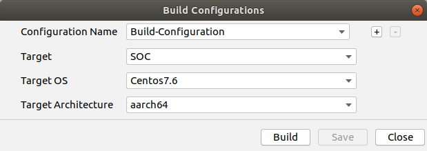
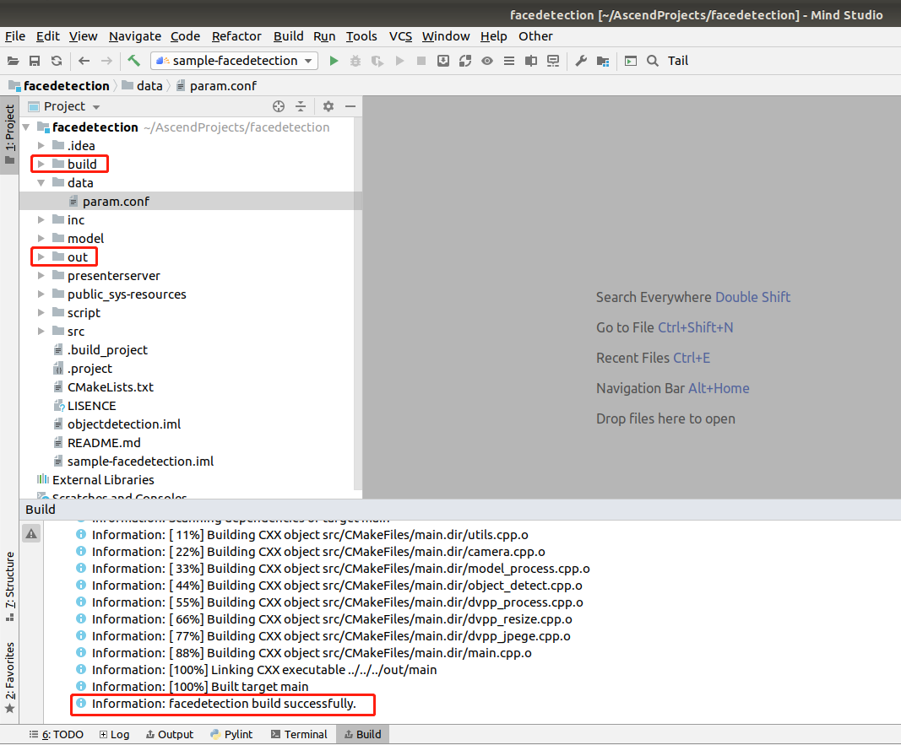

中文|[English](Readme_EN.md)

# 人脸检测（C++）  

本Application支持运行在Atlas 200 DK上，实现了摄像头读入图片，caffessd网络的人脸检测模型推理并输出带有推理结果标签的视频。 

## 软件准备

运行此Sample前，需要按照此章节获取源码包。

1.  获取源码包。

    **cd $HOME/AscendProjects**  

    **wget https://c7xcode.obs.cn-north-4.myhuaweicloud.com/code_Ascend/facedetection.zip** 
              
    **unzip facedetection.zip**  
    
    > **说明：**   
    >- 如果使用wget下载失败，可使用如下命令下载代码。  
    **curl -OL https://c7xcode.obs.cn-north-4.myhuaweicloud.com/code_Ascend/facedetection.zip** 
    >- 如果curl也下载失败，可复制下载链接到浏览器，手动上传至服务器。
    
2.  获取此应用中所需要的原始网络模型。    
 
    参考[表 人脸检测应用使用模型](#zh-cn_topic_0219108795_table19942111763710)获取此应用中所用到的原始网络模型及其对应的权重文件，并将其存放到Ubuntu服务器的任意目录，例如：$HOME/models/colorization_video。

    **表 1**  人脸检测应用使用模型

    
    <table><thead align="left"><tr id="zh-cn_topic_0219108795_row611318123710"><th class="cellrowborder" valign="top" width="11.959999999999999%" id="mcps1.2.4.1.1">
模型名称

    </th>
    <th class="cellrowborder" valign="top" width="8.07%" id="mcps1.2.4.1.2">
模型说明

    </th>
    <th class="cellrowborder" valign="top" width="79.97%" id="mcps1.2.4.1.3">
模型下载路径

    </th>
    </tr>
    </thead>
    <tbody><tr id="zh-cn_topic_0219108795_row1119187377"><td class="cellrowborder" valign="top" width="11.959999999999999%" headers="mcps1.2.4.1.1 ">
face_detection

    </td>
    <td class="cellrowborder" valign="top" width="8.07%" headers="mcps1.2.4.1.2 ">
人脸检测模型

    </td>
    <td class="cellrowborder" valign="top" width="79.97%" headers="mcps1.2.4.1.3 ">
请参考<a href="https://gitee.com/ascend/models/tree/master/face_detection/for_1.7x.0.0" target="_blank" rel="noopener noreferrer">https://gitee.com/ascend/models/tree/master/face_detection/for_1.7x.0.0</a>目录中README.md下载原始网络模型文件及其对应的权重文件。

    </td>
    </tr>
    </tbody>
    </table>

3.  将原始网络模型转换为适配昇腾AI处理器的模型。  

    1.  设置环境变量
        
        命令行中输入以下命令设置环境变量。

        **cd \$HOME/yolov3**
        
        **export install_path=\$HOME/Ascend/ascend-toolkit/20.0.RC1/x86_64-linux_gcc7.3.0**  

        **export PATH=/usr/local/python3.7.5/bin:\\${install_path}/atc/ccec_compiler/bin:\\${install_path}/atc/bin:\\$PATH**  

        **export PYTHONPATH=\\${install_path}/atc/python/site-packages/te:\\${install_path}/atc/python/site-packages/topi:\\$PYTHONPATH**  

        **export LD_LIBRARY_PATH=\\${install_path}/atc/lib64:\\$LD_LIBRARY_PATH**  

        **export ASCEND_OPP_PATH=\\${install_path}/opp**  

    2.  执行以下命令转换模型。

        atc --model=yolov3.prototxt --weight=yolov3.caffemodel --framework=0 --output=yolov3 --soc_version=Ascend310 --insert_op_conf=aipp_nv12.cfg

    
5.  将转换好的模型文件（.om文件）上传到[步骤1](#zh-cn_topic_0228757084_section8534138124114)中源码所在路径下的“**classification/model**”目录下。
    
     **cp ./yolov3.om \$HOME/AscendProjects/cameradetect/model/**  
  

## 环境配置   

**注：服务器上已安装交叉编译工具可跳过此步骤。**   
      
- 安装编译工具  
  **sudo apt-get install -y g++\-aarch64-linux-gnu g++\-5-aarch64-linux-gnu** 
  

## 编译

1.  打开对应的工程。

    以Mind Studio安装用户在命令行进入安装包解压后的“MindStudio-ubuntu/bin”目录，如：$HOME/MindStudio-ubuntu/bin。执行如下命令启动Mind Studio。

    **./MindStudio.sh**

    启动成功后，打开**cameradetect**工程，如[图 打开cameradetect工程](#zh-cn_topic_0228461902_zh-cn_topic_0203223265_fig11106241192810)所示。

    **图 1**  打开cameradetect工程  
    

2.  修改配置文件

    将data/face_detection.conf中的presenter_server_ip、presenter_view_ip、presenter_agent_ip修改为Mind Studio所在Ubuntu服务器的虚拟网卡的ip地址，如下图所示。

    

    > **说明：**    
    >-  虚拟网卡的ip地址请通过ifconfig命令查看。

3.  开始编译，打开Mind Studio工具，在工具栏中点击**Build \> Edit Build Configuration**。  
    选择Target OS 为Centos7.6，如[图 配置编译](#zh-cn_topic_0203223265_fig17414647130)所示。

    **图 2**  配置编译  
      
    
    之后点击**Build \> Build \> Build Configuration**，如[图 编译操作及生成文件](#zh-cn_topic_0203223265_fig1741464713019)所示，会在目录下生成build和out文件夹。

    **图 3**  编译操作及生成文件  
    

    > **须知：**   
    >首次编译工程时，**Build \> Build**为灰色不可点击状态。需要点击**Build \> Edit Build Configuration**，配置编译参数后再进行编译。 

4.  启动Presenter Server。

    打开Mind Studio工具的Terminal，在应用代码存放路径下，执行如下命令在后台启动cameradetect应用的Presenter Server主程序。如[图 启动PresenterServer](#zh-cn_topic_0228461904_zh-cn_topic_0203223294_fig423515251067)所示。

    **bash script/run_presenter_server.sh**

    **图 4**  启动PresenterServer  
    
   
  
    如[图 启动PresenterServer](#zh-cn_topic_0228461904_zh-cn_topic_0203223294_fig423)所示，表示presenter_server的服务启动成功。  
    **图 5**  启动PresenterServer    
    
 
## 运行

1.  单击  **Run \> Run 'cameradetect'**，如[图 程序已执行示意图](#zh-cn_topic_0203223265_fig93931954162719)所示，可执行程序已经在开发者板执行。  

    **图 6**  程序已执行示意图  
    

2.  使用启动Presenter Server服务时提示的URL登录 Presenter Server 网站。

    等待Presenter Agent传输数据给服务端，单击“Refresh“刷新，当有数据时相应的Channel 的Status变成绿色，如下图所示。

    **图 7**  Presenter Server界面  
     

3.  单击右侧对应的View Name链接，比如上图的“person”，查看结果。
 
## 结束应用

命令行执行以下命令登陆开发板（密码：Mind@123）。

**ssh HwHiAiUser@192.168.1.2**

执行以下指令查找仍在运行的进程。

**ps -ef|grep ./workspace_mind_studio_cameradetect**

打印如下：

*HwHiAiU+  2417  2415  7 08:05 ?        00:00:05 ./workspace_mind_studio_cameradetect*

杀死进程：

kill -9 2417

