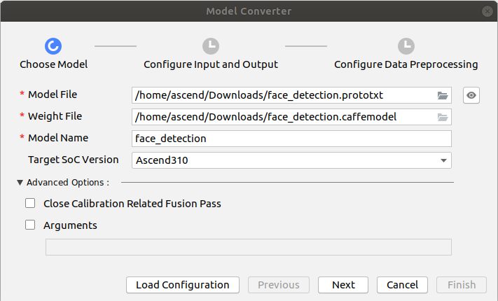
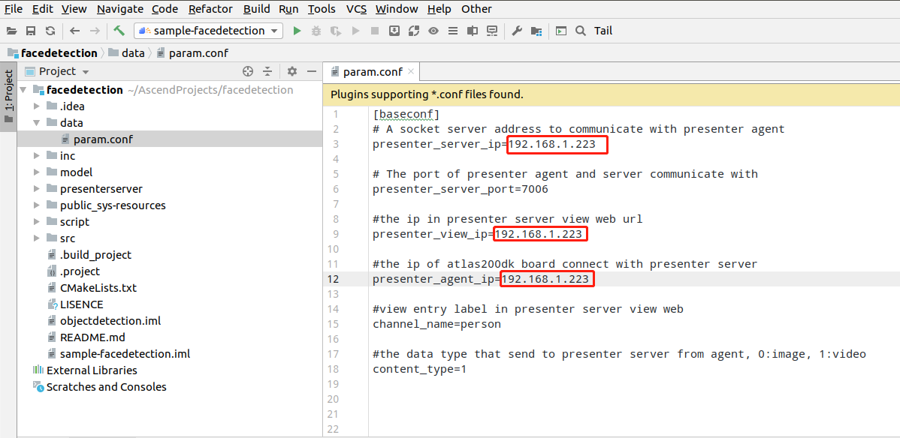
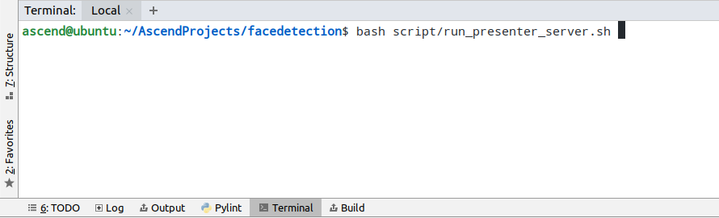
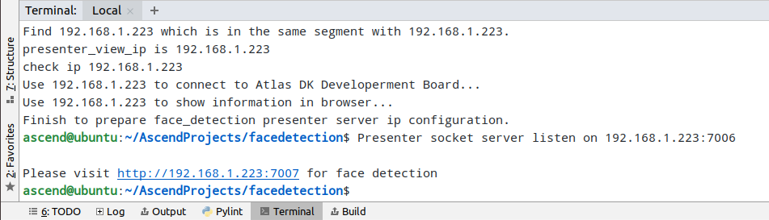

中文|[English](Readme_EN.md)

# 人脸检测（C++）  

本Application支持运行在Atlas 200 DK上，实现了摄像头读入图片，caffessd网络的人脸检测模型推理并输出带有推理结果标签的视频。 

## 软件准备

运行此Sample前，需要按照此章节获取源码包。

1.  获取源码包。

    **cd $HOME/AscendProjects**  

    **wget https://c7xcode.obs.cn-north-4.myhuaweicloud.com/code_Ascend/facedetection.zip** 
              
    **unzip facedetection.zip**  

    > **说明：**   
    >- 如果使用wget下载失败，可使用如下命令下载代码。  
    **curl -OL https://c7xcode.obs.cn-north-4.myhuaweicloud.com/code_Ascend/facedetection.zip** 
    >- 如果curl也下载失败，可复制下载链接到浏览器，手动上传至服务器。
    
2.  获取此应用中所需要的原始网络模型。    
 
     -  下载原始网络模型及权重文件至ubuntu服务器任意目录，如:$HOME/facedetection。

        **mkdir -p $HOME/facedetection** 

        **wget -P $HOME/facedetection https://c7xcode.obs.cn-north-4.myhuaweicloud.com/models/face_detection/face_detection.caffemodel** 
 
        **wget -P $HOME/facedetection https://c7xcode.obs.cn-north-4.myhuaweicloud.com/models/face_detection/face_detection.prototxt**
    
        > **说明：**   
        >- facedetection原始模型网络：https://github.com/opencv/opencv/blob/master/samples/dnn/face_detector/deploy.prototxt。
        >- C7x对prototxt文件有修改要求，按照[SSD网络模型prototxt修改](https://support.huaweicloud.com/usermanual-mindstudioc73/atlasmindstudio_02_0114.html)文档对prototxt文件进行修改。

3.  将原始网络模型转换为适配昇腾AI处理器的模型。  

    1.  在Mind Studio操作界面的顶部菜单栏中选择**Tools \> Model Convert**，进入模型转换界面。
    2.  在弹出的**Model Conversion**操作界面中，进行模型转换配置。
    3.  参照以下图片进行参数配置。    
        -   Model File选择[步骤2](#zh-cn_topic_0219108795_li2074865610364)中下载的模型文件，此时会自动匹配到权重文件并填写在Weight File中。  
        -   模型输入选择fp32。  
        -   Input Image Resolution填写为300\*304。   
        -   Model Image Format选择BGR。   
        -   打开Crop。

      
      
    

    
5.  将转换好的模型文件（.om文件）上传到[步骤1](#zh-cn_topic_0228757084_section8534138124114)中源码所在路径下的“**facedetection/model**”目录下。
    
     **cp \\$HOME/modelzoo/face_detection/device/face_detection.om \\$HOME/AscendProjects/facedetection/model/**  
  

## 环境配置   

**注：服务器上已安装交叉编译工具可跳过此步骤。**   
      
- 安装编译工具  
  **sudo apt-get install -y g++\-aarch64-linux-gnu g++\-5-aarch64-linux-gnu** 
  

## 编译

1.  打开对应的工程。

    以Mind Studio安装用户在命令行进入安装包解压后的“MindStudio-ubuntu/bin”目录，如：$HOME/MindStudio-ubuntu/bin。执行如下命令启动Mind Studio。

    **./MindStudio.sh**

    启动成功后，打开**facedetection**工程，如[图 打开facedetection工程](#zh-cn_topic_0228461902_zh-cn_topic_0203223265_fig11106241192810)所示。

    **图 1**  打开facedetection工程  
    

2.  修改配置文件

    将data/face_detection.conf中的presenter_server_ip、presenter_view_ip、presenter_agent_ip修改为Mind Studio所在Ubuntu服务器的虚拟网卡的ip地址，如下图所示。

    

    > **说明：**    
    >-  虚拟网卡的ip地址请通过ifconfig命令查看。

3.  开始编译，打开Mind Studio工具，在工具栏中点击**Build \> Edit Build Configuration**。  
    选择Target OS 为Centos7.6，如[图 配置编译](#zh-cn_topic_0203223265_fig17414647130)所示。

    **图 2**  配置编译  
      
    
    之后点击**Build \> Build \> Build Configuration**，如[图 编译操作及生成文件](#zh-cn_topic_0203223265_fig1741464713019)所示，会在目录下生成build和out文件夹。

    **图 3**  编译操作及生成文件  
    

    > **须知：**   
    >首次编译工程时，**Build \> Build**为灰色不可点击状态。需要点击**Build \> Edit Build Configuration**，配置编译参数后再进行编译。 

4.  启动Presenter Server。

    打开Mind Studio工具的Terminal，在应用代码存放路径下，执行如下命令在后台启动facedetection应用的Presenter Server主程序。如[图 启动PresenterServer](#zh-cn_topic_0228461904_zh-cn_topic_0203223294_fig423515251067)所示。

    **bash script/run_presenter_server.sh**

    **图 4**  启动PresenterServer  
    
   
  
    如[图 启动PresenterServer](#zh-cn_topic_0228461904_zh-cn_topic_0203223294_fig423)所示，表示presenter_server的服务启动成功。  
    **图 5**  启动PresenterServer    
    
 
## 运行

1.  单击  **Run \> Run 'facedetection'**，如[图 程序已执行示意图](#zh-cn_topic_0203223265_fig93931954162719)所示，可执行程序已经在开发者板执行。  

    **图 6**  程序已执行示意图  
    

2.  使用启动Presenter Server服务时提示的URL登录 Presenter Server 网站。

    等待Presenter Agent传输数据给服务端，单击“Refresh“刷新，当有数据时相应的Channel 的Status变成绿色，如下图所示。

    **图 7**  Presenter Server界面  
     

3.  单击右侧对应的View Name链接，比如上图的“person”，查看结果。
 
## 结束应用

命令行执行以下命令登陆开发板（密码：Mind@123）。

**ssh HwHiAiUser@192.168.1.2**

执行以下指令查找仍在运行的进程。

**ps -ef|grep ./workspace_mind_studio_facedetection**

打印如下：

*HwHiAiU+  2417  2415  7 08:05 ?        00:00:05 ./workspace_mind_studio_facedetection*

杀死进程：

kill -9 2417

