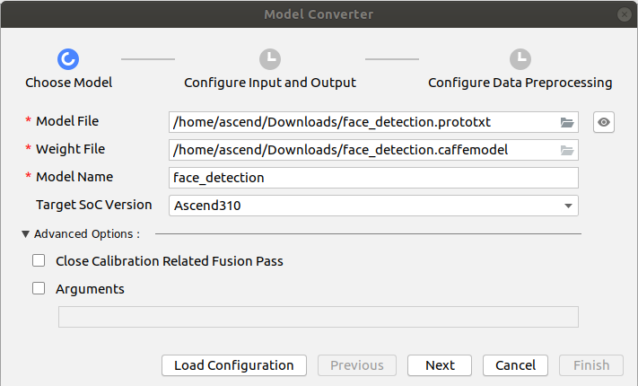
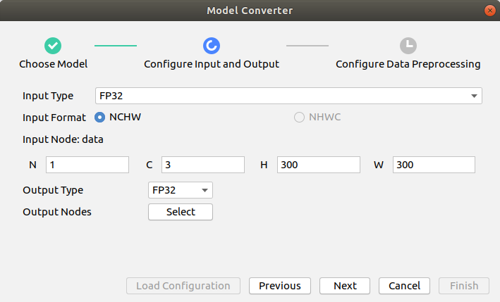
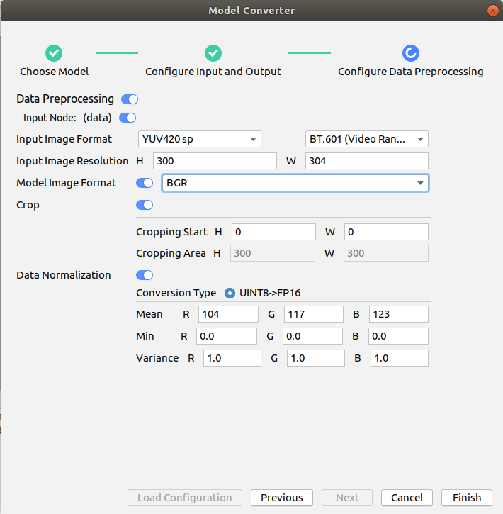
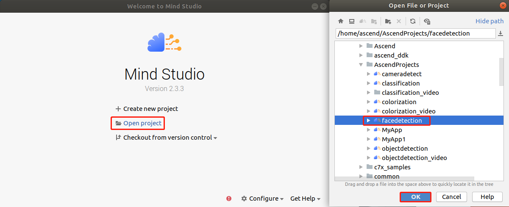
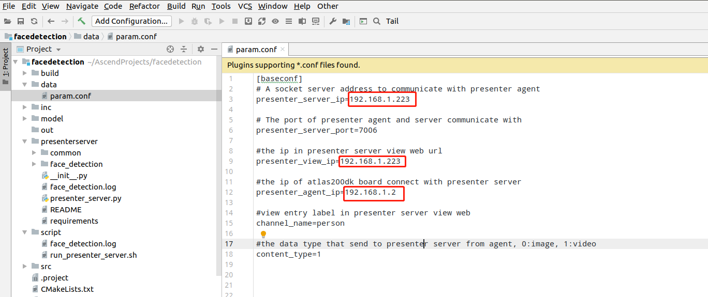
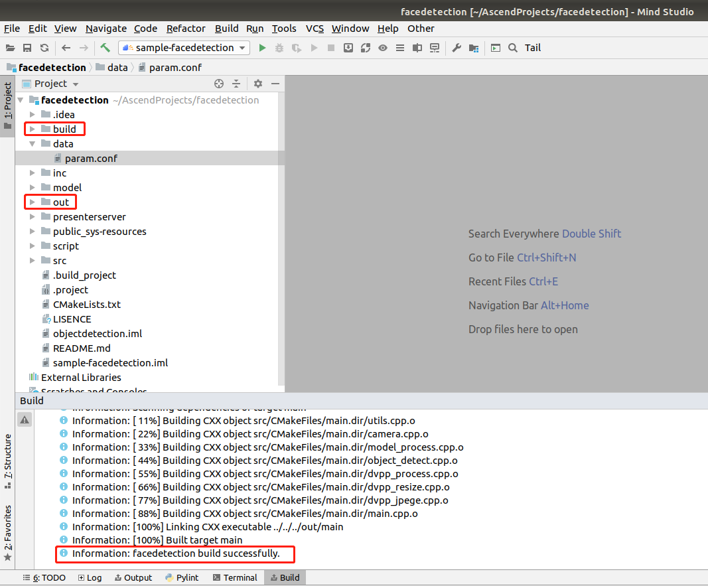
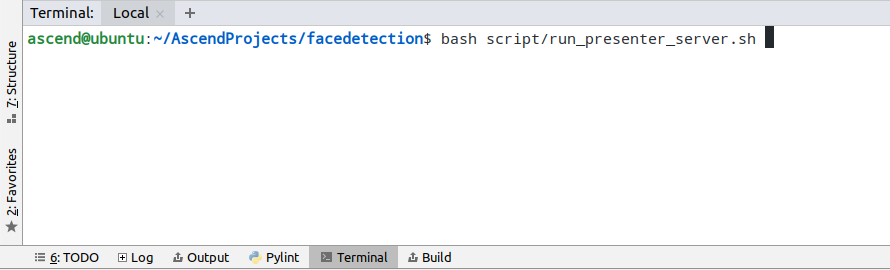
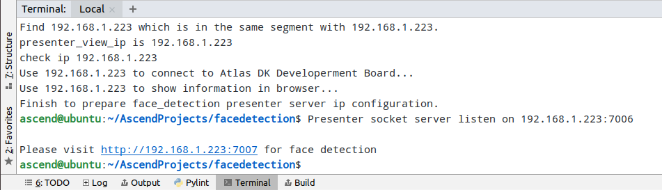
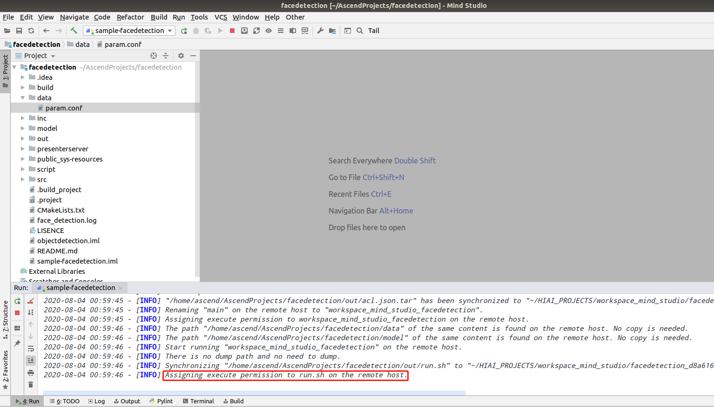
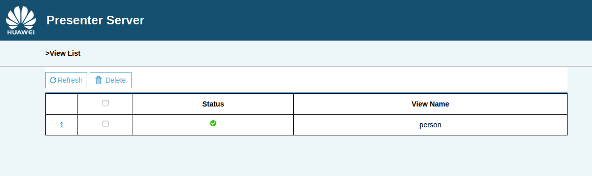

Chinese | [English](Readme_EN.md)

# Face Detection (C++)

This application runs on the Atlas 200 DK to detect faces captured by cameras using the SSD (Caffe) network, and output videos labeled with the inference result.

## Software Preparation

Before running this sample, obtain the source code package.

1. Obtain the source code package.
   
   **cd $HOME/AscendProjects**
   
   **wget https://c7xcode.obs.cn-north-4.myhuaweicloud.com/code\_Ascend/facedetection.zip**
   
   **unzip facedetection.zip**
   
   >  NOTE
   > - If the download using **wget** fails, run the following command to download the code:   
   **curl -OL https://c7xcode.obs.cn-north-4.myhuaweicloud.com/code\_Ascend/facedetection.zip**
   > - If the download using **curl** also fails, open the download link in a browser to download the code and manually upload it to the server.

2. Obtain the original model required by the application.
   
   - Download the original model file and weight file to any directory on the Ubuntu server, for example, **$HOME/facedetection**.
     
        **mkdir -p $HOME/facedetection** 

        **wget -P $HOME/facedetection https://c7xcode.obs.cn-north-4.myhuaweicloud.com/models/face\_detection/face\_detection.caffemodel**
     
        **wget -P $HOME/facedetection https://c7xcode.obs.cn-north-4.myhuaweicloud.com/models/face\_detection/face\_detection.prototxt**
     
        >  NOTE
        > - Original facedetection network: https://github.com/opencv/opencv/blob/master/samples/dnn/face_detector/deploy.prototxt.
        > - To obtain the LICENSE of the original facedetection network, visit the following website: https://github.com/opencv/opencv/blob/master/LICENSE
        > - The C7x version requires modification on the .prototxt file. Modify the file by referring to the following link:  https://support.huaweicloud.com/usermanual-mindstudioc73/atlasmindstudio_02_0114.html)
	    The modification has been completed herein. You can directly run the preceding command to download the file.

3. Convert the original model to an offline model adapted to the Ascend AI Processor.
   
   1. Choose **Tools** \> **Model Converter** from the menu bar of Mind Studio.
   2. Configure the model conversion settings in the displayed **Model Converter** dialog box.
   3. Set the parameters by referring to the following figures.
      - Select the model file downloaded in [Step 2](#zh-cn_topic_0219108795_li2074865610364) in **Model File**, and **Weight File** is automatically filled in.
      - Set **Input Type** to **FP32**.
      - Set **Input Image Resolution** to **300 x 304**.
      - Set **Model Image Format** to **BGR**.
      - Enable **Crop**.
   
     
     
   

4. Upload the converted model file (.om) to the **facedetection/model** directory under the path of the source code downloaded in [Step 1](#zh-cn_topic_0228757084_section8534138124114).
   
     **cp \\$HOME/modelzoo/face_detection/device/face_detection.om \\$HOME/AscendProjects/facedetection/model/** 

## Environment Configuration

**Note: If a cross compiler has been installed on the server, skip this step.**

- Install the compiler.  
  **sudo apt-get install -y g++\-aarch64-linux-gnu g++\-5-aarch64-linux-gnu**

- Install Presenter Agent.   
  For details, visit https://gitee.com/ascend/samples/tree/master/common/install_presenteragent/for_atlas200dk.

## Build

1. Open the project.
   
   Go to the directory of the decompressed installation package as the Mind Studio installation user in CLI mode, for example, **$HOME/MindStudio-ubuntu/bin**. Launch Mind Studio.
   
   **./MindStudio.sh**
   
   Open the **facedetection** project, as shown in [Figure 1 Opening the facedetection project](#zh-cn_topic_0228461902_zh-cn_topic_0203223265_fig11106241192810).
   
   **Figure 1** Opening the facedetection project  
   

2. Modify the configuration file.
   
   Change the values of **presenter_server_ip** and **presenter_view_ip** in **data/param.conf** to the virtual NIC IP address of the Ubuntu server where Mind Studio is installed, and change the value of **presenter\_agent\_ip** to the IP address of the network port that connects the developer board and the Ubuntu server, as shown in the following figure.
   
   
   
   >  NOTE
   > - Run the **ifconfig** command to view the IP address of the virtual NIC.

3. Start the build. Choose **Build \> Edit Build Configuration** on the toolbar of Mind Studio.   
   Set **Target OS** to **Centos7.6**, as shown in [Figure 2 Build configuration](#zh-cn_topic_0203223265_fig17414647130).
   
   **Figure 2** Build configuration  
   
   
   Click **Build \> Build \> Build Configuration**. The **build** and **out** folders are generated in the directory, as shown in [Figure 3 Build operations and generated files](#zh-cn_topic_0203223265_fig1741464713019).
   
   **Figure 3** Build operations and generated files  
   
   
   >  NOTE   
   When you build a project for the first time, **Build \> Build** is unavailable. You need to choose **Build \> Edit Build Configuration** to set parameters before the build.

4. Start Presenter Server.
   
   Open the Terminal window of Mind Studio. Run the following command in the path where the application code is stored to start Presenter Server in the background, as shown in [Figure 4 Starting Presenter Server](#zh-cn_topic_0228461904_zh-cn_topic_0203223294_fig423515251067).
   
   **bash script/run_presenter_server.sh**
   
   **Figure 4** Starting Presenter Server  
   
   
   Presenter Server is started successfully, as shown in [Figure 5 Presenter Server started successfully](#zh-cn_topic_0228461904_zh-cn_topic_0203223294_fig423).   
   **Figure 5** Presenter Server started successfully  
   

## Run

1. Click **Run \> Run 'facedetection'**. The executable file has been executed on the developer board, as shown in [Figure 6 Execution finished](#zh-cn_topic_0203223265_fig93931954162719).
   
   **Figure 6** Execution finished  
   

2. Use the URL displayed upon the start of Presenter Server service to log in to Presenter Server.
   
   Wait for Presenter Agent to transmit data to the server and click **Refresh**. When there is data, the icon in the **Status** column for the corresponding channel turns green, as shown in the following figure.
   
   **Figure 7** Presenter Server page  
   

3. Click a link in the **View Name** column, for example, **"person"** in the preceding figure to view the result.

## End the application.

Log in to the developer board (password: **Mind@123**).

**ssh HwHiAiUser@192.168.1.2**

Search for the running processes.

**ps -ef | grep ./workspace_mind_studio_facedetection**

For example, the following information is printed:

*HwHiAiU+  2417  2415  7 08:05 ?        00:00:05 ./workspace_mind_studio_facedetection*

Kill the process.

kill -9 2417

## CLI mode

1. Mind Studio runs improperly.
   
   Samples may fail to run or run slowly in Mind Studio.
   
   This is caused by the Mind Studio version, which can be solved by logging in to the developer board and run the sample in the CLI.
   
   **Note: The application must be run once in Mind Studio. Otherwise, data such as binary files cannot be sent to the developer board.**

2. In the development environment, run the following command as a common user to log in to the developer board (USB connection is used by default):
   
   **ssh HwHiAiUser@192.168.1.2**
   
   

3. Go to the path of the executable file.
   
   **cd HIAI_PROJECTS/workspace_mind_studio/facedetection_xxx/out**
   
   Replace ***xxx*** as required.
   
   

4. Run the application. (Present Server must be started in the development environment and the build and run operations must be performed once.)
   
   **bash run.sh**

5. Press Ctrl\+C to end the application.