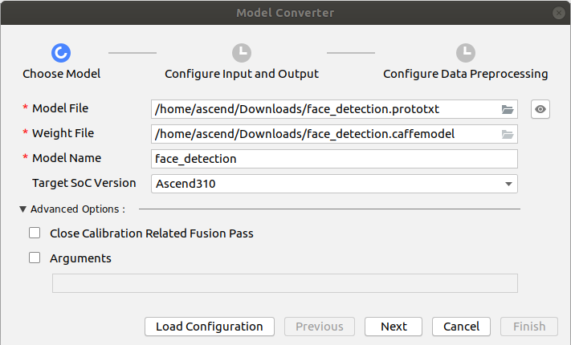
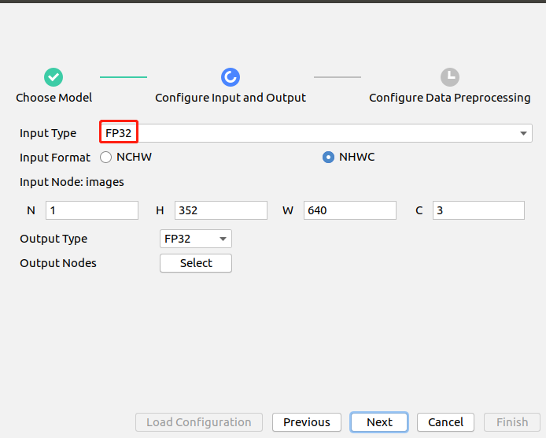
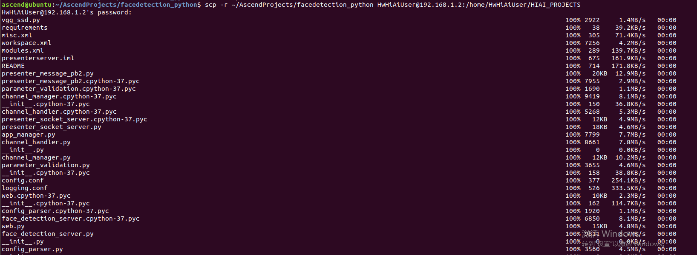
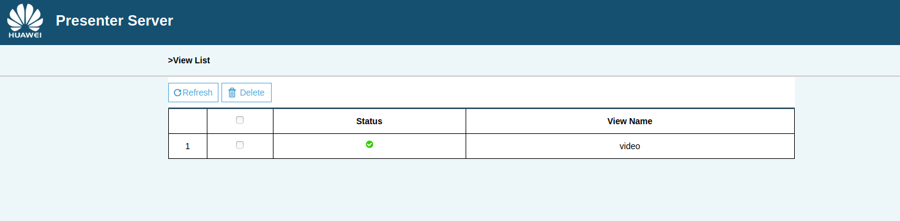

# 人脸检测 （python）  

本Application支持运行在Atlas 200 DK上，实现了摄像头读入图片，caffessd网络的人脸检测模型推理并输出带有推理结果标签的视频。

## 软件准备

运行此Sample前，需要下载本仓中的源码包。

1. 获取源码包。  
    **mkdir -p $HOME/AscendProjects**

    **cd $HOME/AscendProjects**  

    **wget https://c7xcode.obs.myhuaweicloud.com/code_Ascend/facedetection_python.zip --no-check-certificate** 
              
    **unzip facedetection_python.zip**  
    
    > **说明：**   
    >- 如果使用wget下载失败，可使用如下命令下载代码。  
    **curl -OL https://c7xcode.obs.myhuaweicloud.com/code_Ascend/facedetection_python.zip** 
    >- 如果curl也下载失败，可复制下载链接到浏览器，手动上传至服务器。

2.  获取此应用中所需要的原始网络模型。    
 
     -  下载原始网络模型及权重文件至ubuntu服务器任意目录，如:$HOME/models/facedetection_python。

        **mkdir -p $HOME/models/facedetection_python** 

        **wget -P $HOME/models/facedetection_python https://c7xcode.obs.cn-north-4.myhuaweicloud.com/models/face_detection/face_detection.caffemodel** 
 
        **wget -P $HOME/models/facedetection_python https://c7xcode.obs.cn-north-4.myhuaweicloud.com/models/face_detection/face_detection.prototxt**
    
        > **说明：**   
        >- facedetection原始模型网络： https://github.com/opencv/opencv/blob/master/samples/dnn/face_detector/deploy.prototxt。
        >- facedetection原始网络LICENSE地址： https://github.com/opencv/opencv/blob/master/LICENSE
        >- C7x对prototxt文件有修改要求，按照[SSD网络模型prototxt修改](https://support.huaweicloud.com/usermanual-mindstudioc73/atlasmindstudio_02_0114.html)文档对prototxt文件进行修改。这里已经修改完成，直接执行以上命令下载即可。

3.  将原始网络模型转换为适配昇腾AI处理器的模型。  

    1.  在Mind Studio操作界面的顶部菜单栏中选择**Tools \> Model Convert**，进入模型转换界面。
    2.  在弹出的**Model Conversion**操作界面中，进行模型转换配置。
    3.  参照以下图片进行参数配置。    
        -   Model File选择[步骤2](#zh-cn_topic_0219108795_li2074865610364)中下载的模型文件，此时会自动匹配到权重文件并填写在Weight File中。  
        -   模型输入选择fp32。  
        -   Input Image Resolution填写为300\*304。   
        -   Model Image Format选择BGR。   
        -   打开Crop。

      
      
    

    
4.  将转换好的模型文件（.om文件）上传到[步骤1](#zh-cn_topic_0228757084_section8534138124114)中源码所在路径下的“**facedetection/model**”目录下。
    
     **cp \\$HOME/modelzoo/face_detection/device/face_detection.om \\$HOME/AscendProjects/facedetection_python/model/**  
  
## 环境配置 
   - 安装numpy、pillow   
       请参考 https://gitee.com/ascend/common/blob/master/install_python3env/for_atlas200dk/README.md 进行安装。   
   

## 环境部署  

1.  以Mind Studio安装用户进入facedetectionapp应用代码所在根目录，如：\\$HOME/AscendProjects/facedetection_python/。  
     
    **cd \\$HOME/AscendProjects/facedetection_python/** 

2.  修改配置文件。  

    修改 **script/face\_detection.conf** 中 **presenter\_server\_ip** 和 **presenter\_view\_ip** 为当前ubuntu服务器上和atlas200dk开发板连接的网口ip， **presenter\_agent\_ip** 为开发板上和ubuntu服务器连接的网口ip。

    如使用USB连接，开发板的USB网口ip为192.168.1.2，ubuntu服务器和开发板连接的虚拟网卡的网口ip为192.168.1.134，则配置文件内容如下所示：

    **presenter\_server\_ip=192.168.1.134**

    **presenter\_view\_ip=192.168.1.134**

    **presenter\_agent\_ip=192.168.1.2**

    > **说明：**   
    >-   一般通过USB连接时，atlas200dk\_board\_ip为开发板的USB网口ip，默认为192.168.1.2。通过网口连接时，atlas200dk\_board\_ip为开发板的网络网口ip，默认为192.168.0.2。

3.  应用代码拷贝到开发板。

    以Mind Studio安装用户进入口罩检测应用\(python\)代码所在根目录，如：AscendProjects/facedetection_python，执行以下命令将应用代码拷贝到开发板。若拷贝失败，请检查开发板上是否有HIAI\_PROJECTS这个目录，没有就创建一下。
    
    **scp -r ~/AscendProjects/facedetection_python HwHiAiUser@192.168.1.2:/home/HwHiAiUser/HIAI\_PROJECTS**
    
     提示password时输入开发板密码，开发板默认密码为**Mind@123**，如[图 应用代码拷贝](#zh-cn_topic_0228757083_zh-cn_topic_0198304761_fig1660453512014)。
    
     **图** **应用代码拷贝**  
    

    
    
4.  启动Presenter Server。
    执行如下命令在后台启动人脸检测python应用的Presenter Server主程序。

    **bash \$HOME/AscendProjects/facedetection_python/script/run_presenter_server.sh &**

    使用提示的URL登录Presenter Server。如下图所示，表示Presenter Server启动成功。

    **图**  主页显示  
    

    Presenter Server、Mind Studio与Atlas 200 DK之间通信使用的IP地址示例如下图所示：

    **图**  IP地址示例  
    

    其中：

    -   Atlas 200 DK开发者板使用的IP地址为192.168.1.2（USB方式连接）。
    -   Presenter Server与Atlas 200 DK通信的IP地址为UI Host服务器中与Atlas 200 DK在同一网段的IP地址，例如：192.168.1.223。
    -   通过浏览器访问Presenter Server的IP地址本示例为：10.10.0.1，由于Presenter Server与Mind Studio部署在同一服务器，此IP地址也为通过浏览器访问Mind Studio的IP。
    
5.  acl.so拷贝到开发板。

    **scp ~/Ascend/ascend-toolkit/20.0.RC1/arm64-linux_gcc7.3.0/pyACL/python/site-packages/acl/acl.so HwHiAiUser@192.168.1.2:/home/HwHiAiUser/Ascend/**  
   > **说明：**   
            **请将X.X.X替换为Ascend-Toolkit开发套件包的实际版本号。**   
            **例如：Toolkit包的包名为Ascend-Toolkit-20.0.RC1-x86_64-linux_gcc7.3.0.run，则此Toolkit的版本号为20.0.RC1。**

6. 登录开发板，添加环境变量。  

   **ssh HwHiAiUser@192.168.1.2**  
   **vim ~/.bashrc**   
   在最后添加两行    
   **export LD_LIBRARY_PATH=/home/HwHiAiUser/Ascend/acllib/lib64**   
   **export PYTHONPATH=/home/HwHiAiUser/Ascend/:\\${PYTHONPATH}**  
      
   执行如下命令，使环境变量生效   
   **source ~/.bashrc**  

## 运行
1. 检查是否使用的"CAMERA0"摄像头。  
   代码中默认使用的是"CAMERA0"摄像头，查看方法参考下方链接。   
   https://support.huaweicloud.com/usermanual-A200dk_3000/atlas200dk_02_0051.html 

2. 登录到开发板上，进入工程目录下，执行如下命令运行程序。  

   **cd ~/HIAI_PROJECTS/facedetection_python/**   
   **python3 main.py**

3.  使用启动Presenter Server服务时提示的URL登录 Presenter Server 网站。

    等待Presenter Agent传输数据给服务端，单击“Refresh“刷新，当有数据时相应的Channel 的Status变成绿色，如下图所示。

    **图**  Presenter Server界面  
     

4.  单击右侧对应的View Name链接，比如上图的“video”，查看结果。
   