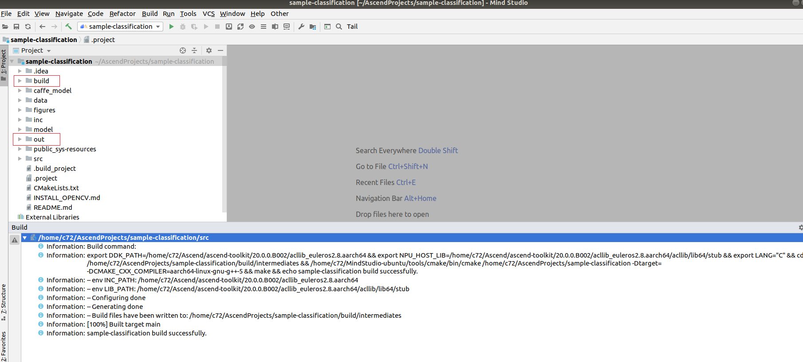

中文|[English](Readme_EN.md)

**该案例仅仅用于学习，打通流程，不对效果负责，不支持商用。**

# 人脸识别<a name="ZH-CN_TOPIC_0208835545"></a>

开发者可以将本Application部署至Atlas 200 DK上实现人脸注册、并通过摄像头对视频中的人脸信息进行预测，与已注册的人脸进行比对，预测出最可能的用户。

当前分支中的应用适配**1.32.0.0及以上**版本的[DDK&RunTime](https://ascend.huawei.com/resources)。

## 前提条件<a name="zh-cn_topic_0203223340_section137245294533"></a>

部署此Sample前，需要准备好以下环境：

-   已完成Mind Studio的安装。
-   已完成Atlas 200 DK开发者板与Mind Studio的连接，交叉编译器的安装，SD卡的制作及基本信息的配置等。

## 软件准备<a name="zh-cn_topic_0203223340_section8534138124114"></a>

运行此Sample前，需要按照此章节获取源码包，并进行相关的环境配置。

1.  <a name="zh-cn_topic_0203223340_li953280133816"></a>获取源码包。
    1.  下载压缩包方式获取。

        将[https://gitee.com/Atlas200DK/sample-facialrecognition/tree/1.3x.0.0/](https://gitee.com/Atlas200DK/sample-facialrecognition/tree/1.3x.0.0/)仓中的代码以Mind Studio安装用户下载至Mind Studio所在Ubuntu服务器的任意目录，例如代码存放路径为：$HOME/AscendProjects/sample-facialrecognition。

    2.  命令行使用git命令方式获取。

        在命令行中：$HOME/AscendProjects目录下执行以下命令下载代码。

        **git clone https://gitee.com/Atlas200DK/sample-facialrecognition.git --branch 1.3x.0.0**

2.  <a name="zh-cn_topic_0203223340_li99811487013"></a>获取此应用中所需要的原始网络模型。

    参考[表1](#zh-cn_topic_0203223340_table97791025517)获取此应用中所用到的原始网络模型及其对应的权重文件，并将其存放到Mind Studio所在Ubuntu服务器的任意目录，这两个文件必须存放到同一个目录下。例如：$HOME/models/facialrecognition。

    **表 1**  Facial Recognition中使用模型

    <a name="zh-cn_topic_0203223340_table97791025517"></a>
    <table><thead align="left"><tr id="zh-cn_topic_0203223340_row48791253115"><th class="cellrowborder" valign="top" width="13.309999999999999%" id="mcps1.2.4.1.1"><p id="zh-cn_topic_0203223340_p187902511114"><a name="zh-cn_topic_0203223340_p187902511114"></a><a name="zh-cn_topic_0203223340_p187902511114"></a>模型名称</p>
    </th>
    <th class="cellrowborder" valign="top" width="12.04%" id="mcps1.2.4.1.2"><p id="zh-cn_topic_0203223340_p148791259118"><a name="zh-cn_topic_0203223340_p148791259118"></a><a name="zh-cn_topic_0203223340_p148791259118"></a>模型说明</p>
    </th>
    <th class="cellrowborder" valign="top" width="74.65%" id="mcps1.2.4.1.3"><p id="zh-cn_topic_0203223340_p987922511111"><a name="zh-cn_topic_0203223340_p987922511111"></a><a name="zh-cn_topic_0203223340_p987922511111"></a>模型下载路径</p>
    </th>
    </tr>
    </thead>
    <tbody><tr id="zh-cn_topic_0203223340_row38791825912"><td class="cellrowborder" valign="top" width="13.309999999999999%" headers="mcps1.2.4.1.1 "><p id="zh-cn_topic_0203223340_p0879152519115"><a name="zh-cn_topic_0203223340_p0879152519115"></a><a name="zh-cn_topic_0203223340_p0879152519115"></a>face_detection</p>
    </td>
    <td class="cellrowborder" valign="top" width="12.04%" headers="mcps1.2.4.1.2 "><p id="zh-cn_topic_0203223340_p9879112516111"><a name="zh-cn_topic_0203223340_p9879112516111"></a><a name="zh-cn_topic_0203223340_p9879112516111"></a>人脸检测网络模型。</p>
    <p id="zh-cn_topic_0203223340_p1087912253112"><a name="zh-cn_topic_0203223340_p1087912253112"></a><a name="zh-cn_topic_0203223340_p1087912253112"></a>是基于Caffe的Resnet10-SSD300模型转换后的网络模型。</p>
    </td>
    <td class="cellrowborder" valign="top" width="74.65%" headers="mcps1.2.4.1.3 "><p id="zh-cn_topic_0203223340_p188801525813"><a name="zh-cn_topic_0203223340_p188801525813"></a><a name="zh-cn_topic_0203223340_p188801525813"></a>请参考<a href="https://gitee.com/HuaweiAscend/models/tree/master/computer_vision/object_detect/face_detection" target="_blank" rel="noopener noreferrer">https://gitee.com/HuaweiAscend/models/tree/master/computer_vision/object_detect/face_detection</a>目录中README.md下载原始网络模型文件及其对应的权重文件。</p>
    </td>
    </tr>
    <tr id="zh-cn_topic_0203223340_row11880162511114"><td class="cellrowborder" valign="top" width="13.309999999999999%" headers="mcps1.2.4.1.1 "><p id="zh-cn_topic_0203223340_p1388012251117"><a name="zh-cn_topic_0203223340_p1388012251117"></a><a name="zh-cn_topic_0203223340_p1388012251117"></a>vanillacnn</p>
    </td>
    <td class="cellrowborder" valign="top" width="12.04%" headers="mcps1.2.4.1.2 "><p id="zh-cn_topic_0203223340_p1988018251110"><a name="zh-cn_topic_0203223340_p1988018251110"></a><a name="zh-cn_topic_0203223340_p1988018251110"></a>人脸特征点标记网络模型。</p>
    <p id="zh-cn_topic_0203223340_p588013251514"><a name="zh-cn_topic_0203223340_p588013251514"></a><a name="zh-cn_topic_0203223340_p588013251514"></a>是基于Caffe的VanillaCNN模型转换后的网络模型。</p>
    </td>
    <td class="cellrowborder" valign="top" width="74.65%" headers="mcps1.2.4.1.3 "><p id="zh-cn_topic_0203223340_p28801025319"><a name="zh-cn_topic_0203223340_p28801025319"></a><a name="zh-cn_topic_0203223340_p28801025319"></a>请参考<a href="https://gitee.com/HuaweiAscend/models/tree/master/computer_vision/classification/vanillacnn" target="_blank" rel="noopener noreferrer">https://gitee.com/HuaweiAscend/models/tree/master/computer_vision/classification/vanillacnn</a><span>目录中</span>README.md下载原始网络模型文件及其对应的权重文件。</p>
    </td>
    </tr>
    <tr id="zh-cn_topic_0203223340_row988092511120"><td class="cellrowborder" valign="top" width="13.309999999999999%" headers="mcps1.2.4.1.1 "><p id="zh-cn_topic_0203223340_p108806251513"><a name="zh-cn_topic_0203223340_p108806251513"></a><a name="zh-cn_topic_0203223340_p108806251513"></a>sphereface</p>
    </td>
    <td class="cellrowborder" valign="top" width="12.04%" headers="mcps1.2.4.1.2 "><p id="zh-cn_topic_0203223340_p68802251019"><a name="zh-cn_topic_0203223340_p68802251019"></a><a name="zh-cn_topic_0203223340_p68802251019"></a>特征向量获取网络模型。</p>
    <p id="zh-cn_topic_0203223340_p148801125512"><a name="zh-cn_topic_0203223340_p148801125512"></a><a name="zh-cn_topic_0203223340_p148801125512"></a>是基于Caffe的SphereFace模型转换后的网络模型</p>
    </td>
    <td class="cellrowborder" valign="top" width="74.65%" headers="mcps1.2.4.1.3 "><p id="zh-cn_topic_0203223340_p128806251116"><a name="zh-cn_topic_0203223340_p128806251116"></a><a name="zh-cn_topic_0203223340_p128806251116"></a>请参考<a href="https://gitee.com/HuaweiAscend/models/tree/master/computer_vision/classification/sphereface" target="_blank" rel="noopener noreferrer">https://gitee.com/HuaweiAscend/models/tree/master/computer_vision/classification/sphereface</a><span>目录中</span>README.md下载原始网络模型文件及其对应的权重文件。</p>
    </td>
    </tr>
    </tbody>
    </table>

3.  以Mind Studio安装用户登录Mind Studio所在Ubuntu服务器，确定当前使用的DDK版本号并设置环境变量DDK\_HOME，tools\_version，LD\_LIBRARY\_PATH。
    1.  <a name="zh-cn_topic_0203223340_zh-cn_topic_0203223294_li61417158198"></a>查询当前使用的DDK版本号。

        可通过Mind Studio工具查询，也可以通过DDK软件包进行获取。

        -   使用Mind Studio工具查询。

            在Mind Studio工程界面依次选择“File \> Settings \> System Settings \> Ascend DDK“，弹出如[图 DDK版本号查询](#zh-cn_topic_0203223340_zh-cn_topic_0203223294_fig17553193319118)所示界面。

            **图 1**  DDK版本号查询<a name="zh-cn_topic_0203223340_zh-cn_topic_0203223294_fig17553193319118"></a>  
            

            其中显示的**DDK Version**就是当前使用的DDK版本号，如**1.32.0.B080**。

        -   通过DDK软件包进行查询。

            通过安装的DDK的包名获取DDK的版本号。

            DDK包的包名格式为：**Ascend\_DDK-\{software version\}-\{interface version\}-x86\_64.ubuntu16.04.tar.gz**

            其中**software version**就是DDK的软件版本号。

            例如：

            DDK包的包名为Ascend\_DDK-1.32.0.B080-1.1.1-x86\_64.ubuntu16.04.tar.gz，则此DDK的版本号为1.32.0.B080。

    2.  设置环境变量。

        **vim \~/.bashrc**

        执行如下命令在最后一行添加DDK\_HOME及LD\_LIBRARY\_PATH的环境变量。

        **export tools\_version=_1.32.X.X_**

        **export DDK\_HOME=$HOME/.mindstudio/huawei/ddk/_1.32.X.X_/ddk**

        **export LD\_LIBRARY\_PATH=$DDK\_HOME/lib/x86\_64-linux-gcc5.4**

        > **说明：**   
        >-   **_1.32.X.X_**是[a](#zh-cn_topic_0203223340_zh-cn_topic_0203223294_li61417158198)中查询到的DDK版本号，需要根据查询结果对应填写，如**1.32.0.B080**  
        >-   如果此环境变量已经添加，则此步骤可跳过。  

        输入:wq!保存退出。

        执行如下命令使环境变量生效。

        **source \~/.bashrc**

4.  将原始网络模型转换为适配昇腾AI处理器的模型，模型转换有Mind Studio工具转换和命令行转换两种方式。
    -   通过Mind Studio工具进行模型转换。
        1.  在Mind Studio操作界面的顶部菜单栏中选择**Tools \> Model Convert**进入模型转换界面。
        2.  在弹出的**Model** **Conversion**操作界面中，进行模型转换配置。
            -   Model File选择[步骤2](#zh-cn_topic_0203223340_li99811487013)中下载的模型文件，此时会自动匹配到权重文件并填写在Weight File中。
            -   Model Name填写为[表1](#zh-cn_topic_0203223340_table97791025517)中对应的**模型名称**。
            -   VanillaCNNModel模型转换时非默认值配置如下：

                -   Nodes配置中的“Input Node:data“中的N值修改为**4**，此参数需要与“graph\_template.config“中的对应模型的“batch\_size“的值保持一致，C、H、W保持默认值，如[图2](#zh-cn_topic_0203223340_fig5158834193915)。
                -   AIPP配置中的“Image Preprocess“请设置为**off**。

                **图 2**  VanillaCNNModel模型转换时Nodes配置<a name="zh-cn_topic_0203223340_fig5158834193915"></a>  
                

                

            -   SpherefaceModel模型转换非默认值配置如下：

                -   Nodes配置中的“Input Node:data“中的N:8表示人脸识别程序，每次处理8张人脸，此参数需要与“graph\_template.config”中的对应模型的“batch\_size“的值保持一致。
                -   AIPP配置中的“Input Image Format“：输入图片的格式，此处选择  **RGB888\_U8**  。
                -   AIPP配置中的“Input Image Size“：因为此处不需要做128\*16对齐，直接使用模型要求的宽和高即可，即96与112。
                -   AIPP配置中的“**Model Image Format**”：模型图片的格式，此处选择  **BGR888\_U8**  。
                -   AIPP配置中的“**Mean Less**“：此模型训练使用的图片的均值，可从此模型的sphereface\_model.prototxt文件中获取。
                -   AIPP配置中的“**Multiplying Factor**”：此模型训练使用的图片的乘系数，可从此模型的sphereface\_model.prototxt文件中获取，即scale的值。

                **图 3**  SpherefaceModel模型转化时Nodes配置<a name="zh-cn_topic_0203223340_fig188415461909"></a>  
                

                

                **图 4**  SpherefaceModel模型转化时AIPP配置请按照下图修改<a name="zh-cn_topic_0203223340_fig159362210546"></a>  
                

                

            -   face\_detection模型中**Input Image Size**需要分别修改为384,304， 此处需要做128\*16对齐。**Model Image Format**需要选择为BGR888\_U8。其他使用默认值。

                **图 5**  face\_detection模型转换时非默认配置部分<a name="zh-cn_topic_0203223340_fig525743174114"></a>  
                

                

        3.  单击OK开始模型转换。

            face\_detection模型在转换的时候，会出现如[图6](#zh-cn_topic_0203223340_fig19683520164211)所示错误。

            **图 6**  模型转换错误<a name="zh-cn_topic_0203223340_fig19683520164211"></a>  
            

            

            此时在**DetectionOutput**层的**Suggestion**中选择**SSDDetectionOutput**，并点击**Retry**。

            模型转换成功后，后缀为.om的离线模型存放地址为：$HOME/modelzoo/XXX/device。

            > **说明：**   
            >-   Mind Studio模型转换中每一步的具体意义和参数说明可以参考[Mind Studio用户手册](https://ascend.huawei.com/doc/mindstudio/)中的“模型转换“章节。  
            >-   XXX表示当前转换的模型名称，如face\_detection.om存放地址为：$HOME/modelzoo/face\_detection/device。  


    -   命令行模式下模型转换。
        1.  以Mind Studio安装用户进入存放原始模型的文件夹。

            **cd $HOME/ascend/models/facialrecognition**

        2.  使用omg工具执行以下命令进行模型转换。

            ```
            ${DDK_HOME}/uihost/bin/omg --output="./XXX" --model="./XXX.prototxt" --framework=0 --ddk_version=${tools_version} --weight="./XXX.caffemodel" --input_shape=`head -1 $HOME/AscendProjects/sample-facialrecognition/script/shape_XXX` --insert_op_conf=$HOME/AscendProjects/sample-facialrecognition/script/aipp_XXX.cfg --op_name_map=$HOME/AscendProjects/sample-facialrecognition/script/reassign_operators
            ```

            > **说明：**   
            >-   input\_shape、insert\_op\_conf、op\_name\_map所需要的文件都在源码所在路径下的“sample-facialrecognition/script”目录下，请根据您实际的源码所在路径配置这些文件路径。  
            >-   **XXX**为[表 Facial Recognition中使用模型](#zh-cn_topic_0203223340_table97791025517)中的模型名称，转换时请替换为实际的模型名称。  
            >-   vanillacnn模型转换时不需要insert\_op\_conf、op\_name\_map参数，sphereface模型转换时不需要op\_name\_map参数，如果没有删除不需要的参数，转换模型时会报错。  
            >-   每个参数的具体意义可参考[Atlas 200 DK用户手册](https://ascend.huawei.com/doc/atlas200dk/)中的“模型转换“章节。  


5.  将转换好的模型文件（.om文件）上传到[步骤1](#zh-cn_topic_0203223340_li953280133816)中源码所在路径的“sample-facialrecognition/script”目录下。

## 编译<a name="zh-cn_topic_0203223340_section147911829155918"></a>

1.  打开对应的工程。

    以Mind Studio安装用户在命令行中进入安装包解压后的“MindStudio-ubuntu/bin”目录，如：$HOME/MindStudio-ubuntu/bin。执行如下命令启动Mind Studio

    **./MindStudio.sh**

    启动成功后，打开**sample-facialrecognition**工程，如[图7](#zh-cn_topic_0203223340_fig28591855104218)所示。

    **图 7**  打开sample-facialrecognition工程<a name="zh-cn_topic_0203223340_fig28591855104218"></a>  
    

2.  在**src/param\_configure.conf**文件中配置相关工程信息。

    如[图8](#zh-cn_topic_0203223340_fig1338571124515)所示。

    **图 8**  配置文件路径<a name="zh-cn_topic_0203223340_fig1338571124515"></a>  
    

    

    该配置文件默认配置内容如下：

    ```
    remote_host=192.168.1.2
    data_source=Channel-1
    presenter_view_app_name=video
    ```

    -   remote\_host：配置为Atlas 200 DK开发者板的IP地址。
    -   data\_source: 配置为摄像头所属Channel，取值为Channel-1或者Channel-2，查询摄像头所属Channel的方法请参考[Atlas 200 DK用户手册](https://ascend.huawei.com/doc/Atlas200DK/)中的“如何查看摄像头所属Channel”。
    -   presenter\_view\_app\_name: 用户自定义的在PresenterServer界面展示的View Name，此View Name需要在Presenter Server展示界面唯一，只能为大小写字母、数字、“\_”的组合，位数3\~20。

    > **说明：**   
    >-   三个参数必须全部填写，否则无法通过build。  
    >-   注意参数填写时不需要使用“”符号。  
    >-   当前已经按照配置示例配置默认值，请按照配置情况自行修改。  

3.  执行deploy脚本， 进行配置参数调整及第三方库下载编译 打开Mind Studio工具的Terminal，此时默认在代码主目录下，执行如下命令在后台指执行deploy脚本，进行环境部署。如[图 执行deploy脚本](#zh-cn_topic_0203223340_fig16909182592016)所示。

    **图 9**  执行deploy脚本<a name="zh-cn_topic_0203223340_fig16909182592016"></a>  
    

    > **说明：**   
    >-   首次deploy时，没有部署第三方库时会自动下载并编译，耗时可能比较久，请耐心等待。后续再重新编译时，不会重复下载编译，部署如上图所示。  
    >-   deploy时，需要选择与开发板通信的主机侧ip，一般为虚拟网卡配置的ip。如果此ip和开发板ip属于同网段，则会自动选择并部署。如果非同网段，则需要手动输入与开发板通信的主机侧ip才能完成deploy。  

4.  开始编译，打开Mind Studio工具，在工具栏中点击**Build \> Build \> Build-Configuration**。如[图10](#zh-cn_topic_0203223340_fig1629455494718)所示，会在目录下生成build和run文件夹。

    **图 10**  编译操作及生成文件<a name="zh-cn_topic_0203223340_fig1629455494718"></a>  
    

    > **须知：**   
    >首次编译工程时，**Build \> Build**为灰色不可点击状态。需要点击**Build \> Edit Build Configuration**，配置编译参数后再进行编译。  

5.  <a name="zh-cn_topic_0203223340_li1364788188"></a>启动Presenter Server

    打开Mind Studio工具的Terminal，在应用代码存放路径下，执行如下命令在后台启动_facialrecognition_应用的Presenter Server主程序。如[图11](#zh-cn_topic_0203223340_fig156364995016)所示。

    **bash run\_present\_server.sh**

    **图 11**  启动PresenterServer<a name="zh-cn_topic_0203223340_fig156364995016"></a>  
    

    

    -   当提示“Please choose one to show the presenter in browser\(default: 127.0.0.1\):“时，请输入在浏览器中访问Presenter Server服务所使用的IP地址（一般为访问Mind Studio的IP地址）。
    -   当提示“Please input a absolute path to storage facial recognition data:“时，请输入Mind Studio中存储人脸注册数据及解析数据，此路径Mind Studio用户需要有读写权限，如果此路径不存在，脚本会自动创建。

    如[图12](#zh-cn_topic_0203223340_fig157571218181018)所示，请在“Current environment valid ip list“中选择通过浏览器访问Presenter Server服务使用的IP地址，并输入存储人脸识别解析数据的路径。

    **图 12**  工程部署示意图<a name="zh-cn_topic_0203223340_fig157571218181018"></a>  
    

    

    如[图13](#zh-cn_topic_0203223340_fig123741843161320)所示，表示presenter\_server的服务启动成功。

    **图 13**  Presenter Server进程启动<a name="zh-cn_topic_0203223340_fig123741843161320"></a>  
    

    

    使用上图提示的URL登录Presenter Server，IP地址为[图12](#zh-cn_topic_0203223340_fig157571218181018)中输入的IP地址，端口号默为7009，如下图所示，表示Presenter Server启动成功。

    **图 14**  主页显示<a name="zh-cn_topic_0203223340_fig98461795813"></a>  
    

    Presenter Server、Mind Studio与Atlas 200 DK之间通信使用的IP地址示例如下图所示：

    **图 15**  IP地址示例<a name="zh-cn_topic_0203223340_fig1627210116351"></a>  
    

    其中：

    -   Atlas 200 DK开发者板使用的IP地址为192.168.1.2（USB方式连接）。
    -   Presenter Server与Atlas 200 DK通信的IP地址为UI Host服务器中与Atlas 200 DK在同一网段的IP地址，例如：192.168.1.223。
    -   通过浏览器访问Presenter Server的IP地址本示例为：10.10.0.1，由于Presenter Server与Mind Studio部署在同一服务器，此IP地址也为通过浏览器访问Mind Studio的IP。


## 运行<a name="zh-cn_topic_0203223340_section1676879104"></a>

1.  运行人脸识别应用程序。

    在Mind Studio工具的工具栏中找到Run按钮，点击**Run \> Run 'sample-facialrecognition'**，如[图16](#zh-cn_topic_0203223340_fig182957429910)所示，可执行程序已经在开发者板执行。

    **图 16**  程序已执行示意图<a name="zh-cn_topic_0203223340_fig182957429910"></a>  
    

    

2.  使用启动Presenter Server服务时提示的URL登录 Presenter Server 网站，详细可参考[启动Presenter Server](#zh-cn_topic_0203223340_li1364788188)  。

    Presenter Server展示界面如[图17](#zh-cn_topic_0203223340_fig1189774382115)所示。

    **图 17**  Presenter Server界面<a name="zh-cn_topic_0203223340_fig1189774382115"></a>  
    

    > **说明：**   
    >-   Facial Recognition的Presenter Server最多支持2路Channel同时显示，每个  _presenter\_view\_app\_name_  对应一路Channel。  
    >-   由于硬件的限制，每一路支持的最大帧率是20fps，受限于网络带宽的影响，帧率会自动适配较低的帧率进行显示。  

3.  进行人脸注册。
    1.  点击“Face Library“页签，在界面中输入“Username“。

        **图 18**  人脸注册界面<a name="zh-cn_topic_0203223340_fig12445181112163"></a>  
        

    2.  单击“Browse“按钮，上传人脸图像，人脸图像裁剪时尽量按照“Example Photo“的比例设置。

    1.  点击Submit按钮上传若上传失败，可以更改裁剪比例。

4.  人脸识别以及比对。

    进入“App List“页签，在界面中点击对应的“App Name“，例如  _video_  ，若有人脸出现在摄像头中，且与已注册人脸匹配一致，则会出现对应人员姓名及相似度的标注。


## 后续处理<a name="zh-cn_topic_0203223340_section1092612277429"></a>

-   **停止人脸识别应用**

    Facial Recognition应用执行后会处于持续运行状态，若要停止Facial Recognition应用程序，可执行如下操作。

    单击[图19 停止Facial Recognition应用](#zh-cn_topic_0203223340_fig12461162791610)所示的停止按钮停止Facial Recognition应用程序。

    **图 19**  停止Facial Recognition应用<a name="zh-cn_topic_0203223340_fig12461162791610"></a>  
    

    

    如[图20](#zh-cn_topic_0203223340_fig5786125319165)所示应用程序已停止运行

    **图 20**  Facial Recognition应用已停止<a name="zh-cn_topic_0203223340_fig5786125319165"></a>  
    

    

-   **停止Presenter Server服务**

    Presenter Server服务启动后会一直处于运行状态，若想停止人脸识别应用对应的Presenter Server服务，可执行如下操作。

    以Mind Studio安装用户在Mind Studio所在服务器中执行如下命令查看人脸识别应用对应的Presenter Server服务的进程。

    **ps -ef | grep presenter | grep facial\_recognition**

    ```
    ascend@ascend-HP-ProDesk-600-G4-PCI-MT:~/sample-facialrecognition$ ps -ef | grep presenter | grep facial_recognition
    ascend 22294 20313 22 14:45 pts/24?? 00:00:01 python3 presenterserver/presenter_server.py --app facial_recognition
    ```

    如上所示  _22294_  即为人脸识别应用对应的Presenter Server服务的进程ID。

    若想停止此服务，执行如下命令：

    **kill -9** _22294_


