# ModelArts+200DK 从modelarts到线下部署，开发口罩识别AI应用（图片输入+图片输出）

## 案例内容
此案例将带领开发者体验端云协同开发，首先使用ModelArts训练口罩识别模型，然后，使用Atlas200 DK部署模型并进行口罩识别，端到端掌握AI业务全流程开发实践技能。开发技能的流程如图所示：

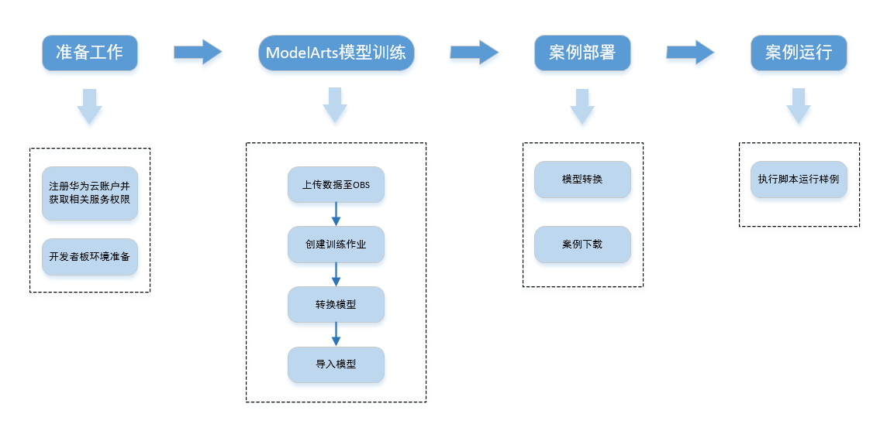
## 案例目标
- 掌握使用ModelArts训练口罩识别AI模型。
- 掌握使用Atlas200 DK部署模型并跑通口罩识别样例。

## 物料准备
- Liunx环境（虚拟机或Liunx系统）。
- Atlas200 DK开发套件（如需购买，请在[此处](https://www.vmall.com/product/10086085080100.html?78119)购买）。

## 环境准备
体验口罩识别AI应用的开发，需要完成以下准备工作
1. **ModelArts准备工作**

    参考[此文档](https://github.com/huaweicloud/ModelArts-Lab/tree/master/docs/ModelArts%E5%87%86%E5%A4%87%E5%B7%A5%E4%BD%9C)，完成ModelArts准备工作。包括注册华为云账号、ModelArts全局配置和OBS相关操作。如果没有windows环境可以不安装OBS Browser+。

2. **Atlas200 DK准备工作**

    （1）参考[此文档](https://www.huaweicloud.com/ascend/doc/Atlas200DK/1.32.0.0(beta)/zh/zh-cn_topic_0238627491.html)进行SD卡制作，制卡成功后等待开发者板四个灯常亮即可。
    
    （2）参考[此文档](https://www.huaweicloud.com/ascend/doc/Atlas200DK/1.32.0.0(beta)/zh/zh-cn_topic_0238627493.html)中的**使用网线通过路由器连接Ubuntu服务器**步骤，完成开发者板和本地机器的连接及开发者板上网配置。

    （3）配置完成后，在连接开发者板的虚拟机（或Liunx机器）中执行**ssh HwHiAiUser@192.168.1.2**命令登录开发者板,如下图。

    （4）参考[此文档](https://gitee.com/Atlas200DK/sample-README/blob/master/DK_Environment/Readme.md)在开发者板中进行Python2开发环境的依赖安装。

## 数据集准备
按照如下步骤在modelarts上部署数据集。
1. **下载数据集**
    
    本案例使用口罩识别数据集，点击[此链接](https://modelarts-labs.obs.cn-north-1.myhuaweicloud.com/codelab/mask_detection/mask_detection_500.tar.gz)，下载压缩包至本地，然后解压。

    解压后，可以看到mask_detection_500文件夹下有train和test两个文件夹。train文件夹中存放的训练集，共500张图片，均已标注。test文件夹下存放的是测试图片。

    **注意：该口罩识别数据集只能用于学习用途，不得用于商业用途。**

2. **上传数据至OBS**

    windows环境中在OBS Browser+中，进入刚刚创建的“华为北京四”区域的OBS桶，然后点击上传按钮，上传本地文件夹mask_detection_500至OBS桶。

    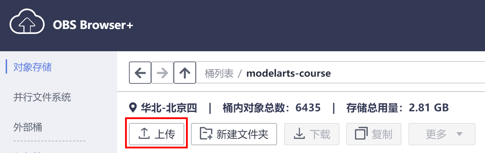

    如果没有下载OBS Browser+，可以直接在网页上的OBS桶中直接上传文件（每次最多上传100个文件）。
    
    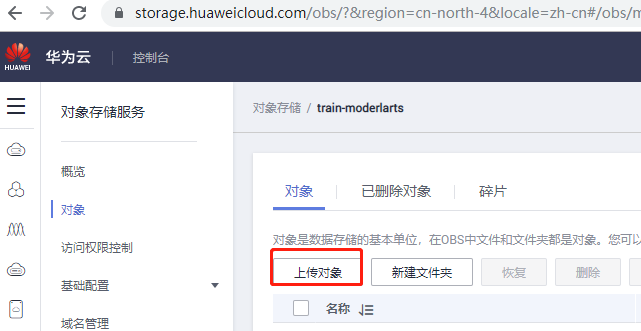

3. **创建数据集**

    点击[此链接](https://console.huaweicloud.com/modelarts/?region=cn-north-4#/manage/dataLabel_Beta)，进入ModelArts数据集。请确保区域在“华北-北京四”，本案例所有操作在“华北-北京四”。

    点击页面上的“创建数据集”按钮， 创建数据集页面填写示例如下：
    
    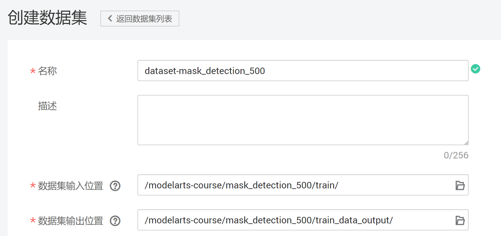
    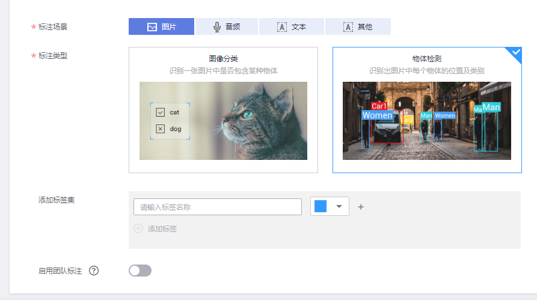

    - 数据集名称：自定义
    - 数据集输入位置：train文件夹所在的OBS路径
    - 数据集输出位置：标注数据的输出OBS路径。需要在OBS中创建这个路径，可以是使用OBS Browser+创建。
    - 标注场景：图片
    - 标注类型：物体检测
    
    填写完毕上述字段后，点击创建按钮。

    训练集中已经包含了标注文件，ModelArts数据集会自动加载标注文件。

    创建成功后，点击“发布”按钮，发布数据集

    注意：训练验证集比例中的训练集比例需要填写比例值（如：0.8）。

    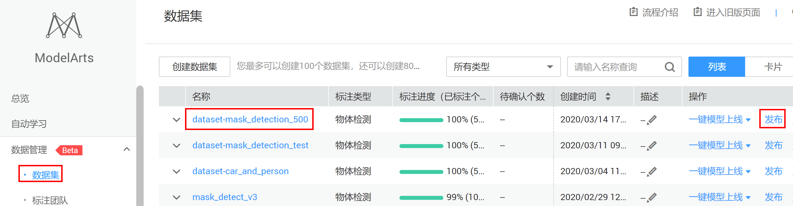    

    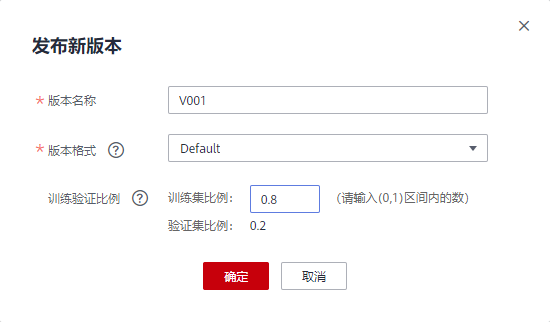

4. **数据标注格式解读**

    **这里是对图片标注的介绍，当前的训练集中已经包含了标注文件，无需标注。**

    数据集发布成功后，点击进入数据集，然后点击“开始标注”按钮，观察数据标注详情。其中一张样例图片的标注详情如下：

    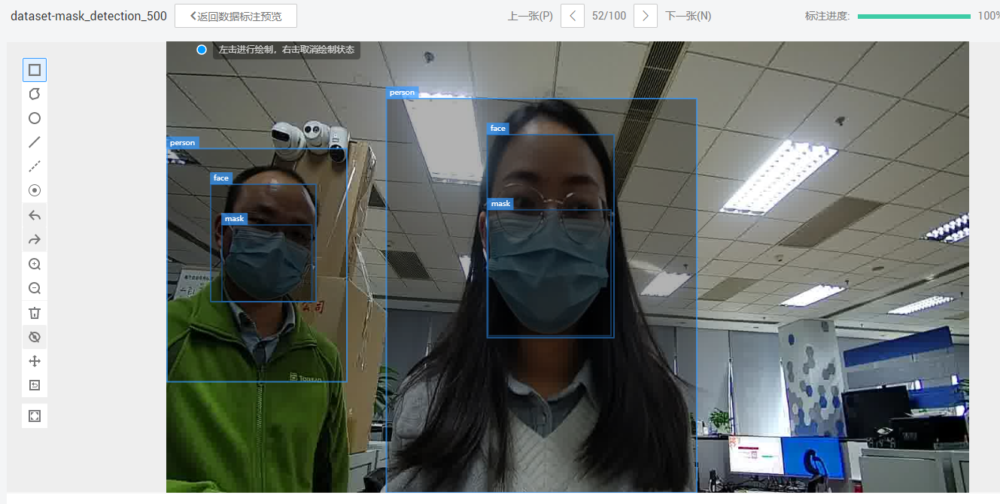

    数据集共有三种类型的标注框，person（包含头部和肩部）、face和mask。判断一个人有没有戴口罩的方法是，脸部的检测框里面是否有口罩的检测框。person物体的作用是对人做目标跟踪。

## 模型训练
我们在ModelArts中训练模型，模型训练完成后转换成Atlas200 DK中可用的om模型。

1. **创建训练作业**

    接下来将通过ModelArts训练作业训练AI模型，使用ModelArts的yolov3预置算法训练一个口罩检测模型。

    进入[ModelArts管理控制台](https://console.huaweicloud.com/modelarts/?region=cn-north-4#/manage/trainingjobs)，进入ModelArts“训练作业”页面。

    单击“ **创建** ”按钮，进入“ **创建训练作业** ”页面。

     在“创建训练作业”页面，按照如下指导填写训练作业相关参数。

    “计费模式”和“版本”为系统自动生成，不需修改。

    - 名称：自定义。
    - 描述：描述信息，可选。

    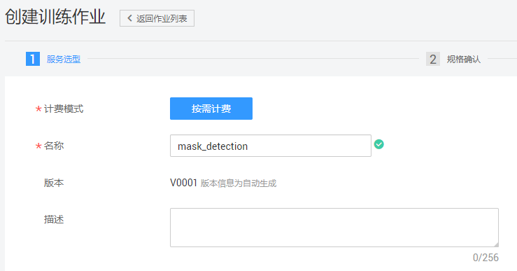

    算法来源：单击“ **选择** ”，从“ **预置算法** ”列表中，选择“ **yolov3_resnet18** ”算法。

    - 数据来源：数据集
    - 选择数据集和选择版本：选择刚刚创建的口罩数据集和版本。
    - 训练输出位置：选择一个空的OBS路径，用来存储训练输出的模型。如/modelarts-course/mask_detection_500/output/，该路径需要自己创建。
    - 运行参数：列表中会自动增加train_url和data_url两个参数。需要添加一个运行参数max_epochs=400，max_epochs值越大训练时间越长。
    - 作业日志路径：选择一个空的OBS路径，用来存储作业训练日志。如/modelarts-course/mask_detection_500/log/，该路径需要自己创建。

    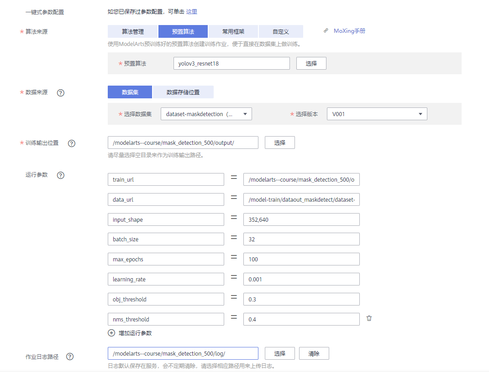
    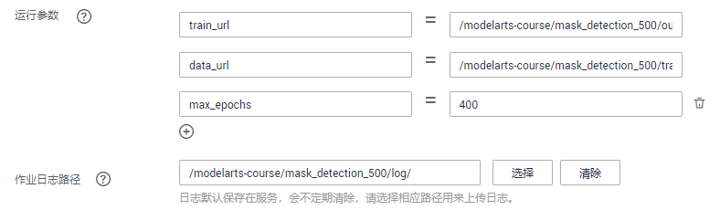

    - 资源池：公共资源池
    - 类型：GPU
    - 规格：CPU：8 核 64GiB GPU：1 * nvidia-p100 16GiB。也可以选择V100，V100比P100的算力更强，但是更贵。
    - 计算节点：1

    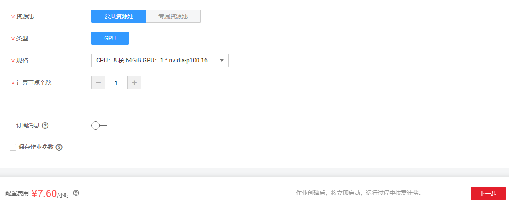

    完成信息填写，单击“下一步”。

    在“规格确认”页面，确认填写信息无误后，单击“ **立即创建** ”。

    在“训练作业”管理页面，可以查看新建训练作业的状态。

    如果设置 **max_epochs=400** ，训练过程需要4小时30分钟左右。当状态变更为“运行成功”时，表示训练作业运行完成。 您可以单击训练作业的名称，可进入此作业详情页面，了解训练作业的“配置信息”、“日志”、“资源占用情况”和“评估结果”等信息。
    
2. **模型转换**

    进入ModelArts管理控制台，在左侧导航栏中选择 **“模型管理”> “压缩/转换”** ，进入模型转换列表页面。

    单击左上角的 **“创建任务”** ，进入任务创建任务页面。

    在“创建任务”页面，填写相关信息。

    - 名称：输入“ **convert-mask-detection** ”。
    - 描述：口罩识别。
    - 转换模板：选择 **“TensorFlow frozen graph 转 Ascend”** 。就是将TensorFlow的frozen graph格式的模型转换成可在昇腾芯片上推理的格式。
    - 转换输入目录：训练作业的训练输出目录下的frozen_graph OBS目录，本案例中是/modelarts-course/mask_detection_500/output/frozen_graph/。
    - 转换输出目录：训练作业的训练输出目录下的om/model OBS目录，本案例中是/modelarts-course/mask_detection_500/output/om/model/。
    - 高级选项：“输入张量形状”为images:1,352,640,3。
    
    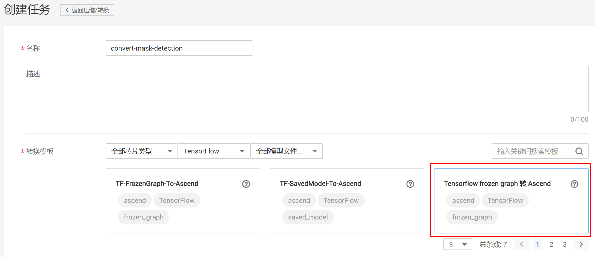 
    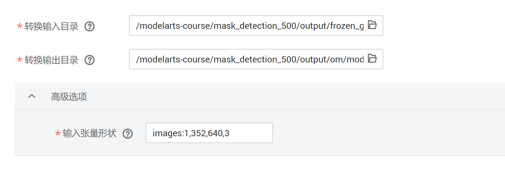    

    任务信息填写完成后，单击右下角 **“立即创建”** 按钮。等待模型转换任务完成。

    模型转换完成后，在OBS的对应目录中下载模型，在本案例中模型路径如下：

    **/modelarts-course/mask_detection_500/output/om/model/convert-mask-detection.om**

## 案例部署
登录开发者板(未登录请参考[此步骤](#1)登录开发者板)，执行以下命令下载案例代码。

**wget https://obs-book.obs.cn-east-2.myhuaweicloud.com/mark_detection.zip**

**unzip mark_detection.zip**

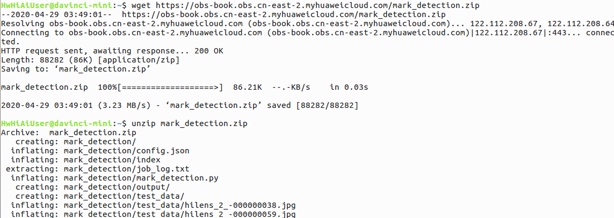

将模型转换中已下载的om模型存放到虚拟机中，然后参考[此文档](https://www.huaweicloud.com/ascend/doc/Atlas200DK/1.3.0.0/zh/zh-cn_topic_0183299383.html)将此模型拷贝到开发板中**mark_detection**文件夹下，并将模型更名为 **yolo3_resnet18.om** ，

本样例中执行命令如下：

**scp ./convert-mask-detection.om HwHiAiUser@192.168.1.2:/home/HwHiAiUser/mark_detection**

如下图所示：

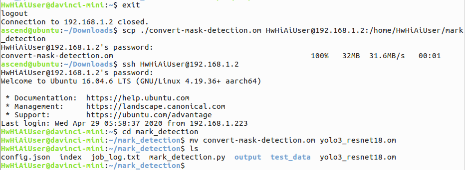

## 案例运行
执行以下命令运行口罩识别（mark_detection文件夹下test_data已经预置了测试图片，可以自行添加验证图片）。

**python mark_detection.py**

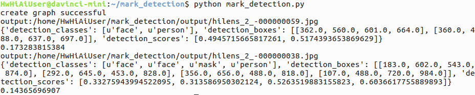

运行完毕后，标注结果图片生成在mark_detection文件夹下的output文件夹中，参考[此文档](https://www.huaweicloud.com/ascend/doc/Atlas200DK/1.3.0.0/zh/zh-cn_topic_0183299383.html)将output文件夹拷贝到本地虚拟机中进行查看。

本样例中执行命令如下：

**scp -r HwHiAiUser@192.168.1.2:/home/HwHiAiUser/mark_detection/output ./output**

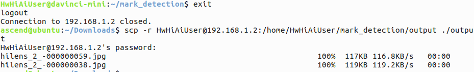

查看图片效果如下：

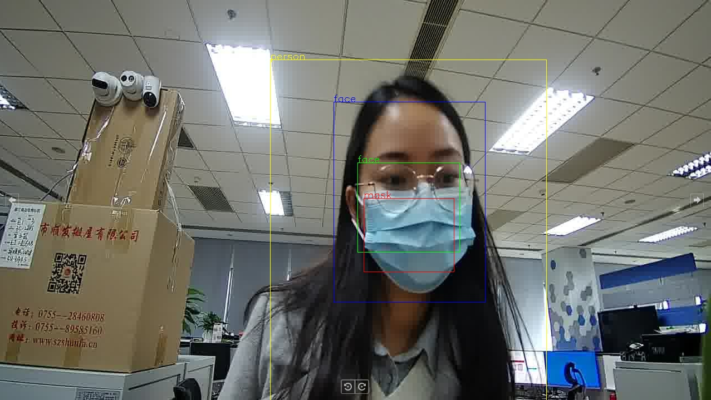