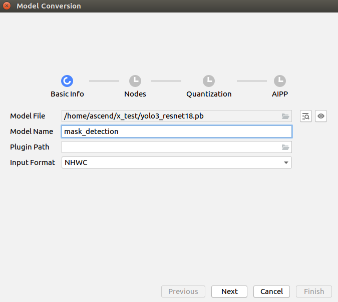
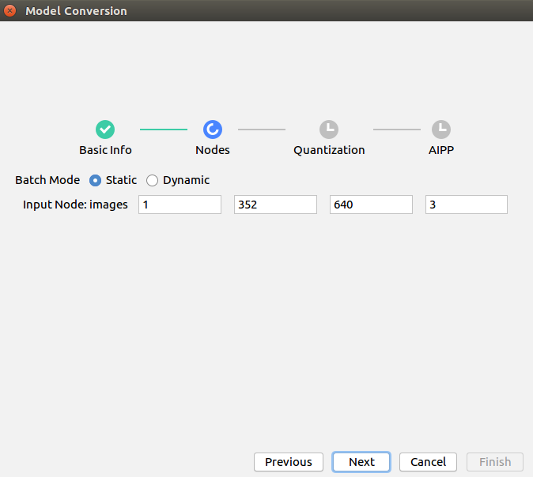
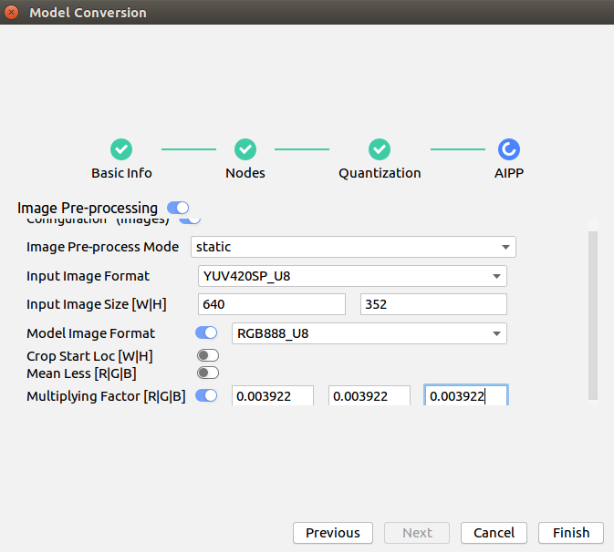
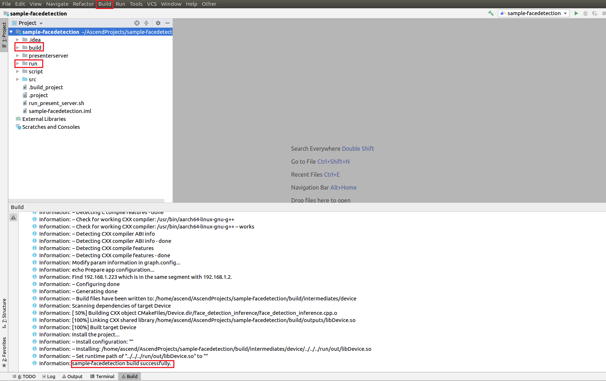
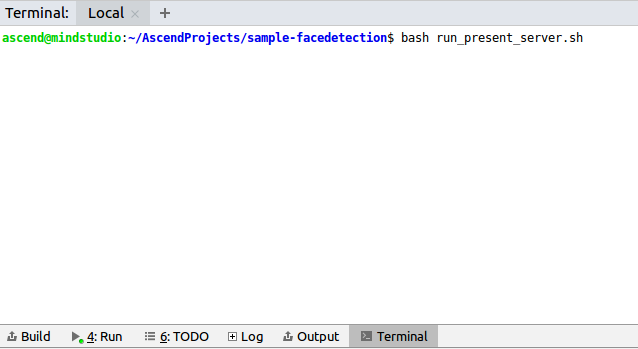
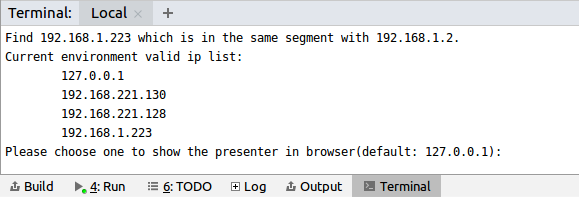
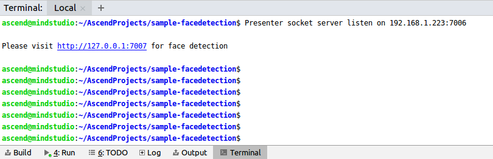
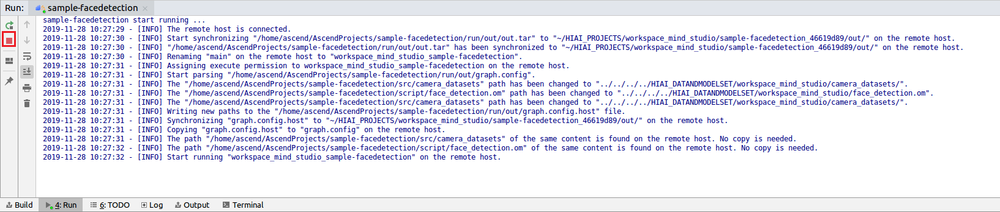
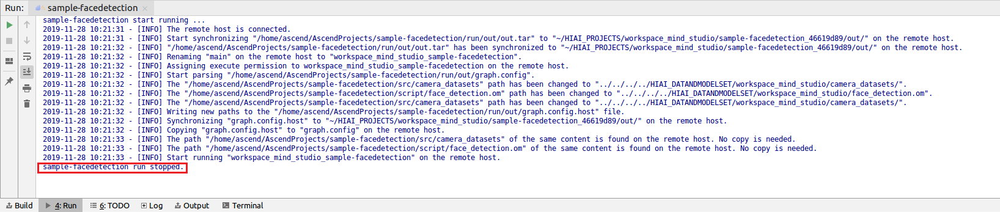

中文|[English](Readme_EN.md)

# 口罩检测<a name="ZH-CN_TOPIC_0208834076"></a>

开发者可以将本application部署至Atlas 200DK上实现对摄像头数据的实时采集、并对视频中的口罩、人脸、人信息进行预测的功能。

当前分支中的应用适配**1.32.0.0及以上**版本的[DDK&RunTime](https://ascend.huawei.com/resources)。

## 前提条件<a name="zh-cn_topic_0203223294_section137245294533"></a>

部署此Sample前，需要准备好以下环境：

-   已完成Mind Studio的安装。
-   已完成Atlas 200 DK开发者板与Mind Studio的连接，交叉编译器的安装，SD卡的制作及基本信息的配置等。

## 软件准备<a name="zh-cn_topic_0203223294_section081240125311"></a>

运行此Sample前，需要按照此章节获取源码包，进行相关的环境配置并准备模型文件。

1.  <a name="zh-cn_topic_0203223294_li953280133816"></a>获取源码包。
    1.  下载压缩包方式获取。

        将[https://gitee.com/Atlas200DK/sample-maskdetection/tree/master/](https://gitee.com/Atlas200DK/sample-maskdetection/tree/master/)仓中的代码以Mind Studio安装用户下载至Mind Studio所在Ubuntu服务器的任意目录，例如代码存放路径为：$HOME/AscendProjects/sample-maskdetection。

    2.  命令行使用git命令方式获取。

        在命令行中：$HOME/AscendProjects目录下执行以下命令下载代码。

        **git clone https://gitee.com/Atlas200DK/sample-maskdetection.git --branch master**

2.  <a name="zh-cn_topic_0203223294_li1365682471610"></a>获取此应用中所需要的原始网络模型。

    参考[表1](#zh-cn_topic_0203223294_table144841813177)获取此应用中所用到的原始网络模型及其对应的权重文件，并将其存放到Mind Studio所在Ubuntu服务器的任意目录，这两个文件必须存放到同一个目录下。例如：$HOME/models/maskdetection。

    **表 1**  Mask Detection中使用模型

    <a name="zh-cn_topic_0203223294_table144841813177"></a>
    <table><thead align="left"><tr id="zh-cn_topic_0203223294_row161061318181712"><th class="cellrowborder" valign="top" width="13.61%" id="mcps1.2.4.1.1"><p id="zh-cn_topic_0203223294_p1410671814173"><a name="zh-cn_topic_0203223294_p1410671814173"></a><a name="zh-cn_topic_0203223294_p1410671814173"></a>模型名称</p>
    </th>
    <th class="cellrowborder" valign="top" width="10.03%" id="mcps1.2.4.1.2"><p id="zh-cn_topic_0203223294_p1106118121716"><a name="zh-cn_topic_0203223294_p1106118121716"></a><a name="zh-cn_topic_0203223294_p1106118121716"></a>模型说明</p>
    </th>
    <th class="cellrowborder" valign="top" width="76.36%" id="mcps1.2.4.1.3"><p id="zh-cn_topic_0203223294_p14106218121710"><a name="zh-cn_topic_0203223294_p14106218121710"></a><a name="zh-cn_topic_0203223294_p14106218121710"></a>模型下载路径</p>
    </th>
    </tr>
    </thead>
    <tbody><tr id="zh-cn_topic_0203223294_row1710661814171"><td class="cellrowborder" valign="top" width="13.61%" headers="mcps1.2.4.1.1 "><p id="zh-cn_topic_0203223294_p13106121801715"><a name="zh-cn_topic_0203223294_p13106121801715"></a><a name="zh-cn_topic_0203223294_p13106121801715"></a>mask_detection</p>
    </td>
    <td class="cellrowborder" valign="top" width="10.03%" headers="mcps1.2.4.1.2 "><p id="zh-cn_topic_0203223294_p13106171831710"><a name="zh-cn_topic_0203223294_p13106171831710"></a><a name="zh-cn_topic_0203223294_p13106171831710"></a>口罩检测网络模型。</p>
    <p id="zh-cn_topic_0203223294_p18106718131714"><a name="zh-cn_topic_0203223294_p18106718131714"></a><a name="zh-cn_topic_0203223294_p18106718131714"></a></p>
    </td>
    <td class="cellrowborder" valign="top" width="76.36%" headers="mcps1.2.4.1.3 "><p id="zh-cn_topic_0203223294_p110671813170"><a name="zh-cn_topic_0203223294_p110671813170"></a><a name="zh-cn_topic_0203223294_p110671813170"></a>请参考<a href="https://gitee.com/HuaweiAscend/models/tree/master/computer_vision/object_detect/mask_detection" target="_blank" rel="noopener noreferrer">https://gitee.com/HuaweiAscend/models/tree/master/computer_vision/object_detect/mask_detection</a>目录中README.md下载原始网络模型文件及其对应的权重文件。</p>
    </td>
    </tr>
    </tbody>
    </table>

3.  以Mind Studio安装用户登录Mind Studio所在Ubuntu服务器，确定当前使用的DDK版本号并设置环境变量DDK\_HOME，tools\_version，LD\_LIBRARY\_PATH。
    1.  <a name="zh-cn_topic_0203223294_li61417158198"></a>查询当前使用的DDK版本号。

        可通过Mind Studio工具查询，也可以通过DDK软件包进行获取。

        -   使用Mind Studio工具查询。

            在Mind Studio工程界面依次选择“File \> Settings \> System Settings \> Ascend DDK“，弹出如[图 DDK版本号查询](#zh-cn_topic_0203223294_fig17553193319118)所示界面。

            **图 1**  DDK版本号查询<a name="zh-cn_topic_0203223294_fig17553193319118"></a>  
            

            其中显示的**DDK Version**就是当前使用的DDK版本号，如**1.32.0.B080**。

        -   通过DDK软件包进行查询。

            通过安装的DDK的包名获取DDK的版本号。

            DDK包的包名格式为：**Ascend\_DDK-\{software version\}-\{intermask version\}-x86\_64.ubuntu16.04.tar.gz**

            其中**software version**就是DDK的软件版本号。

            例如：

            DDK包的包名为Ascend\_DDK-1.32.0.B080-1.1.1-x86\_64.ubuntu16.04.tar.gz，则此DDK的版本号为1.32.0.B080。

    2.  设置环境变量。

        **vim \~/.bashrc**

        执行如下命令在最后一行添加DDK\_HOME及LD\_LIBRARY\_PATH的环境变量。

        **export tools\_version=_1.32.X.X_**

        **export DDK\_HOME=$HOME/.mindstudio/huawei/ddk/_1.32.X.X_/ddk**

        **export LD\_LIBRARY\_PATH=$DDK\_HOME/lib/x86\_64-linux-gcc5.4**

        > **说明：**   
        >-   **_1.32.X.X_**是[a](#zh-cn_topic_0203223294_li61417158198)中查询到的DDK版本号，需要根据查询结果对应填写，如**1.32.0.B080**  
        >-   如果此环境变量已经添加，则此步骤可跳过。  

        输入:wq!保存退出。

        执行如下命令使环境变量生效。

        **source \~/.bashrc**

4.  将原始网络模型转换为适配昇腾AI处理器的模型，模型转换有Mind Studio工具转换和命令行转换两种方式。
    -   通过Mind Studio工具进行模型转换。
        1.  在Mind Studio操作界面的顶部菜单栏中选择**Tools \> Model Convert**，进入模型转换界面。
        2.  在弹出的**Model** **Conversion**操作界面中，进行模型转换配置，如[图 mask\_detection模型转换配置](#zh-cn_topic_0203223294_fig206931026131712)所示。

            **图 2**  mask\_detection模型转换配置<a name="zh-cn_topic_0203223294_fig206931026131712"></a>  
            

            

            -   Model File选择[步骤2](#zh-cn_topic_0203223294_li1365682471610)中下载的模型文件，此时会自动匹配到权重文件并填写在Weight File中。
            -   Model Name填写为[表1](#zh-cn_topic_0203223294_table144841813177)中的模型名称：**mask\_detection**。

        3.  单击**Next**，进入Nodes配置界面。

            **图 3**  Nodes配置示例<a name="zh-cn_topic_0203223294_fig3754173017185"></a>  
            

            

        4.  单击**Next**，进入Quantization配置界面。

            关闭**Quantization Configuration**按钮，不开启量化。

        5.  单击**Next**，进入AIPP配置界面。需要将**Model Image Format**修改为BGR888\_U8。关闭Mean Less，打开Multiplying Factor，全部填写0.003922。其他使用默认值。如[图 AIPP配置](#zh-cn_topic_0203223294_fig1682055223010)所示

            **图 4**  AIPP配置<a name="zh-cn_topic_0203223294_fig1682055223010"></a>  
            

        6.  单击**OK**开始转换模型。

        模型转换成功后，后缀为.om的离线模型存放地址为：$HOME/modelzoo/mask\_detection/device。

            > **说明：**   
            >Mindstudio模型转换中每一步的具体意义和参数说明可以参考[Mind Studio用户手册](https://ascend.huawei.com/doc/mindstudio/)中的“模型转换“章节。  


    -   命令行模式转换模型
        1.  以Mind Studio安装用户进入存放原始模型的文件夹。

            **cd $HOME/models/maskdetection**

        2.  使用omg工具执行以下命令进行模型转换。

            ```
            ${DDK_HOME}/uihost/bin/omg --output="./XXX" --model="./XXX.pb" --framework=3 --ddk_version=${tools_version} --input_shape=`head -1 $HOME/AscendProjects/sample-videoanalysisperson/script/shape_XXX` --insert_op_conf=$HOME/AscendProjects/sample-videoanalysisperson/script/aipp_XXX.cfg
            ```

            > **说明：**   
            >-   **XXX**为[表 人体检测应用中使用模型](#zh-cn_topic_0203223281_table1193115345597)中的TensorFlow模型名称，转换时请替换填入需要转换的TensorFlow模型名称。  


5.  将转换好的模型文件（.om文件）上传到[步骤1](#zh-cn_topic_0203223294_li953280133816)中源码所在路径下的“**sample-maskdetection/script**”目录下。

## 编译<a name="zh-cn_topic_0203223294_section7994174585917"></a>

1.  打开对应的工程。

    以Mind Studio安装用户在命令行中进入安装包解压后的“MindStudio-ubuntu/bin”目录，如：$HOME/MindStudio-ubuntu/bin。执行如下命令启动Mind Studio。

    **./MindStudio.sh**

    启动成功后，打开**sample-maskdetection**工程，如[图 打开maskdetection工程](#zh-cn_topic_0203223294_fig05481157171918)所示。

    **图 6**  打开maskdetection工程<a name="zh-cn_topic_0203223294_fig05481157171918"></a>  
    

    

2.  在**src/param\_configure.conf**文件中配置相关工程信息。

    如[图 配置文件路径](#zh-cn_topic_0203223294_fig0391184062214)所示。

    **图 7**  配置文件<a name="zh-cn_topic_0203223294_fig0391184062214"></a>  
    

    

    该配置文件默认配置内容如下：

    ```
    remote_host=192.168.1.2
    data_source=Channel-1
    presenter_view_app_name=video
    ```

    -   remote\_host：配置为Atlas 200 DK开发者板的IP地址。
    -   data\_source : 配置摄像头所属Channel，取值为Channel-1或者Channel-2，查询摄像头所属Channel的方法请参考[Atlas 200 DK用户手册](https://ascend.huawei.com/doc/Atlas200DK/)中的“如何查看摄像头所属Channel”。
    -   presenter\_view\_app\_name : 用户自定义的在PresenterServer界面展示的View Name，此View Name需要在Presenter Server展示界面唯一，只能为大小写字母、数字、“/”的组合，位数至少1位。

    > **说明：**   
    >-   三个参数必须全部填写，否则无法通过编译。  
    >-   注意参数填写时不需要使用“”符号。  
    >-   当前已经按照配置示例配置默认值，请按照配置情况自行修改。  

3.  执行deploy脚本， 进行配置参数调整及第三方库下载编译 打开Mind Studio工具的Terminal，此时默认在代码主目录下，执行如下命令在后台指执行deploy脚本，进行环境部署。如[图 执行deploy脚本](#zh-cn_topic_0203223294_fig107831626101910)所示。

    **图 8**  执行deploy脚本<a name="zh-cn_topic_0203223294_fig107831626101910"></a>  
    

    > **说明：**   
    >-   首次deploy时，没有部署第三方库时会自动下载并编译，耗时可能比较久，请耐心等待。后续再重新编译时，不会重复下载编译，部署如上图所示。  
    >-   deploy时，需要选择与开发板通信的主机侧ip，一般为虚拟网卡配置的ip。如果此ip和开发板ip属于同网段，则会自动选择并部署。如果非同网段，则需要手动输入与开发板通信的主机侧ip才能完成deploy。  

4.  开始编译，打开Mindstudio工具，在工具栏中点击**Build \> Build \> Build-Configuration**。如[图 编译操作及生成文件](#zh-cn_topic_0203223294_fig1625447397)所示，会在目录下生成build和run文件夹。

    **图 9**  编译操作及生成文件<a name="zh-cn_topic_0203223294_fig1625447397"></a>  
    

    

    > **须知：**   
    >首次编译工程时，**Build \> Build**为灰色不可点击状态。需要点击**Build \> Edit Build Configuration**，配置编译参数后再进行编译。  

5.  启动Presenter Server。

    打开Mind Studio工具的Terminal，在应用代码存放路径下，执行如下命令在后台启动mask Detection应用的Presenter Server主程序。如[图 启动PresenterServer](#zh-cn_topic_0203223294_fig423515251067)所示。

    **bash run\_present\_server.sh**

    **图 10**  启动PresenterServer<a name="zh-cn_topic_0203223294_fig423515251067"></a>  
    

    

    当提示“**Please choose one to show the presenter in browser\(default: 127.0.0.1\):**”时，请输入在浏览器中访问Presenter Server服务所使用的IP地址（一般为访问Mind Studio的IP地址）。

    如[图 工程部署示意图](#zh-cn_topic_0203223294_fig999812514814)所示，请在“**Current environment valid ip list**”中选择通过浏览器访问Presenter Server服务使用的IP地址。

    **图 11**  工程部署示意图<a name="zh-cn_topic_0203223294_fig999812514814"></a>  
    

    

    如[图12](#zh-cn_topic_0203223294_fig69531305324)所示，表示presenter\_server的服务启动成功。

    **图 12**  Presenter Server进程启动<a name="zh-cn_topic_0203223294_fig69531305324"></a>  
    

    

    使用上图提示的URL登录Presenter Server。IP地址为[图 工程部署示意图](#zh-cn_topic_0203223294_fig999812514814)操作时输入的IP地址，端口号默为7007，如下图所示，表示Presenter Server启动成功。

    **图 13**  主页显示<a name="zh-cn_topic_0203223294_fig64391558352"></a>  
    

    Presenter Server、Mind Studio与Atlas 200 DK之间通信使用的IP地址示例如下图所示：

    **图 14**  IP地址示例<a name="zh-cn_topic_0203223294_fig1881532172010"></a>  
    

    其中：

    -   Atlas 200 DK开发者板使用的IP地址为192.168.1.2（USB方式连接）。
    -   Presenter Server与Atlas 200 DK通信的IP地址为UI Host服务器中与Atlas 200 DK在同一网段的IP地址，例如：192.168.1.223。
    -   通过浏览器访问Presenter Server的IP地址本示例为：10.10.0.1，由于Presenter Server与Mind Studio部署在同一服务器，此IP地址也为通过浏览器访问Mind Studio的IP。


## 运行<a name="zh-cn_topic_0203223294_section551710297235"></a>

1.  运行mask Detection程序。

    在Mind Studio工具的工具栏中找到Run按钮，点击**Run \> Run 'sample-maskdetection'**，如[图 程序已执行示意图](#zh-cn_topic_0203223294_fig93931954162719)所示，可执行程序已经在开发者板运行。

    **图 15**  程序运行示例<a name="zh-cn_topic_0203223294_fig93931954162719"></a>  
    

    

2.  使用启动Presenter Server服务时提示的URL登录 Presenter Server 网站。

    等待Presenter Agent传输数据给服务端，单击“Refresh“刷新，当有数据时相应的Channel 的Status变成绿色，如下图所示。

    **图 16**  Presenter Server界面<a name="zh-cn_topic_0203223294_fig113691556202312"></a>  
    

    > **说明：**   
    >-   mask Detection的Presenter Server最多支持10路Channel同时显示，每个  _presenter\_view\_app\_name_  对应一路Channel。  
    >-   由于硬件的限制，每一路支持的最大帧率是20fps，受限于网络带宽的影响，帧率会自动适配为较低的帧率进行展示。  

3.  单击右侧对应的View Name链接，比如上图的“video”，查看结果，对于检测到的人脸，会给出置信度的标注。

## 后续处理<a name="zh-cn_topic_0203223294_section177619345260"></a>

-   **停止mask Detection应用**

    mask Detection应用执行后会处于持续运行状态，若要停止mask Detection应用程序，可执行如下操作。

    单击[图 停止mask Detection应用](#zh-cn_topic_0203223294_fig14326454172518)所示的停止按钮停止mask Detection应用程序。

    **图 17**  停止mask Detection应用<a name="zh-cn_topic_0203223294_fig14326454172518"></a>  
    

    

    如[图 mask Detection应用已停止](#zh-cn_topic_0203223294_fig2182182518112)所示应用程序已停止运行

    **图 18**  mask Detection应用已停止<a name="zh-cn_topic_0203223294_fig2182182518112"></a>  
    

    

-   **停止Presenter Server服务**

    Presenter Server服务启动后会一直处于运行状态，若想停止mask Detection应用对应的Presenter Server服务，可执行如下操作。

    以Mind Studio安装用户在Mind Studio所在服务器中的命令行中执行如下命令查看mask Detection应用对应的Presenter Server服务的进程。

    **ps -ef | grep presenter | grep mask\_detection**

    ```
    ascend@ascend-HP-ProDesk-600-G4-PCI-MT:~/sample-maskdetection$ ps -ef | grep presenter | grep mask_detection
    ascend    7701  1615  0 14:21 pts/8    00:00:00 python3 presenterserver/presenter_server.py --app mask_detection
    ```

    如上所示  _7701_  即为mask\_detection应用对应的Presenter Server服务的进程ID。

    若想停止此服务，执行如下命令：

    **kill -9** _7701_


