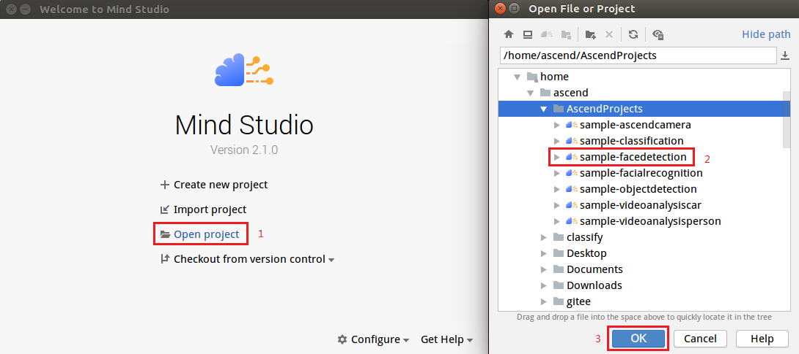

中文|[English](Readme_EN.md)

# 人脸检测<a name="ZH-CN_TOPIC_0232337872"></a>

开发者可以将本application部署至Atlas 200DK上实现对摄像头数据的实时采集、并对视频中的人脸信息进行预测的功能。

当前分支中的应用适配**1.32.0.0及以上**版本的[DDK&RunTime](https://ascend.huawei.com/resources)。

## 前提条件<a name="zh-cn_topic_0228461904_section137245294533"></a>

部署此Sample前，需要准备好以下环境：

-   已完成Mind Studio的安装。
-   已完成Atlas 200 DK开发者板与Mind Studio的连接，交叉编译器的安装，SD卡的制作及基本信息的配置等。

## 部署<a name="zh-cn_topic_0228461904_section412811285117"></a>

可以选择如下快速部署或者常规方法部署，二选一即可：

1.  快速部署，请参考：  [https://gitee.com/Atlas200DK/faster-deploy](https://gitee.com/Atlas200DK/faster-deploy)  。

    > **说明：**   
    >-   该快速部署脚本可以快速部署多个案例，请选择人脸检测案例部署即可。  
    >-   该快速部署脚本自动完成了代码下载、模型转换、环境变量配置等流程，如果需要了解详细的部署过程请选择常规部署方式。转：**[2. 常规部署](#zh-cn_topic_0228461904_li3208251440)**  

2.  <a name="zh-cn_topic_0228461904_li3208251440"></a>常规部署，请参考：  [https://gitee.com/Atlas200DK/sample-README/tree/master/sample-facedetection](https://gitee.com/Atlas200DK/sample-README/tree/master/sample-facedetection)  。

    > **说明：**   
    >-   该部署方式，需要手动完成代码下载、模型转换、环境变量配置等过程。完成后，会对其中的过程更加了解。  


## 编译<a name="zh-cn_topic_0228461904_section7994174585917"></a>

1.  打开对应的工程。

    以Mind Studio安装用户在命令行中进入安装包解压后的“MindStudio-ubuntu/bin”目录，如：$HOME/MindStudio-ubuntu/bin。执行如下命令启动Mind Studio。

    **./MindStudio.sh**

    启动成功后，打开**sample-facedetection**工程，如[图 打开facedetection工程](#zh-cn_topic_0228461904_zh-cn_topic_0203223294_fig05481157171918)所示。

    **图 1**  打开facedetection工程<a name="zh-cn_topic_0228461904_zh-cn_topic_0203223294_fig05481157171918"></a>  
    

    

2.  在**src/param\_configure.conf**文件中配置相关工程信息。

    如[图 配置文件路径](#zh-cn_topic_0228461904_zh-cn_topic_0203223294_fig0391184062214)所示。

    **图 2**  配置文件<a name="zh-cn_topic_0228461904_zh-cn_topic_0203223294_fig0391184062214"></a>  
    

    

    该配置文件默认配置内容如下：

    ```
    remote_host=192.168.1.2
    data_source=Channel-1
    presenter_view_app_name=video
    ```

    -   remote\_host：配置为Atlas 200 DK开发者板的IP地址。
    -   data\_source : 配置摄像头所属Channel，取值为Channel-1或者Channel-2，查询摄像头所属Channel的方法请参考[Atlas 200 DK用户手册](https://ascend.huawei.com/doc/Atlas200DK/)中的“如何查看摄像头所属Channel”。
    -   presenter\_view\_app\_name : 用户自定义的在PresenterServer界面展示的View Name，此View Name需要在Presenter Server展示界面唯一，只能为大小写字母、数字、“/”的组合，位数至少1位。

    > **说明：**   
    >-   三个参数必须全部填写，否则无法通过编译。  
    >-   注意参数填写时不需要使用“”符号。  
    >-   当前已经按照配置示例配置默认值，请按照配置情况自行修改。  

3.  执行deploy脚本， 进行配置参数调整及第三方库下载编译 打开Mind Studio工具的Terminal，此时默认在代码主目录下，执行如下命令在后台指执行deploy脚本，进行环境部署。如[图 执行deploy脚本](#zh-cn_topic_0228461904_zh-cn_topic_0203223294_fig107831626101910)所示。

    **图 3**  执行deploy脚本<a name="zh-cn_topic_0228461904_zh-cn_topic_0203223294_fig107831626101910"></a>  
    

    > **说明：**   
    >-   首次deploy时，没有部署第三方库时会自动下载并编译，耗时可能比较久，请耐心等待。后续再重新编译时，不会重复下载编译，部署如上图所示。  
    >-   deploy时，需要选择与开发板通信的主机侧ip，一般为虚拟网卡配置的ip。如果此ip和开发板ip属于同网段，则会自动选择并部署。如果非同网段，则需要手动输入与开发板通信的主机侧ip才能完成deploy。  

4.  开始编译，打开Mindstudio工具，在工具栏中点击**Build \> Build \> Build-Configuration**。如[图 编译操作及生成文件](#zh-cn_topic_0228461904_zh-cn_topic_0203223294_fig1625447397)所示，会在目录下生成build和run文件夹。

    **图 4**  编译操作及生成文件<a name="zh-cn_topic_0228461904_zh-cn_topic_0203223294_fig1625447397"></a>  
    

    

    > **须知：**   
    >首次编译工程时，**Build \> Build**为灰色不可点击状态。需要点击**Build \> Edit Build Configuration**，配置编译参数后再进行编译。  

5.  启动Presenter Server。

    打开Mind Studio工具的Terminal，在应用代码存放路径下，执行如下命令在后台启动Face Detection应用的Presenter Server主程序。如[图 启动PresenterServer](#zh-cn_topic_0228461904_zh-cn_topic_0203223294_fig423515251067)所示。

    **bash run\_present\_server.sh**

    **图 5**  启动PresenterServer<a name="zh-cn_topic_0228461904_zh-cn_topic_0203223294_fig423515251067"></a>  
    

    

    当提示“**Please choose one to show the presenter in browser\(default: 127.0.0.1\):**”时，请输入在浏览器中访问Presenter Server服务所使用的IP地址（一般为访问Mind Studio的IP地址）。

    如[图 工程部署示意图](#zh-cn_topic_0228461904_zh-cn_topic_0203223294_fig999812514814)所示，请在“**Current environment valid ip list**”中选择通过浏览器访问Presenter Server服务使用的IP地址。

    **图 6**  工程部署示意图<a name="zh-cn_topic_0228461904_zh-cn_topic_0203223294_fig999812514814"></a>  
    

    

    如[图7](#zh-cn_topic_0228461904_zh-cn_topic_0203223294_fig69531305324)所示，表示presenter\_server的服务启动成功。

    **图 7**  Presenter Server进程启动<a name="zh-cn_topic_0228461904_zh-cn_topic_0203223294_fig69531305324"></a>  
    

    

    使用上图提示的URL登录Presenter Server。IP地址为[图 工程部署示意图](#zh-cn_topic_0228461904_zh-cn_topic_0203223294_fig999812514814)操作时输入的IP地址，端口号默为7007，如下图所示，表示Presenter Server启动成功。

    **图 8**  主页显示<a name="zh-cn_topic_0228461904_zh-cn_topic_0203223294_fig64391558352"></a>  
    

    Presenter Server、Mind Studio与Atlas 200 DK之间通信使用的IP地址示例如下图所示：

    **图 9**  IP地址示例<a name="zh-cn_topic_0228461904_zh-cn_topic_0203223294_fig1881532172010"></a>  
    

    其中：

    -   Atlas 200 DK开发者板使用的IP地址为192.168.1.2（USB方式连接）。
    -   Presenter Server与Atlas 200 DK通信的IP地址为UI Host服务器中与Atlas 200 DK在同一网段的IP地址，例如：192.168.1.223。
    -   通过浏览器访问Presenter Server的IP地址本示例为：10.10.0.1，由于Presenter Server与Mind Studio部署在同一服务器，此IP地址也为通过浏览器访问Mind Studio的IP。


## 运行<a name="zh-cn_topic_0228461904_section551710297235"></a>

1.  运行Face Detection程序。

    在Mind Studio工具的工具栏中找到Run按钮，点击**Run \> Run 'sample-facedetection'**，如[图 程序已执行示意图](#zh-cn_topic_0228461904_zh-cn_topic_0203223294_fig93931954162719)所示，可执行程序已经在开发者板运行。

    **图 10**  程序运行示例<a name="zh-cn_topic_0228461904_zh-cn_topic_0203223294_fig93931954162719"></a>  
    

    

2.  使用启动Presenter Server服务时提示的URL登录 Presenter Server 网站。

    等待Presenter Agent传输数据给服务端，单击“Refresh“刷新，当有数据时相应的Channel 的Status变成绿色，如下图所示。

    **图 11**  Presenter Server界面<a name="zh-cn_topic_0228461904_zh-cn_topic_0203223294_fig113691556202312"></a>  
    

    > **说明：**   
    >-   Face Detection的Presenter Server最多支持10路Channel同时显示，每个  _presenter\_view\_app\_name_  对应一路Channel。  
    >-   由于硬件的限制，每一路支持的最大帧率是20fps，受限于网络带宽的影响，帧率会自动适配为较低的帧率进行展示。  

3.  单击右侧对应的View Name链接，比如上图的“video”，查看结果，对于检测到的人脸，会给出置信度的标注。

## 后续处理<a name="zh-cn_topic_0228461904_section177619345260"></a>

-   **停止Face Detection应用**

    Face Detection应用执行后会处于持续运行状态，若要停止Face Detection应用程序，可执行如下操作。

    单击[图 停止Face Detection应用](#zh-cn_topic_0228461904_zh-cn_topic_0203223294_fig14326454172518)所示的停止按钮停止Face Detection应用程序。

    **图 12**  停止Face Detection应用<a name="zh-cn_topic_0228461904_zh-cn_topic_0203223294_fig14326454172518"></a>  
    

    

    如[图 Face Detection应用已停止](#zh-cn_topic_0228461904_zh-cn_topic_0203223294_fig2182182518112)所示应用程序已停止运行

    **图 13**  Face Detection应用已停止<a name="zh-cn_topic_0228461904_zh-cn_topic_0203223294_fig2182182518112"></a>  
    

    

-   **停止Presenter Server服务**

    Presenter Server服务启动后会一直处于运行状态，若想停止Face Detection应用对应的Presenter Server服务，可执行如下操作。

    以Mind Studio安装用户在Mind Studio所在服务器中的命令行中执行如下命令查看Face Detection应用对应的Presenter Server服务的进程。

    **ps -ef | grep presenter | grep face\_detection**

    ```
    ascend@ascend-HP-ProDesk-600-G4-PCI-MT:~/sample-facedetection$ ps -ef | grep presenter | grep face_detection
    ascend    7701  1615  0 14:21 pts/8    00:00:00 python3 presenterserver/presenter_server.py --app face_detection
    ```

    如上所示  _7701_  即为face\_detection应用对应的Presenter Server服务的进程ID。

    若想停止此服务，执行如下命令：

    **kill -9** _7701_


