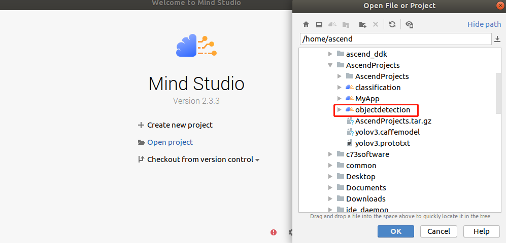
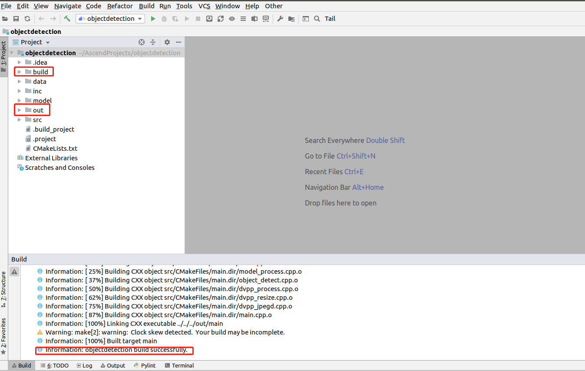
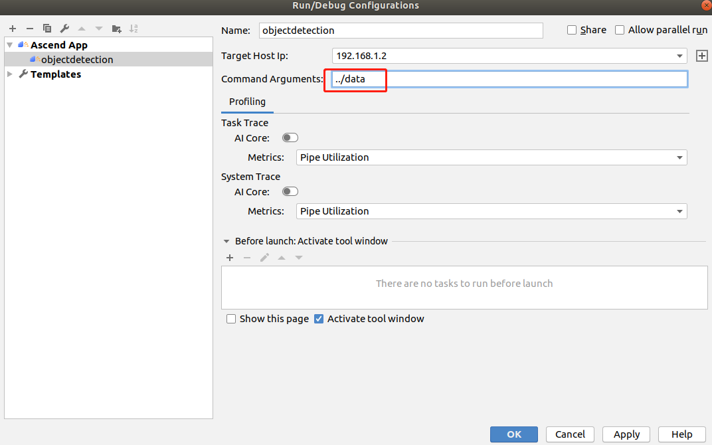
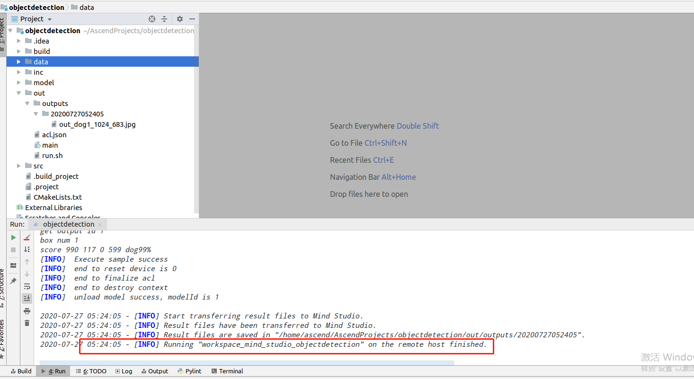
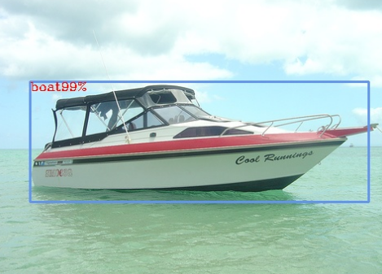

中文|[English](README_EN.md)

#  检测网络应用（C++）
本应用支持运行在Atlas 200 DK上，实现了对yolov3目标检测网络的推理功能。 

## 软件准备

运行此Sample前，需要按照此章节获取源码包。

1.  获取源码包。

    **cd $HOME/AscendProjects**  

    **wget https://c7xcode.obs.cn-north-4.myhuaweicloud.com/code_Ascend/objectdetection.zip** 
              
    **unzip objectdetection.zip**  
    
    > **说明：**   
    >- 如果使用wget下载失败，可使用如下命令下载代码。  
    **curl -OL https://c7xcode.obs.cn-north-4.myhuaweicloud.com/code_Ascend/objectdetection.zip** 
    >- 如果curl也下载失败，可复制下载链接到浏览器，手动上传至服务器。
    
2.  获取此应用中所需要的原始网络模型。    
 
     -  下载原始网络模型及权重文件至ubuntu服务器任意目录，如:$HOME/yolov3。

        **mkdir -p $HOME/yolov3**

        **wget -P $HOME/yolov3 https://c7xcode.obs.cn-north-4.myhuaweicloud.com/models/yolov3/yolov3.caffemodel** 
 
        **wget -P $HOME/yolov3 https://c7xcode.obs.cn-north-4.myhuaweicloud.com/models/yolov3/yolov3.prototxt**

        **wget -P $HOME/yolov3 https://c7xcode.obs.cn-north-4.myhuaweicloud.com/models/yolov3/aipp_nv12.cfg** 
            
        > **说明：**   
        >- yolov3原始模型网络： https://github.com/maxuehao/YOLOV3/blob/master/yolov3_res18.prototxt 
        >- yolov3原始网络LICENSE地址： https://github.com/maxuehao/caffe/blob/master/LICENSE
        >- C7x对prototxt文件有修改要求，按照[yolov3网络模型prototxt修改](https://support.huaweicloud.com/usermanual-mindstudioc73/atlasmindstudio_02_0112.html)文档对prototxt文件进行修改。这里已经修改完成，直接执行以上命令下载即可。
3.  Convert the source model to a model supported by the Ascend AI Processor.  

    1.  Set environment variables.
        
        Set the following environment variables:

        **cd \$HOME/yolov3**
        
        **export install_path=\$HOME/Ascend/ascend-toolkit/20.0.RC1/x86_64-linux_gcc7.3.0**  

        **export PATH=/usr/local/python3.7.5/bin:\\${install_path}/atc/ccec_compiler/bin:\\${install_path}/atc/bin:\\$PATH**  

        **export PYTHONPATH=\\${install_path}/atc/python/site-packages/te:\\${install_path}/atc/python/site-packages/topi:\\$PYTHONPATH**  

        **export LD_LIBRARY_PATH=\\${install_path}/atc/lib64:\\$LD_LIBRARY_PATH**  

        **export ASCEND_OPP_PATH=\\${install_path}/opp**  

    2.  Set the following environment variables:

        **atc --model=yolov3.prototxt --weight=yolov3.caffemodel --framework=0 --output=yolov3 --soc_version=Ascend310 --insert_op_conf=aipp_nv12.cfg**

    
4.  4.	Upload the converted model file (.om file) to the objectdetection/model directory in the path where the source code is stored in [step 1](#zh-cn_topic_0219108795_li953280133816).
    
    **cp ./yolov3.om \$HOME/AscendProjects/objectdetection/model/**

## Environment Configuration   

**Note: If OpenCV and a cross compiler have been installed on the server, skip this step.**  
    
- Install the compiler.  
  **sudo apt-get install -y g++\-aarch64-linux-gnu g++\-5-aarch64-linux-gnu** 

- Install OpenCV 
      
    For details, see **https://gitee.com/ascend/common/blob/master/install_opencv/for_atlas200dk/README.md**    

## Build
1.  Open the project.

    Go to the directory of the decompressed installation package as the Mind Studio installation user in CLI mode, for example, $HOME/MindStudio-ubuntu/bin. Run the following command to launch Mind Studio:

    **./MindStudio.sh**

    After the project is started, open the **objectdetection** project, as shown in[Figure 1 Opening the objectdetection project](#zh-cn_topic_0228461902_zh-cn_topic_0203223265_fig11106241192810).

    **Figure 1**  Opening the objectdetection project  
    

2.  Start build. Choose **Build > Build-Configuration** from the main menu of Mind Studio.  
    Set Target OS to Centos7.6, as shown in [Figure 2 Build Configurations](#zh-cn_topic_0203223265_fig17414647130).

    **Figure 2**  Build Configurations  
      
    
    Click **Build > Build > Build Configuration**. The build and out folders are generated in the directory, as shown in [Figure 3 Build and files generated](#zh-cn_topic_0203223265_fig1741464713019).

    **Figure 3**  Build and files generated  
    

    > **NOTICE**   
    >When you build a project for the first time, **Build > Build** is unavailable. You need to choose **Build > Edit Build Configuration** to set parameters before build.  

## Run
1.  Choose **Run > Edit Configurations** from the main menu of Mind Studio.    
    Add the running parameter ../data in Command Arguments and click Apply and then click OK, as shown in [Figure 4 Run/Debug Configurations](#zh-cn_topic_0203223265_fig93931954162720).   

    **Figure 4**  Run/Debug Configurations   
    
 
2.  Click Run > Run 'objectdetection'. The executable file has been executed on the developer board, as shown in [Figure 5 Execution finished](#zh-cn_topic_0203223265_fig93931954162719).  

    **Figure 5** Execution finished  
    

3.  Check the execution result.

    The result images are stored in the folder named after the timestamp in the output > outputs directory of the project.  

 