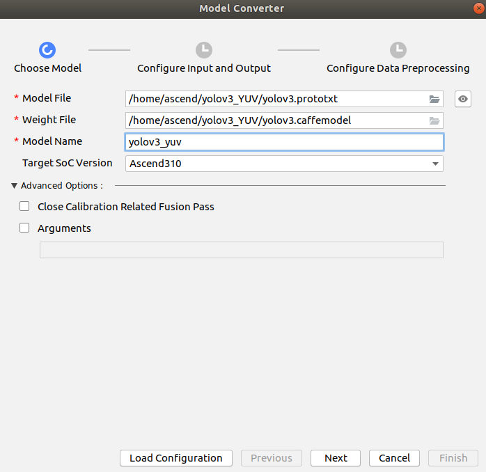
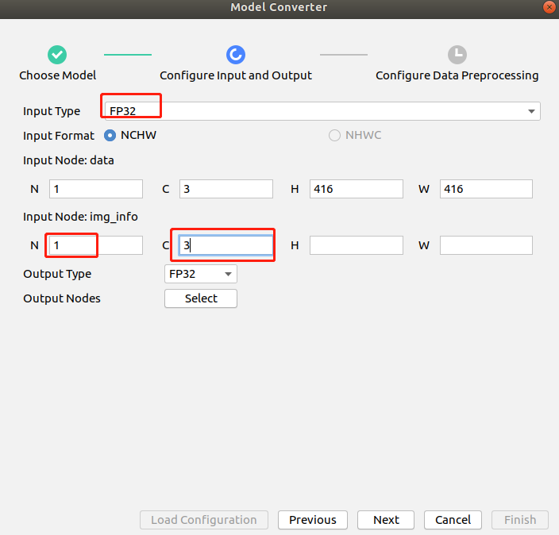
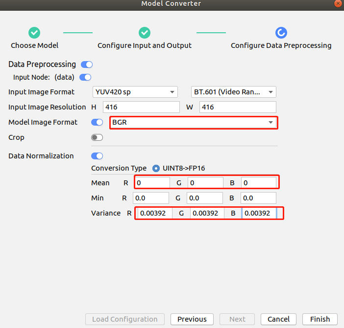
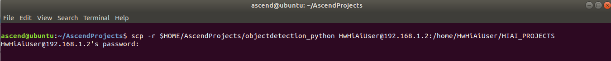
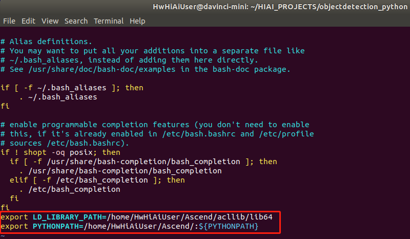
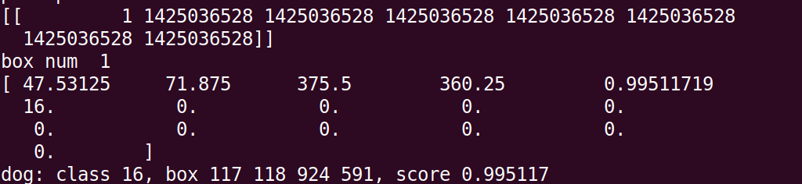

# 检测网络应用 （python）

本Application支持运行在Atlas 200 DK上，实现了yolov3网络的推理功能并在终端打印出检测结果。

## 软件准备

运行此Sample前，需要按照此章节获取源码包。

1.  获取源码包。  
    **mkdir -p $HOME/AscendProjects**
    
    **cd $HOME/AscendProjects**  

    **wget https://c7xcode.obs.cn-north-4.myhuaweicloud.com/code_Ascend/objectdetection_python.zip** 
              
    **unzip objectdetection_python.zip**  
    
    > **说明：**  
    >- 如果使用wget下载失败，可使用如下命令下载代码。  
    **curl -OL https://c7xcode.obs.cn-north-4.myhuaweicloud.com/code_Ascend/objectdetection_python.zip** 
    >- 如果curl也下载失败，可复制下载链接到浏览器，手动上传至服务器。

2.  获取此应用中所需要的原始网络模型。    

     -  下载原始网络模型及权重文件至ubuntu服务器任意目录，如:$HOME/yolov3_yuv。

        **mkdir -p $HOME/yolov3_yuv**

        **wget -P $HOME/yolov3_yuv https://c7xcode.obs.cn-north-4.myhuaweicloud.com/models/yolov3/yolov3.caffemodel** 

        **wget -P $HOME/yolov3_yuv https://c7xcode.obs.cn-north-4.myhuaweicloud.com/models/yolov3/yolov3.prototxt**

3.  将原始网络模型转换为适配昇腾AI处理器的模型。  

    1.  在Mind Studio操作界面的顶部菜单栏中选择**Tools \> Model Converter**，进入模型转换界面。
    2.  在弹出的**Model Conversion**操作界面中，进行模型转换配置。
    3.  参照以下图片进行参数配置。    
        -   Model File选择[步骤2](#zh-cn_topic_0219108795_li2074865610364)中下载的模型文件，此时会自动匹配到权重文件并填写在Weight File中。  
        -   修改模型的名字为yolov3_yuv，若修改模型名称，需对应修改object_detect.py文件中的MODEL_PATH。
        -   Input Type 选择FP32；img_info的前两个参数N、C填写1、3。  
        -   Model Image Format选择BGR，原始模型需要的图片格式为BGR；Mean全部设为0，Variance全部设为0.00392。
      
      
    

4. 将转换好的模型放到工程文件中的model 目录下。  
    **cp \\$HOME/modelzoo/yolov3_yuv/device/yolov3_yuv.om \\$HOME/AscendProjects/objectdetection_python/model/**   

## 环境部署

1.  应用代码拷贝到开发板。

    以Mind Studio安装用户进入分类网络应用\(python\)代码所在根目录，如：AscendProjects/objectdetection_python，执行以下命令将应用代码拷贝到开发板。

    **scp -r \\$HOME/AscendProjects/objectdetection_python HwHiAiUser@192.168.1.2:/home/HwHiAiUser/HIAI\_PROJECTS**

    提示password时输入开发板密码，开发板默认密码为**Mind@123**，如[图 应用代码拷贝](#zh-cn_topic_0228757083_zh-cn_topic_0198304761_fig1660453512014)。

    **图** **应用代码拷贝**  
    

    

2. acl.so拷贝到开发板。

   **scp ${HOME}/Ascend/ascend-toolkit/X.X.X/arm64-linux_gcc7.3.0/pyACL/python/site-packages/acl/acl.so HwHiAiUser@192.168.1.2:/home/HwHiAiUser/Ascend/**  
   > **说明：**   
            **请将X.X.X替换为Ascend-Toolkit开发套件包的实际版本号。**   
            **例如：Toolkit包的包名为Ascend-Toolkit-20.0.RC1-x86_64-linux_gcc7.3.0.run，则此Toolkit的版本号为20.0.RC1。**

3. 登录开发板，添加环境变量。  

   **ssh HwHiAiUser@192.168.1.2**  
   **vim \${HOME}/.bashrc**   
   在最后添加两行    
   **export LD_LIBRARY_PATH=/home/HwHiAiUser/Ascend/acllib/lib64**   
   **export PYTHONPATH=/home/HwHiAiUser/Ascend/:\\${PYTHONPATH}**  
      
   执行如下命令，使环境变量生效   
   **source \${HOME}/.bashrc**

4. 安装环境依赖。

   请参考 https://gitee.com/ascend/common/blob/master/install_python3env/README.md 进行环境依赖配置。  
    

## 运行

1. 登录到开发板上，进入工程目录下，执行如下命令运行程序。  

   **cd \${HOME}/HIAI_PROJECTS/objectdetection_python/**   
   **python3.7.5 object_detect.py ./data/**

2. 推理结果在终端中显示。

   