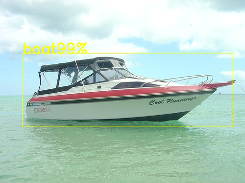

中文|[English](Readme_EN.md)

#  检测网络应用（C++）

本应用支持运行在AI云上加速环境(Atlas300)，实现了对yolov3目标检测网络的推理功能。  
 
**注1：本指导是分设操作指导。开发环境为Mindstudio安装在的本地虚拟机环境，运行环境为云端申请的插有300加速卡的环境。**

**注2：运行环境可以存在多种架构（如arm架构下的Centos系统、arm架构下的Euleros系统、x86架构下的Ubuntu系统等），本指导中只以ai1环境（x86架构下的Ubuntu系统）为例说明**  

## 软件准备

运行此Sample前，需要按照此章节获取源码包。

1.  获取源码包。

    **cd $HOME/AscendProjects**   
 
    **wget https://c7xcode.obs.cn-north-4.myhuaweicloud.com/code_Ascend/objectdetection_300.zip**  
 
    **unzip objectdetection_300.zip**
    > **说明：**   
    >- 如果使用wget下载失败，可使用如下命令下载代码。  
    **curl -OL https://c7xcode.obs.cn-north-4.myhuaweicloud.com/code_Ascend/objectdetection_300.zip** 
    >- 如果curl也下载失败，可复制下载链接到浏览器，手动上传至服务器。
    
2.  获取此应用中所需要的原始网络模型。  
    获取原始网络模型，将其存放到Ubuntu服务器的任意目录，例如：$HOME/models/objectdetection。    
    1.  创建目录。  
        **mkdir -p $HOME/models/objectdetection**     
    2.  下载原始网络模型及权重文件。  
        **wget -P $HOME/models/objectdetection/ https://c7xcode.obs.cn-north-4.myhuaweicloud.com/models/yolov3/yolov3.caffemodel**  
        **wget -P $HOME/models/objectdetection/ https://c7xcode.obs.cn-north-4.myhuaweicloud.com/models/yolov3/yolov3.prototxt**  
        **wget -P $HOME/models/objectdetection/ https://c7xcode.obs.cn-north-4.myhuaweicloud.com/models/yolov3/aipp_nv12.cfg**

3.  将原始网络模型转换为适配昇腾AI处理器的模型。  

    1.  设置环境变量
        
        命令行中输入以下命令设置环境变量。

        **cd $HOME/models/objectdetection/**
        
        **export install_path=\$HOME/Ascend/ascend-toolkit/20.0.RC1/x86_64-linux_gcc7.3.0**  

        **export PATH=/usr/local/python3.7.5/bin:\\${install_path}/atc/ccec_compiler/bin:\\${install_path}/atc/bin:\\$PATH**  

        **export PYTHONPATH=\\${install_path}/atc/python/site-packages/te:\\${install_path}/atc/python/site-packages/topi:\\$PYTHONPATH**  

        **export LD_LIBRARY_PATH=\\${install_path}/atc/lib64:\\$LD_LIBRARY_PATH**  

        **export ASCEND_OPP_PATH=\\${install_path}/opp**  

    2.  执行以下命令转换模型。

        **atc --model=yolov3.prototxt --weight=yolov3.caffemodel --framework=0 --output=yolov3 --soc_version=Ascend310 --insert_op_conf=aipp_nv12.cfg**

    
4.  将转换好的模型文件（.om文件）上传到[步骤1](#zh-cn_topic_0219108795_li953280133816)中源码所在路径下的“**objectdetection/model**”目录下。
    
    **cp ./yolov3.om \$HOME/AscendProjects/objectdetection/model/**

## 环境配置   

**注：服务器上已安装opencv库和ffmpeg库可跳过此步骤。**  
      
- 安装opencv和ffmpeg  
    - centos系统：  
    请参考 **https://gitee.com/ascend/common/blob/master/centos_install_opencv/CENTOS_INSTALL_OPENCV.md**  
    - ubuntu系统：  
    请参考 **https://gitee.com/ascend/common/blob/master/ubuntu_install_opencv/UBUNTU_INSTALL_OPENCV.md**

## 编译

1.  以HwHiAiUser（运行用户）登录开发环境。

2.  设置环境变量。 
   
    执行如下命令。 

     **vim ~/.bashrc** 

    在最后一行添加DDK_PATH及NPU_HOST_LIB的环境变量。

     **export DDK\_PATH=/home/HwHiAiUser/Ascend** 

     **export NPU\_HOST\_LIB=/home/HwHiAiUser/Ascend/acllib/lib64/stub**  

     **export LD\_LIBRARY_PATH=\\$DDK\_PATH/acllib/lib64:/usr/local/Ascend/add-ons:\\$HOME/ascend_ddk/host/lib:\\$DDK_PATH/atc/lib64** 

     > **说明：**   
            **请将/home/HwHiAiUser/Ascend替换为ACLlib标准形态安装包的实际安装路径。** 
    

    输入:wq!保存退出。

    执行如下命令使环境变量生效。

     **source ~/.bashrc**   

3.  创建用于存放编译文件的目录。  

    **cd $HOME/AscendProjects/sample-objectdetection**  
    
    **mkdir -p build/intermediates/host**  

4.  执行cmake生成编译文件。

     **cd build/intermediates/host**   

    **cmake ../../../src -DCMAKE_CXX_COMPILER=g++ -DCMAKE_SKIP_RPATH=TRUE**  

5.  执行make命令，生成的可执行文件main在“$HOME/AscendProjects/sample-objectdetection/out”目录下。 

    **make**
## 运行

1.  将需要检测的图片上传至“$HOME/AscendProjects/sample-objectdetection/data/”目录下。  

2.  切换到可执行文件main所在的目录，给该目录下的main文件加执行权限。  
   
    **cd $HOME/AscendProjects/sample-objectdetection/out**  
    
    **chmod +x main**   

3.  运行可执行文件。  
    **./main \.\./data/**

4.  查看运行结果。 

    **cd out**  

    进入out目录，查看推理结果的图片。

