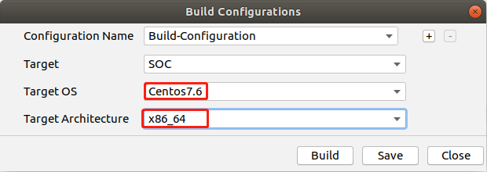

中文|[English](Readme_EN.md)

**该案例仅仅用于学习，打通流程，不对效果负责，不支持商用。**

#  检测网络应用（C++）

本应用支持运行在AI云上加速环境(Atlas300)，实现了对faster_rcnn实例化目标检测功能。  
 
**注1：本指导是合设操作指导。开发环境与运行环境均为云端申请的插有300加速卡的环境。**

**注2：运行环境可以存在多种架构（如arm架构下的Centos系统、arm架构下的Euleros系统、x86架构下的Ubuntu系统等），本指导中只以ai1环境（x86架构下的Ubuntu系统）为例说明**  

## 软件准备

运行此Sample前，需要按照此章节获取源码包。

1.  获取源码包。

    **cd $HOME/AscendProjects**   
 
    **wget https://c7xcode.obs.cn-north-4.myhuaweicloud.com/code_Ascend/objectdetection_dynamic_image_size.zip**  
 
    **unzip objectdetection_dynamic_image_size.zip**
    > **说明：**   
    >- 如果使用wget下载失败，可使用如下命令下载代码。  
    **curl -OL https://c7xcode.obs.cn-north-4.myhuaweicloud.com/code_Ascend/objectdetection_dynamic_image_size.zip** 
    >- 如果curl也下载失败，可复制下载链接到浏览器，手动上传至服务器。
    
2.  获取此应用中所需要的原始网络模型。    
 
     -  下载原始网络模型及权重文件至ubuntu服务器任意目录，如:$HOME/objectdetection_dynamic_image_size。

        **mkdir -p $HOME/objectdetection_dynamic_image_size** 

        **wget -P $HOME/objectdetection_dynamic_image_size https://c7xcode.obs.cn-north-4.myhuaweicloud.com/models/faster_rcnn/faster_rcnn.caffemodel** 
 
        **wget -P $HOME/objectdetection_dynamic_image_size https://c7xcode.obs.cn-north-4.myhuaweicloud.com/models/faster_rcnn/faster_rcnn.prototxt**
    
        > **说明：**   
        >- objectdetection_dynamic_image_size原始模型网络： https://github.com/rbgirshick/py-faster-rcnn/blob/781a917b378dbfdedb45b6a56189a31982da1b43/models/pascal_voc/VGG16/faster_rcnn_end2end/test.prototxt。
        >- objectdetection_dynamic_image_size原始网络LICENSE地址： https://github.com/opencv/opencv/blob/master/LICENSE
        >- C7x对prototxt文件有修改要求，按照[SSD网络模型prototxt修改](https://support.huaweicloud.com/usermanual-mindstudioc73/atlasmindstudio_02_0114.html)文档对prototxt文件进行修改。这里已经修改完成，直接执行以上命令下载即可。

3.  将原始网络模型转换为适配昇腾AI处理器的模型。  

     1.  设置环境变量
        命令行中输入以下命令设置环境变量。    
        **cd $HOME/objectdetection_dynamic_image_size/**
        **export install_path=\$HOME/Ascend/ascend-toolkit/latest/x86_64-linux_gcc7.3.0**  
        **export PATH=/usr/local/python3.7.5/bin:\\${install_path}/atc/ccec_compiler/bin:\\${install_path}/atc/bin:\\$PATH**   
        **export PYTHONPATH=\\${install_path}/atc/python/site-packages/te:\\${install_path}/atc/python/site-packages/topi:\\$PYTHONPATH**    
        **export LD_LIBRARY_PATH=\\${install_path}/atc/lib64:\\$LD_LIBRARY_PATH**  
         **export ASCEND_OPP_PATH=\\${install_path}/opp**  

      2.  转换模型。  
         **atc --model=faster_rcnn.prototxt --weight=faster_rcnn.caffemodel --framework=0 --output=faster_rcnn --soc_version=Ascend310  --input_shape="data:1,3,-1,-1;im_info:1,3" --dynamic_image_size="512,512;600,600;800,800"** 

    
4.  将转换好的模型文件（.om文件）上传到[步骤1](#zh-cn_topic_0219108795_li953280133816)中源码所在路径下的“**objectdetection_dynamic_image_size
/model**”目录下。
    
     **cp \\$HOME/objectdetection_dynamic_image_size/faster_rcnn.om $HOME/AscendProjects/objectdetection_dynamic_image_size/model** 

## 环境配置   

**注：已安装opencv库和ffmpeg库可跳过此步骤。**  

- 安装opencv和ffmpeg  
    请参考 **https://gitee.com/ascend/samples/tree/master/common/install_opencv/for_atlas300**

## 编译
1.  打开对应的工程。

    以Mind Studio安装用户在命令行进入安装包解压后的“MindStudio-ubuntu/bin”目录，如：$HOME/MindStudio-ubuntu/bin。执行如下命令启动Mind Studio。

    **./MindStudio.sh**

    启动成功后，打开**objectdetection_dynamic_image_size**工程，如[图 打开objectdetection工程](#zh-cn_topic_0228461902_zh-cn_topic_0203223265_fig11106241192810)所示。

    **图 1**  打开objectdetection工程  
    

2.  开始编译，打开Mind Studio工具，在工具栏中点击**Build \> Edit Build Configuration**。  
    选择Target OS 为Centos7.6，如[图 配置编译](#zh-cn_topic_0203223265_fig17414647130)所示。

    **图 2**  配置编译  
      
    
    之后点击**Build \> Build \> Build Configuration**，如[图 编译操作及生成文件](#zh-cn_topic_0203223265_fig1741464713019)所示，会在目录下生成build和out文件夹。

    **图 3**  编译操作及生成文件  
    

    > **须知：**   
    >首次编译工程时，**Build \> Build**为灰色不可点击状态。需要点击**Build \> Edit Build Configuration**，配置编译参数后再进行编译。  
## 运行
1.  在Mind Studio工具的工具栏中找到Run按钮，单击  **Run \> Edit Configurations**。  
    在Command Arguments 中点击Apply、OK。如[图 配置运行](#zh-cn_topic_0203223265_fig93931954162720)所示。   

    **图 4**  配置运行   
   
 
2.  单击  **Run \> Run 'objectdetection_dynamic_image_size'**，如[图 程序已执行示意图](#zh-cn_topic_0203223265_fig93931954162719)所示，可执行程序已经在开发者板执行。  

    **图 5**  程序已执行示意图  
    

3.  查看运行结果。

    推理结果图片保存在工程下的“output \> outputs”目录下以时间戳命名的文件夹内。  

