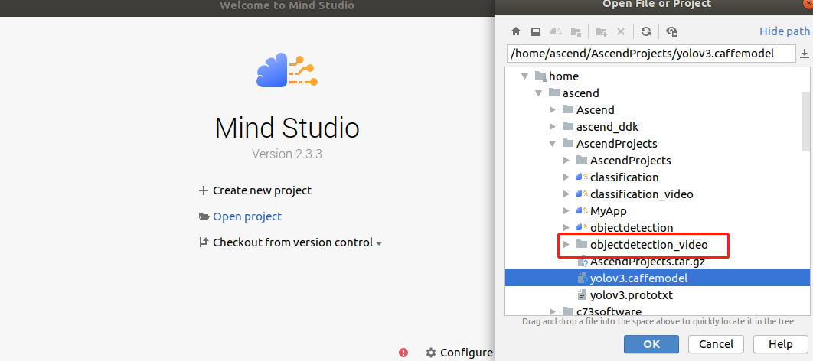
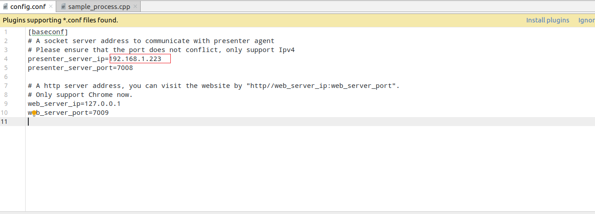
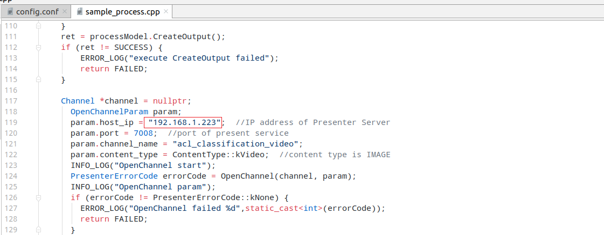
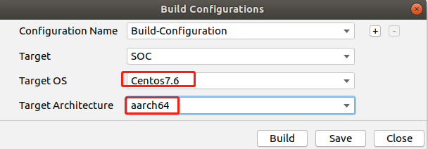
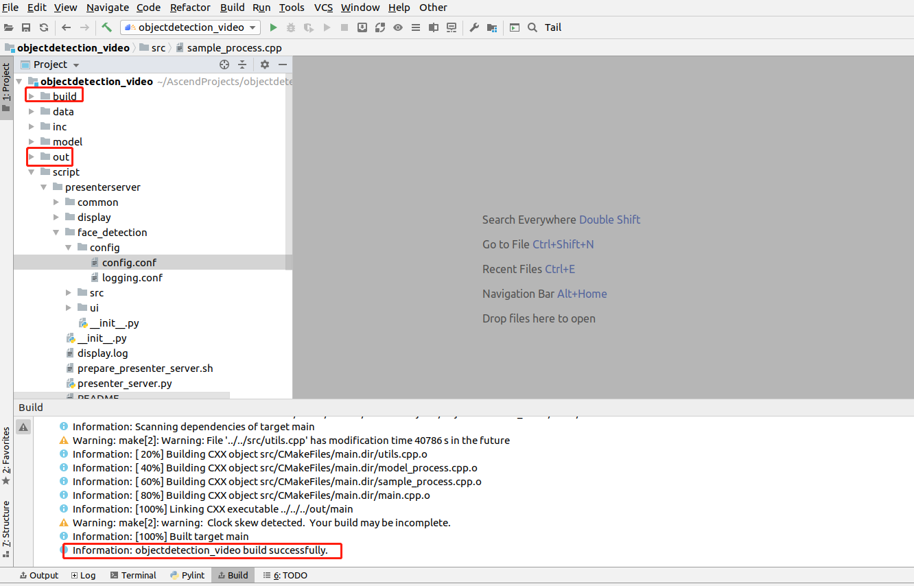
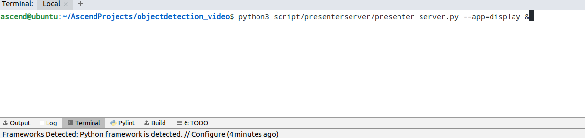
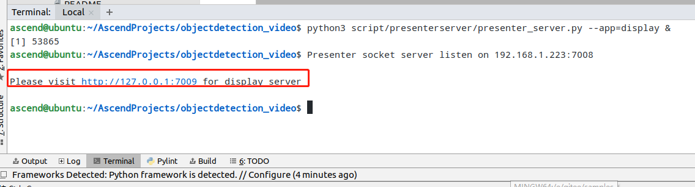
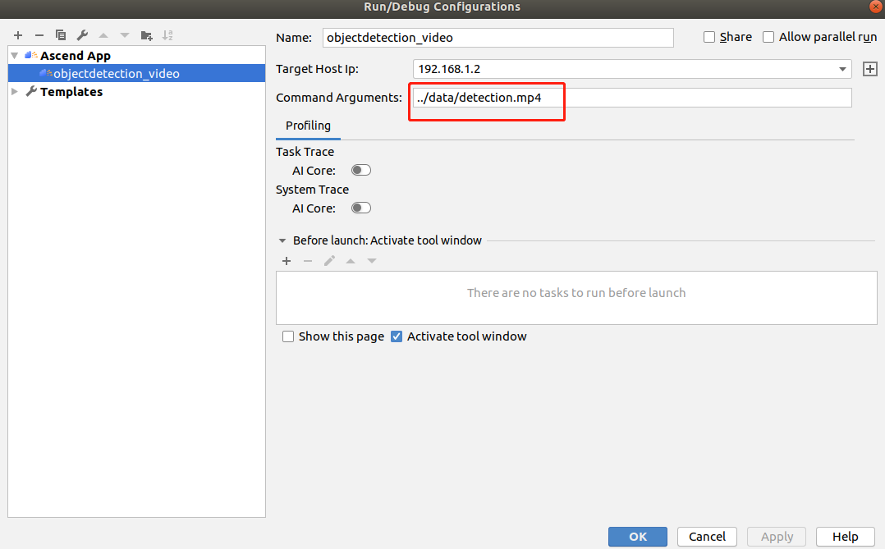
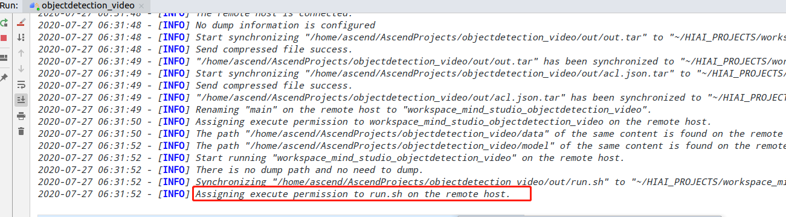

English|[中文](README.md)

# Video Object Detection Network Application (C++)

This application can run on the Atlas 200 DK to detect objects in videos using the YOLOv3 network.

## Software Preparation

Before running this sample, obtain the source code package.

1. Obtain the source code package.
   
    **cd $HOME/AscendProjects**
   
    **wget https://c7xcode.obs.cn-north-4.myhuaweicloud.com/code_Ascend/objectdetection_video.zip**
   
    **unzip objectdetection_video.zip**
   
    >  NOTE 
    > - If the download using **wget** fails, run the following command to download the code:   
    **curl -OL https://c7xcode.obs.cn-north-4.myhuaweicloud.com/code_Ascend/objectdetection_video.zip**
    > - If the download using **curl** also fails, open the download link in a browser to download the code and manually upload it to the server.

2. Obtain the original model required by the application.
   
    - Download the original model file and weight file to any directory on the Ubuntu server, for example, **$HOME/yolov3**.
     
     **mkdir -p $HOME/yolov3**
     
     **wget -P $HOME/yolov3 https://c7xcode.obs.cn-north-4.myhuaweicloud.com/models/yolov3/yolov3.caffemodel**
     
     **wget -P $HOME/yolov3 https://c7xcode.obs.cn-north-4.myhuaweicloud.com/models/yolov3/yolov3.prototxt**
     
     **wget -P $HOME/yolov3 https://c7xcode.obs.myhuaweicloud.com/models/yolov3/aipp_bgr.cfg**
     
     >  NOTE 
     > - Original YOLOv3 network: https://github.com/maxuehao/YOLOV3/blob/master/yolov3_res18.prototxt
     > - To obtain the LICENSE of the original YOLOv3 network, visit the following website: https://github.com/maxuehao/caffe/blob/master/LICENSE
     > - The C7x version requires modification on the .prototxt file. Modify the file by referring to the following website: 	 https://support.huaweicloud.com/usermanual-mindstudioc73/atlasmindstudio_02_0112.html
	 The modification has been completed herein. You can directly run the preceding command to download the file.

3. Convert the original model to an offline model adapted to the Ascend AI Processor.
   
   1. Environment variable setting
      
      Set the following environment variables:
      
      **cd \$HOME/yolov3**
      
      **export install_path=\$HOME/Ascend/ascend-toolkit/20.0.RC1/x86_64-linux_gcc7.3.0**
      
      **export PATH=/usr/local/python3.7.5/bin:\\${install_path}/atc/ccec_compiler/bin:\\${install_path}/atc/bin:\\$PATH** 
      
      **export PYTHONPATH=\\${install_path}/atc/python/site-packages/te:\\${install_path}/atc/python/site-packages/topi:\\$PYTHONPATH** 
      
      **export LD_LIBRARY_PATH=\\${install_path}/atc/lib64:\\$LD_LIBRARY_PATH**
      
      **export ASCEND_OPP_PATH=\\${install_path}/opp**  
   
   2. Convert the model.
      
      **atc --model=yolov3.prototxt --weight=yolov3.caffemodel --framework=0 --output=yolov3 --soc_version=Ascend310 --insert_op_conf=aipp_bgr.cfg**

4. Upload the converted model file (.om) to the **objectdetection_video/model** directory under the path of the source code downloaded in [Step 1](#zh-cn_topic_0219108795_li953280133816).
   
   **cp ./yolov3.om \$HOME/AscendProjects/objectdetection_video/model/**

## Environment Configuration

**Note: If OpenCV, Presenter Agent, and a cross compiler have been installed on the server, skip this step.**

- Install the compiler.  
  **sudo apt-get install -y g++\-aarch64-linux-gnu g++\-5-aarch64-linux-gnu**

- Install OpenCV.
  
   For details, see **https://gitee.com/ascend/common/blob/master/install_opencv/for_atlas200dk/README.md**.

- Install Presenter Agent  
   For details, see **https://gitee.com/ascend/common/blob/master/install_presenteragent/for_atlas200dk/README.md**.

## Build

1. Open the project.
   
   Go to the directory of the decompressed installation package as the Mind Studio installation user in CLI mode, for example, **$HOME/MindStudio-ubuntu/bin**. Launch Mind Studio.
   
   **./MindStudio.sh**
   
   Open the **objectdetection_video** project, as shown in [Figure 1 Opening the objectdetection_video project](#zh-cn_topic_0228461902_zh-cn_topic_0203223265_fig11106241192810).
   
   **Figure 1** Opening the objectdetection_video project  
   

2. Change the IP address of Presenter Server.
   
   - Change the value of **presenter_server_ip** in **script/presentserver/display/config/config.conf** to the virtual NIC IP address of the Ubuntu server where Mind Studio is installed, as shown in [Figure 2 Modifying presenter_server_ip](#zh-cn_topic_0228461902_zh-cn_topic_0203223265_fig1110624110).
   
     **Figure 2** Modifying presenter_server_ip  
     
   
   - Change the value of **param.host_ip** in **src/sample_process.cpp** to the virtual NIC IP address of the Ubuntu server where Mind Studio is installed, as shown in [Figure 3 Modifying param_host_ip](#zh-cn_topic_0228461902_zh-cn_topic_0203223265_fig11).
   
     **Figure 3** Modifying param_host_ip  
     
   
    >  NOTE 
    > - Run the **ifconfig** command to view the IP address of the virtual NIC.

3. Start the build. Choose **Build \> Edit Build Configuration** on the toolbar of Mind Studio.   
Set **Target OS** to **Centos7.6**, as shown in [Figure 4 Build configuration](#zh-cn_topic_0203223265_fig17414647130).
   
   **Figure 4** Build configuration  
   
   
   Click **Build \> Build \> Build Configuration**. The **build** and **out** folders are generated in the directory, as shown in [Figure 5 Build operations and generated files](#zh-cn_topic_0203223265_fig1741464713019).
   
   **Figure 5** Build operations and generated files  
   
   
   >  NOTE   
   When you build a project for the first time, **Build \> Build** is unavailable. You need to choose **Build \> Edit Build Configuration** to set parameters before the build.

4. Start Presenter Server.
   
   Open the Terminal window of Mind Studio. Run the following command in the path where the application code is stored to start Presenter Server in the background, as shown in [Figure 6 Starting Presenter Server.](#zh-cn_topic_0228461904_zh-cn_topic_0203223294_fig423515251067)
   
   **python3 script/presenterserver/presenter_server.py --app=display &**
   
   **Figure 6** Starting Presenter Server   
   
   
   Presenter Server is started successfully, as shown in [Figure 7 Presenter Server started successfully](#zh-cn_topic_0228461904_zh-cn_topic_0203223294_fig423).   
   **Figure 7** Presenter Server started successfully   
   

## Run

1. Choose **Run \> Edit Configurations** from the toolbar of Mind Studio.   
   Add the run parameter **../data/detection.mp4** (path of the input video) in **Command Arguments**, and click **Apply** and **OK** in sequence, as shown in [Figure 8 Run/Debug Configurations](#zh-cn_topic_0203223265_fig93931954162720).
   
   **Figure 8** Run/Debug Configurations  
   

2. Click **Run \> Run 'objectdetection_video'**. The executable file has been executed on the developer board, as shown in [Figure 9 Execution finished](#zh-cn_topic_0203223265_fig93931954162719).
   
   **Figure 9** Execution finished  
   

3. Use the URL displayed upon the start of Presenter Server service to log in to Presenter Server.
   
   Wait for Presenter Agent to transmit data to the server and click Refresh. When there is data, the icon in the Status column for the corresponding channel turns green, as shown in the following figure.
   
   **Figure 10** Presenter Server page  
   

4. Click a link in the View Name column, for example, **"video"** in the preceding figure to view the result.