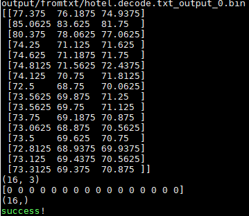

中文|[English](README_EN.md)

**该案例仅仅用于学习，打通流程，不对效果负责，不支持商用。**

# 句子级中文评论情感极性分类网络应用（C++）<a name="ZH-CN_TOPIC"></a>


本项目支持在 Atalas 200 DK上运行，实现了句子级情感极性分类网络的推理功能，输出每个类别的置信度。

## 软件准备<a name="zh-cn_topic"></a>

运行此工程项目前，需要按照此章节获取源码包。

1.  <a name="zh-cn"></a>获取源码包。

    ```shell
    cd $HOME/AscendProjects
    wget https://c7xcode.obs.cn-north-4.myhuaweicloud.com/200dk/SentimentAnalysis.zip
    unzip SentimentAnalysis.zip
    ```
    
    如果wget下载失败，可复制下载链接到浏览器。
    
2. <a name="zh-cn_topic_0219108795_li2074865610364"></a>获取此应用中所需要的原始网络模型和训练好的参数值。

    模型的PB文件在 **models/snapshots** 路径下。BERT网络预训练好的参数来自 https://github.com/google-research/bert 中的 [BERT-Base,  Chinese] 部分。

3.  将原始网络模型转换为适配昇腾AI处理器的模型。

    ```shell
    cd SentimentAnalysis/src/acl_demo
    ./model_convert.sh
    ```

    运行以上命令，将会在**models/snapshots** 路径下生成OM模型。
    
    

## 环境配置

- 安装编译工具  
  
  **sudo apt-get install -y g++\-aarch64-linux-gnu g++\-5-aarch64-linux-gnu**
  
- 下载jsoncpp源码

    ```shell
    cd ./models
    git clone https://github.com/open-source-parsers/jsoncpp.git
    cd jsoncpp
    ```
    到 **jsoncpp** 目录里后，执行python脚本，生成 **dist** 子目录

    ```shell
    python amalgamate.py
    ```

    

## 编译<a name="zh-cn_topic_0219108795_section3723145213347"></a>

-  编译ACL/C++代码

    进入**src/acl_demo** 目录，运行 shell 脚本：
    
    ```shell
    ./build.sh
    ```
    
    编译后的可执行文件 _inference_ 在 **build** 目录中。
    
    

## 运行<a name="zh-cn_topic_0219108795_section1620073406"></a>

- 一键推理

  文本数据读取、数据预处理和前向推理三个步骤整合到一个命令中，执行如下shell命令：

  ```shell
  cd src/acl_demo
  ./build/inference -m ../../models/snapshots/models.om -i ../../models/hotel.decode.txt -o ../../output/
  ```

  -m ：指定OM模型的路径；

  -i ： 指定输入的句子级中文文本文件的路径；

  -o ： 指定网络输出结果的保存目录。

  

- 查看输出结果

  ```shell
  cd ../../models
  python check_output.py
  ```

  shell里会输出网络的输出矩阵，每一行的三个数字对应三个情感类别的score，取最大的score对应的类别作为该评论的情感极性。




  ## Python环境下运行网络

​	以上描述了在Ascend 310上运行ACL/C++代码来实现网络推理的完整流程。下面的内容是介绍在CPU/GPU的python环境下运行网络的方式：

- 训练

  首先进入到 **tf_total_sentiment** 目录中，

  ```shell
  cd SentimentAnalysis/models
  python main.py
  ```

  训练过程中的神经网络参数将被保存在 **snapshots** 子目录里。

  

- 推理/测试

  ```
  python test.py
  ```

  