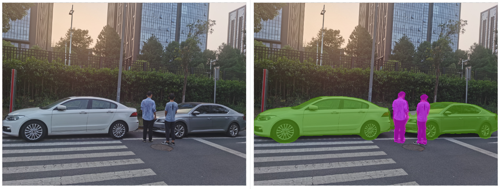

English|[中文](README_CN.md)
  
**This sample provides reference for you to learn the Ascend AI Software Stack and cannot be used for commercial purposes.**

**This README file provides only guidance for running the sample in command line (CLI) mode. For details about how to run the sample in MindStudio, see [Running Image Samples in MindStudio](https://github.com/Ascend/samples/wikis/Mindstudio%E8%BF%90%E8%A1%8C%E5%9B%BE%E7%89%87%E6%A0%B7%E4%BE%8B?sort_id=3164874).**

## Semantic Segmentation Sample
Function: uses the DeepLabv3 model to perform semantic segmentation on the input image and print the result on the output image.  
Input: JPG images.   
Output: JPG images with inference results

### Prerequisites
Check whether the following requirements are met. If not, perform operations according to the remarks. If the CANN version is upgraded, check whether the third-party dependencies need to be reinstalled. (The third-party dependencies for 5.0.4 and later versions are different from those for earlier versions.)
| Item| Requirement| Remarks|
|---|---|---|
| CANN version| ≥ 5.0.4| Install the CANN by referring to [Sample Deployment](https://github.com/Ascend/samples#%E5%AE%89%E8%A3%85) in the About Ascend Samples Repository. If the CANN version is earlier than the required version, switch to the samples repository specific to the CANN version. See [Release Notes](https://github.com/Ascend/samples/blob/master/README.md). |
| Hardware| Atlas 200 DK/Atlas 300 ([AI1s](https://support.huaweicloud.com/en-us/productdesc-ecs/ecs_01_0047.html#ecs_01_0047__section78423209366)) | Currently, the Atlas 200 DK and Atlas 300 have passed the test. For details about the product description, see [Hardware Platform](https://ascend.huawei.com/en/#/hardware/product). For other products, adaptation may be required.|
| Third-party dependency| python-acllite | Select required dependencies. See [Third-Party Dependency Installation Guide (Python Sample)](https://github.com/Ascend/samples/tree/master/python/environment).|

### Sample Preparation

1. Obtain the source package.

   You can download the source code in either of the following ways:  
    - Command line (The download takes a long time, but the procedure is simple.)
       ```    
       # In the development environment, run the following commands as a non-root user to download the source repository:   
       cd ${HOME}     
       git clone https://github.com/Ascend/samples.git
       ```
       **To switch to another tag (for example, v0.5.0), run the following command:**
       ```
       git checkout v0.5.0
       ```
    - Compressed package (The download takes a short time, but the procedure is complex.)  
       **Note: If you want to download the code of another version, switch the branch of the samples repository according to the prerequisites.**  
       ``` 
        # 1. Click **Clone** or **Download** in the upper right corner of the samples repository and click **Download ZIP**.   
        # 2. Upload the .zip package to the home directory of a common user in the development environment, for example, **${HOME}/ascend-samples-master.zip**.    
        # 3. In the development environment, run the following commands to unzip the package:    
        cd ${HOME}    
        unzip ascend-samples-master.zip
       ```

2. Obtain the source model required by the application.
   
    | **Model** | **Description** | **How to Obtain** |
    |---|---|---|
    | DeepLabv3| An inference model for semantic segmentation  | For details, see [ModelZoo-Ascend Community](https://www.hiascend.com/en/software/modelzoo) |

    ```
    # To facilitate download, the commands for downloading the original model and converting the model are provided here. You can directly copy and run the commands. You can also refer to the above table to download the model from ModelZoo and manually convert it.    
    cd ${HOME}/samples/python/level2_simple_inference/3_segmentation/deeplabv3/model    
    wget https://modelzoo-train-atc.obs.cn-north-4.myhuaweicloud.com/003_Atc_Models/AE/ATC%20Model/deeplabv3/deeplabv3_origin.air
    wget https://modelzoo-train-atc.obs.cn-north-4.myhuaweicloud.com/003_Atc_Models/AE/ATC%20Model/deeplabv3/aipp.cfg
    # Model conversion command without AIPP configuration
    atc --output=./deeplab_origin --soc_version=Ascend310 --framework=1 --model=./deeplabv3_origin.air
    # Model conversion command with AIPP configuration
    atc --output=./deeplab_aipp --soc_version=Ascend310 --framework=1 --model=./deeplabv3_origin.air --insert_op_conf=./aipp.cfg
    ```

3. Obtain the test image required by the sample.
    ```
    Run the following commands to go to the **data** folder of the sample and download the corresponding test image:
    cd ${HOME}/samples/python/level2_simple_inference/3_segmentation/deeplabv3/data
    wget https://modelzoo-train-atc.obs.cn-north-4.myhuaweicloud.com/003_Atc_Models/AE/ATC%20Model/deeplabv3/test_image/test.jpg
    cd ../src
    ```

### Sample Running

**Note: If the development environment and operating environment are set up on the same server, skip step 1 and go to [step 2](#step_2) directly.**  

1. Run the following commands to upload the **deeplabv3** directory in the development environment to any directory in the operating environment, for example, **/home/HwHiAiUser**, and log in to the operating environment (host) as the running user (**HwHiAiUser**):
    ```
    # In the following information, *xxx.xxx.xxx.xxx* is the IP address of the operating environment. The IP address of Atlas 200 DK is 192.168.1.2 when it is connected over the USB port, and that of Atlas 300 (AI1s) is the corresponding public IP address.
    scp -r ${HOME}/samples/python/level2_simple_inference/3_segmentation/deeplabv3 HwHiAiUser@xxx.xxx.xxx.xxx:/home/HwHiAiUser
    ssh HwHiAiUser@xxx.xxx.xxx.xxx
    cd ${HOME}/deeplabv3/src    
    ```

2. <a name="step_2"></a>Run the sample.
   ```
   # Without AIPP configuration
   python3.6 deeplab_origin.py
   # With AIPP configuration
   python3.6 deeplab_dvpp_aipp.py
   ```

### Result Viewing

After the running is complete, an inferred image is generated in the **out/output** directory of the sample project. The comparison is as follows:


### Common Errors
For details about how to rectify the errors, see [Troubleshooting](https://github.com/Ascend/samples/wikis/%E5%B8%B8%E8%A7%81%E9%97%AE%E9%A2%98%E5%AE%9A%E4%BD%8D/%E4%BB%8B%E7%BB%8D). If an error is not included in Wiki, submit an issue to the **samples** repository.
