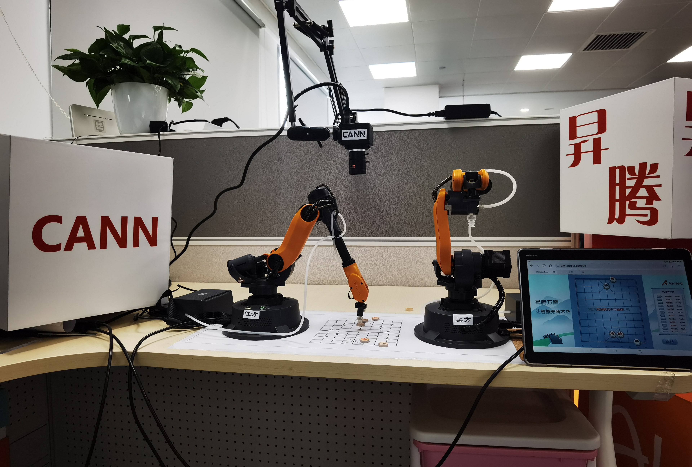
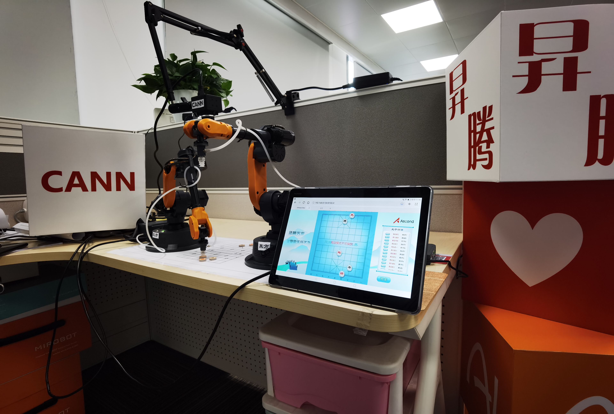

中文|[English](README.md)


**本样例为大家学习昇腾软件栈提供参考，非商业目的！**

**本样例适配3.1.0及以上版本，支持产品为Atlas200DK。**

## 案例描述
使用相机捕获对弈棋盘局面，使用Atlas200DK运行VGG16模型进行推理，在主控平台上运行对弈引擎计算出AI的走法，控制机械臂下棋，
用户使用webserver在移动端根据UI与机械臂进行对弈。

## 物料清单
|**物料类型**|**详细描述**|
|---|---|
|推理平台|[Atlas 200DK](https://www.hiascend.com/document/detail/zh/Atlas200DKDeveloperKit/1013/environment/atlased_04_0001.html)|
|摄像头|480x640 USB相机|
|机械臂|[开塔米罗 桌面级六轴机械臂](http://cn.wlkata.com/cn_mirobot_robot_wlkata.php)|
|主控平台|Ubuntu18.04 LTS-x64-Huawei Matebook X Pro|
|棋盘棋子|亚克力板定制|

## 环境准备
### Ubuntu主控平台准备
- 参考[Atlas200DK说明文档]( https://www.hiascend.com/document/detail/zh/Atlas200DKDeveloperKit/1013/environment/atlased_04_0001.html )部署开发环境
- 参考doc目录下**对弈引擎**和**中心控制**模块的README文件进行环境准备。
### Atlas200DK推理平台准备
- 参考[Atlas200DK说明文档]( https://www.hiascend.com/document/detail/zh/Atlas200DKDeveloperKit/1013/environment/atlased_04_0001.html )部署运行环境
- 参考Ascend案例如[vgg16_cat_dog_picture]( https://github.com/Ascend/samples/tree/master/python/level2_simple_inference/1_classification/vgg16_cat_dog_picture )测试推理平台是否搭建成功
### 棋盘理解准备
- 将摄像头固定在棋盘上方合适高度处，可以通过摄像头捕获软件查看当前效果，在保证棋盘位于图像中心的同时，
使棋盘尽可能大，但是也不要超过边界（可参考data目录下的图）。
- 参考doc目录下棋盘理解模块的README文件进行配置。
### Wlkata Mirobot机械臂准备
- 参考[Wlkata Mirobot使用指南](https://lin-nice.github.io/mirobot_gitbook/) 配置机械臂并校准。
### Webserver服务器准备
- 参考doc目录下webserver模块的README文件进行配置。

## 案例说明
本案例主要由中心控制、棋盘理解、对弈引擎、机械臂和Webserver五个模块组成，具体的开发设计文档请参阅doc目录下各自的README文件。

## 案例部署
### 代码获取
- 获取源码包

   在Ubuntu主控平台中，以非root用户在命令行中执行以下命令下载源码仓:
    ```shell
    cd $HOME
    git clone https://github.com/Ascend/samples.git
    ```

- 获取此案例中所需要的网络模型
 
    参考下表获取此应用中所用到的模型，并将其存放到开发环境普通用户下的工程目录：
    ```shell
    cd $HOME/samples/python/level3_multi_model/Robot_Play_Chess/model
    ```
    
    |  **模型名称**  |  **模型说明**  |  **模型下载路径**  |
    |---|---|---|
    | chess_ckpt_0804_vgg_99.om |  使用VGG16的棋子分类模型 |  https://obs-9be7.obs.cn-east-2.myhuaweicloud.com/003_Atc_Models/AE/ATC%20Model/robot_play_chess/chess_ckpt_0804_vgg_99.om |

     **说明：**  
    > - modelzoo中已经提供了转换好的om模型，可以直接使用。
   
- 执行以下命令，将主控平台的 **samples** 目录上传到推理平台中，例如 **/home/HwHiAiUser**，并以HwHiAiUser（运行用户）登录Atlas200DK推理平台：
    
    ```shell
    scp -r $HOME/samples/ HwHiAiUser@xxx.xxx.xxx.xxx:/home/HwHiAiUser
    ssh HwHiAiUser@xxx.xxx.xxx.xxx 
    ```
   
     **说明：**    
    > - **xxx.xxx.xxx.xxx**为Atlas200DK的ip，在200DK与Ubuntu主控平台用USB连接时一般为192.168.1.2。

### 案例运行

**保证设备都在一个局域网内**

- 200DK端上启动棋盘理解模块
 
- PC端启动对弈引擎
  
- 启动机械臂

- PC端启动中心控制

- PC端启动Webserver

具体启动方式请参考各自模块下的README.md。


### 预期结果
效果图1：

效果图2：


