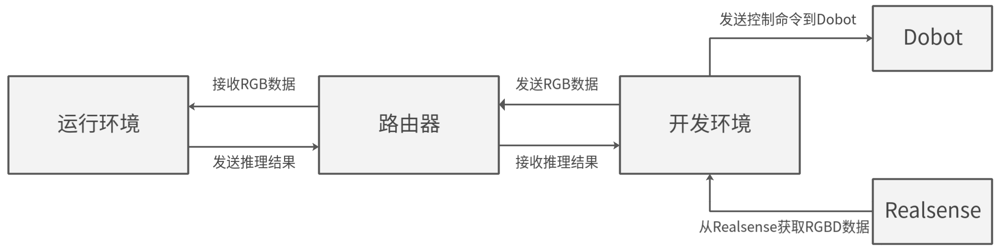
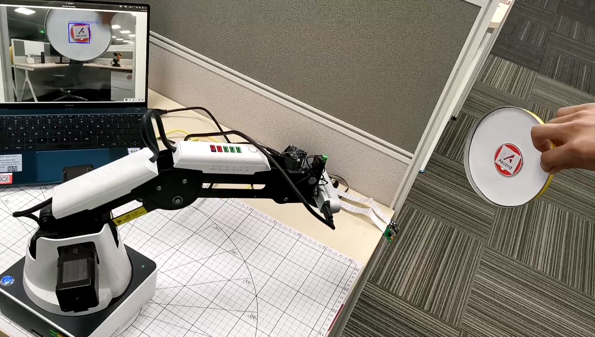
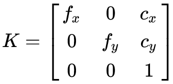
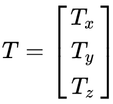
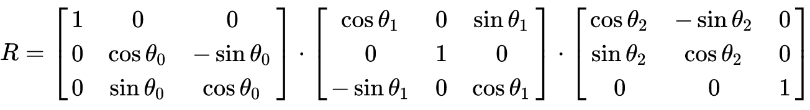
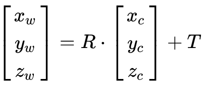
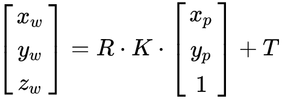
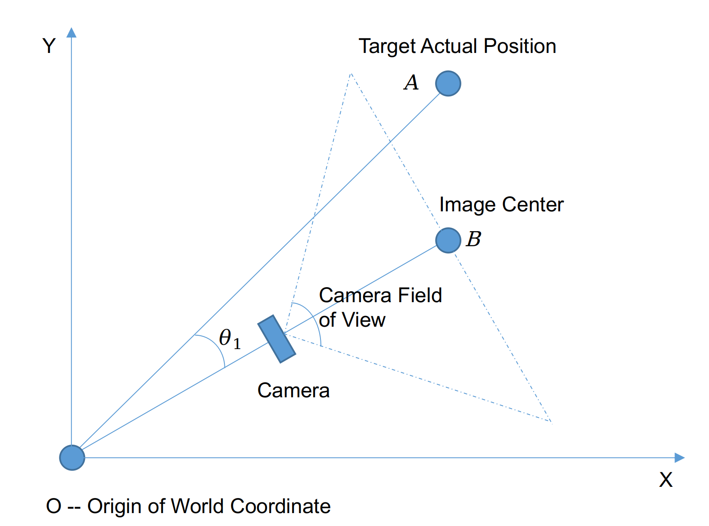
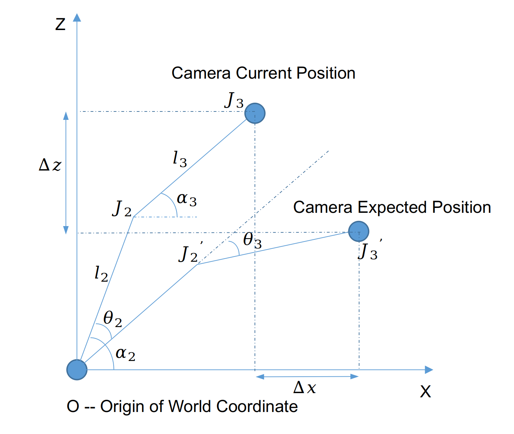

**本样例为大家学习昇腾软件栈提供参考，非商业目的！**

**本样例适配20.1及以上版本，支持产品为Atlas200DK。**

## YOLOV3_ascend_logo_following样例

功能：使用yolov3模型对双目相机[IntelRealsense D435](https://www.intelrealsense.com/depth-camera-d435/ )的RGB数据进行推理，检测Ascend_logo的位置，并利用Ascend_logo的位置控制机械臂[Dobot-Magician](https://cn.dobot.cc/dobot-magician/product-overview.html )的移动，使双目相机对准Ascend_logo。

### 前提条件
部署此Sample前，需要准备好双目相机[IntelRealsense D435](https://www.intelrealsense.com/depth-camera-d435/ )以及机械臂[Dobot-Magician](https://cn.dobot.cc/dobot-magician/product-overview.html )：

- 请确认已按照[环境准备和依赖安装](../../environment)准备好环境。

- 已完成200DK的开发环境和运行环境安装，并配置200DK开发板联网。
  
- 已完成[IntelRealsense D435](https://dev.intelrealsense.com/docs/compiling-librealsense-for-linux-ubuntu-guide?_ga=2.126501389.1287839862.1614240661-1973899397.1612341743 )SDK的安装。

- 完成[Dobot机械臂](https://github.com/luismesas/pydobot )Python API的安装。

    首先参考[USB to UART Bridge VCP Drivers](https://www.silabs.com/products/development-tools/software/usb-to-uart-bridge-vcp-drivers )进行驱动安装；

    然后下载机械臂[Dobot-Magician](https://cn.dobot.cc/dobot-magician/product-overview.html )的Python API：
    
    **git clone https://github.com/luismesas/pydobot.git**

    下载完成后，进入pydobot文件夹，修改dobot.py，在line275后添加：
    ````python
    def move_by_angle(self, j1, j2, j3, j4, wait=False):
        self._set_ptp_cmd(j1, j2, j3, j4, mode=PTPMode.MOVL_ANGLE, wait=wait)
    ````
  
    执行安装命令完成API的安装：
  
    **python3.7.5 setup.py build**
    
    **python3.7.5 setup.py install**

    **说明：**  
    > - 由于机械臂Dobot-Magician的官方Python API没有提供角度控制模式，所以需要手动添加move_by_angle模式。
  
### 软件准备

1. 获取源码包。

   可以使用以下两种方式下载，请选择其中一种进行源码准备。

    - 命令行方式下载（下载时间较长，但步骤简单）。

        开发环境，非root用户命令行中执行以下命令下载源码仓。

       **cd $HOME**

       **git clone https://gitee.com/ascend/samples.git**

    - 压缩包方式下载（下载时间较短，但步骤稍微复杂）。

        1. samples仓右上角选择 **克隆/下载** 下拉框并选择 **下载ZIP**。

        2. 将ZIP包上传到开发环境中的普通用户家目录中，例如 **$HOME/ascend-samples-master.zip**。

        3. 开发环境中，执行以下命令，解压zip包。

            **cd $HOME**

            **unzip ascend-samples-master.zip**

2. 获取此应用中所需要的原始网络模型。
 
    参考下表获取此应用中所用到的模型，并将其存放到开发环境普通用户下的工程目录：   
 **cd $HOME/samples/python/level3_multi_model/YOLOV3_ascend_logo_following/model** 
    
    |  **模型名称**  |  **模型说明**  |  **模型下载路径**  |
    |---|---|---|
    |  yolov3_ascend_logo| 基于Tensorflow-YOLOV3的ascend_logo检测模型。  |  请参考[https://gitee.com/ascend/modelzoo/tree/master/contrib/TensorFlow/Research/cv/yolov3_darknet53/ATC_yolov3_darknet53_tf_AE](https://gitee.com/ascend/modelzoo/tree/master/contrib/TensorFlow/Research/cv/yolov3_darknet53/ATC_yolov3_darknet53_tf_AE )目录中README.md下载原始模型章节下载模型和权重文件。 |

     **说明：**  
    > - modelzoo中已经提供了转换好的om模型，可以直接使用。  

### 样例说明

1. 软件架构说明。
   
   机械臂跟随ascend_logo样例的整个框架如下图，200DK运行环境与Ubuntu服务器开发环境通过路由器进行交互，200DK负责yolov3目标检测模型的推理，Ubuntu服务器通过路由器向200DK发送IntelRealsense的RGB数据，同时接收200DK的推理结果，利用推理结果对机械臂进行控制。

    


2. 机械臂的控制逻辑。

    1. 问题分析：
        * 前提：相机安装在机械臂末端中心，机械臂末端中心的移动就是相机的移动，如图所示：

          

        * 任务：机械臂随Target在空间内移动的任务可以表述为两个子任务：
            1. 机械臂的运动总是尽量使得相机对准Target，即机械臂的运动目标之一是使得Target位于相机的视场（图像）中心。
            2. Target离相机的距离大于标准距离时，机械臂要控制相机向前运动，反之亦然。即机械臂的运动目标之二是使得相机与Target总是保持一定的距离。

        * 目的：机械臂的运动控制最终形式是三个轴的运动角度，也即在拿到Target在图像坐标系中的位置后，J1、J2、J3三个轴要分别运动多少度，使得运动后Target位于相机的视场中心且距离合适。
        
    2. 建立数学模型
        * 几个关键问题和事实：
        在建模之前，先明确几个问题，包括机械臂的运动方式、机械臂运动过程中相机的位置和姿态、相机的内参。
            1. 机械臂的运动方式：
                J1轴的运动与J2 & J3轴之间独立，J1轴的运动不会影响相机的Z轴坐标，会影响X轴坐标但运动角度较小时可简化忽略。
J2轴和J3轴主要影响相机X Z轴，略微影响Y轴坐标但简化忽略。
            2. 相机的位置和姿态以及内参：
                相机的位置和姿态即构成了相机的外参，一共通过6个量即可表示相机的位置和姿态，其中三个轴的旋转参数分别为（ω、δ、 θ），中心点的平移参数分别为（Tx、Ty、Tz）。相机安装在机械臂的末端中心，所以末端中心的坐标即为相机的位置。运动过程中相机不存在绕X, Y轴旋转，所以ω=δ=0。绕Z轴选择的角度 θ可以认为即J1的旋转角度。

                至此可以计算出相机的外参矩阵为：

                相机的内参可以通过Realsense的API接口获取。

        * 坐标系转换——图像坐标系->相机坐标系->世界坐标系
            1. 相机的内参：
               
                相机的内参矩阵可以通过Realsense的API直接获得，详见其API参考文档。在不考虑相机镜头畸变的情况下，内参矩阵$K$可以表示成如下形式：
               
                <div align = center>
               
                
                </div>
            
            2. 相机的外参
               
                根据上述相机位置的计算，可以得到其平移向量$T$：
                
                <div align = center>
               
                
                </div>
                
                根据上述相机姿态的计算，可以得到其旋转矩阵$R$：
               
                <div align = center>
               
                
                </div>
               
                所以从相机坐标系到世界坐标系的转换为:
               
                <div align = center>
               
                
                </div>
               
            3. 图像坐标系到世界坐标系的转换
               
                完整地从图像坐标系向世界坐标系的转换过程为：
               
                <div align = center>
               
                
                </div>
    
        * J1轴的运动逻辑
            
            根据之前的假设，J1轴的运动问题可以在世界坐标系的XOY投影平面内分析。
            
          
            如图所示，A(x~A, x~B)为Target的实际位置，B(x~A, x~B)为当前相机视场中心位置（图像中心）。运动目标为机械臂移动之后Target位于视场中心。J1轴的移动角度$\theta_1$可表示为：
            
            $$
            \theta_1 = \arccos[\frac{\overrightarrow {OA} \cdot \overrightarrow {OB}}
                                                            {\mid\overrightarrow {OA}\mid \cdot \mid\overrightarrow {OB}\mid}]
            $$
            
            即：
          
            $$
            \theta_1 = \arccos(\frac {x_A x_B + y_A y_B} {\sqrt{x_A^2 + y_A^2}\sqrt{x_B^2 + y_B^2}})
            $$
        * J2 & J3轴的运动逻辑
            
            
          
            建立关于$\theta_2$和$\theta_3$的方程组：
            
            $$l_2\cos(\alpha_2 + \theta_2) + l_3\cos(\alpha_3 + \theta_3) = \Delta x + l_2\cos(\alpha_2) + l_3\cos(\alpha_3)$$
            
            $$l_2\sin(\alpha_2 + \theta_2) + l_3\sin(\alpha_3 + \theta_3) = \Delta z + l_2\sin(\alpha_2) + l_3\sin(\alpha_3)$$
    
            求解该方程组，得到:
          
            $$\theta_3 = \arctan(\frac {R_z} {R_x}) - \arccos(\frac {l_3^2 - l_2^2 + R_x^2 + R_z^2} {2l_3\sqrt{R_x^2 + R_z^2}}) - \alpha_3$$
            $$\theta_2 = \arccos[\frac{\Delta x + l_2\cos\alpha_2 +l_3\cos\alpha_3 - l_3cos(\alpha_3 + \theta_3)}{l_2}] - \alpha_2$$
            
            其中：
            
            $$R_x = \Delta x + l_2\cos(\alpha_2) + l_3\cos(\alpha_3)$$
            
            $$R_z = \Delta z + l_2\sin(\alpha_2) + l_3\sin(\alpha_3)$$


### 样例运行
1. 测试机械臂Dobot-Magician和双目相机IntelRealsense是否可以正常工作。

    测试机械臂是否可以正常工作在move_by_angle模式：
   
    **cd samples/python/level3_multi_model/YOLOV3_ascend_logo_following/src** 

    **python3.7.5 dobot_test.py**    

    双目相机IntelRealsense的测试可以参考[IntelRealSense-python-examples](https://github.com/IntelRealSense/librealsense/tree/master/wrappers/python/examples )。
   
2. 执行以下命令，将开发环境的 **samples** 目录上传到运行环境中，例如 **/home/HwHiAiUser**，并以HwHiAiUser（运行用户）登录运行环境（Host）。
    
    **scp -r $HOME/samples/ HwHiAiUser@xxx.xxx.xxx.xxx:/home/HwHiAiUser**

    **ssh HwHiAiUser@xxx.xxx.xxx.xxx**    

    **说明：**  
    > - **xxx.xxx.xxx.xxx**为运行环境ip，200DK在USB连接时一般为192.168.1.2。

3. 在运行环境运行可执行文件，等待接收IntelRealsense的RGB数据进行推理。

    **cd $HOME/samples/python/level3_multi_model/YOLOV3_ascend_logo_following/src**
    
    切换目录后，执行以下命令运行样例。
    
    **python3.6 yolov3_ascend_detect.py**
    

4.  在开发环境运行可执行程序，发送IntelRealsense数据到运行环境，并接收运行环境的推理结果来控制Dobot-Magician机械臂。

    **cd $HOME/samples/python/level3_multi_model/YOLOV3_ascend_logo_following/src/**
    
    切换目录后，执行以下命令运行样例。
    
    **python3.7.5 yolov3_ascend_logo_following.py**


### 查看结果
运行成功后，可以用Ascend_logo来控制机械臂的移动，效果如下：

<div align = center>

 

</div>


