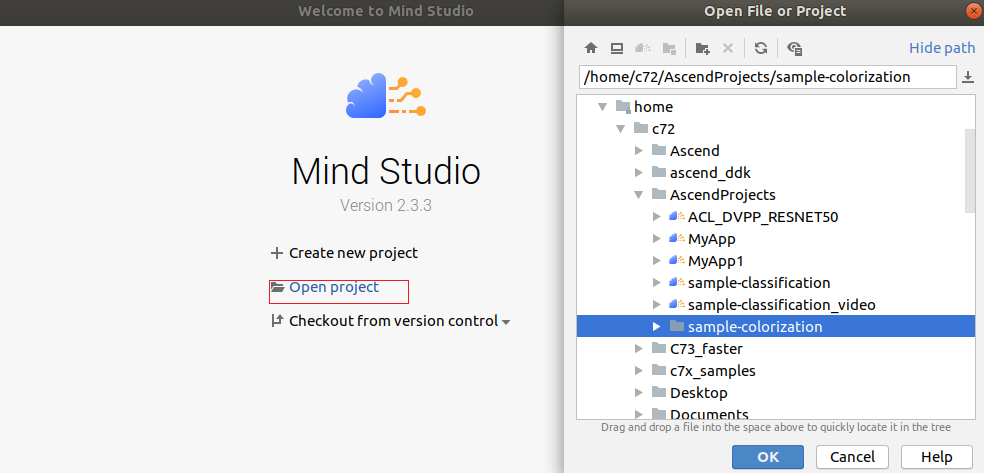
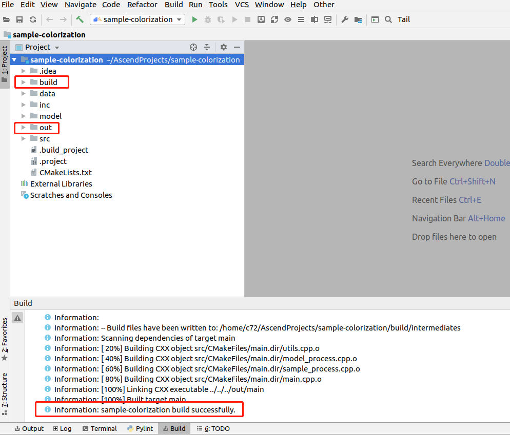
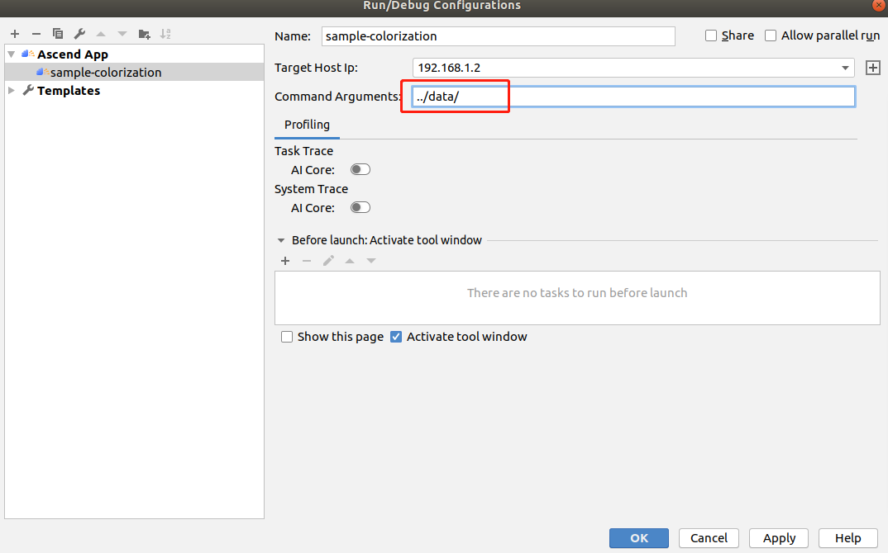
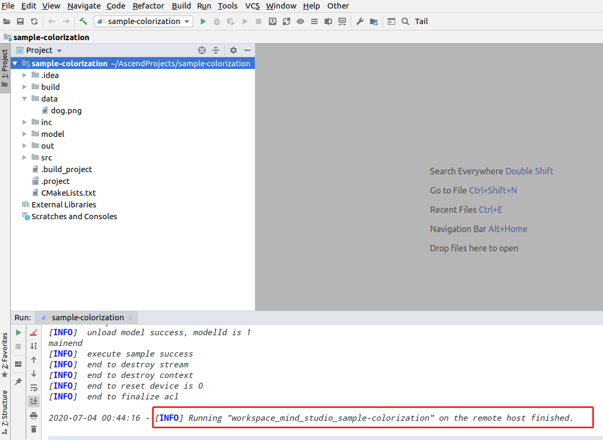

中文|[English](Readme_EN.md)

# 黑白图像上色

本应用支持运行在Atlas 200 DK上，实现了对黑白图像自动上色的功能。

## 软件准备

运行此Sample前，需要按照此章节获取源码包。

1.  获取源码包。

    **cd $HOME/AscendProjects**  

    **wget https://c7xcode.obs.cn-north-4.myhuaweicloud.com/200dk/sample-colorization.zip** 
              
    **unzip sample-colorization.zip**  
    
    > **说明：**   
    >- 如果使用wget下载失败，可使用如下命令下载代码。  
    **curl -OL https://c7xcode.obs.cn-north-4.myhuaweicloud.com/200dk/sample-colorization.zip** 
    >- 如果curl也下载失败，可复制下载链接到浏览器，手动上传至服务器。
    
2.  获取此应用中所需要的原始网络模型。

    参考[表 黑白图像上色应用使用模型](#zh-cn_topic_0219108795_table19942111763710)获取此应用中所用到的原始网络模型及其对应的权重文件，并将其存放到Ubuntu服务器的任意目录，例如：$HOME/models/sample-colorization。

    **表 1**  黑白图像上色应用使用模型

    
    <table><thead align="left"><tr id="zh-cn_topic_0219108795_row611318123710"><th class="cellrowborder" valign="top" width="11.959999999999999%" id="mcps1.2.4.1.1">
模型名称

    </th>
    <th class="cellrowborder" valign="top" width="8.07%" id="mcps1.2.4.1.2">
模型说明

    </th>
    <th class="cellrowborder" valign="top" width="79.97%" id="mcps1.2.4.1.3">
模型下载路径

    </th>
    </tr>
    </thead>
    <tbody><tr id="zh-cn_topic_0219108795_row1119187377"><td class="cellrowborder" valign="top" width="11.959999999999999%" headers="mcps1.2.4.1.1 ">
colorization

    </td>
    <td class="cellrowborder" valign="top" width="8.07%" headers="mcps1.2.4.1.2 ">
黑白图像上色模型

    </td>
    <td class="cellrowborder" valign="top" width="79.97%" headers="mcps1.2.4.1.3 ">
请参考<a href="https://gitee.com/HuaweiAscend/models/tree/master/computer_vision/object_detect/colorization" target="_blank" rel="noopener noreferrer">https://gitee.com/HuaweiAscend/models/tree/master/computer_vision/object_detect/colorization</a>目录中README.md下载原始网络模型文件及其对应的权重文件。

    </td>
    </tr>
    </tbody>
    </table>

3.  将原始网络模型转换为适配昇腾AI处理器的模型。
    1.  切换到模型所在目录。  
        
         **cd $HOME/models/sample-colorization/** 

    2.  执行模型转换的命令。  
        
         **atc --model=colorization.prototxt --weight=colorization.caffemodel --framework=0 --output=colorization --soc_version=Ascend310** 
        
4.  将转换好的模型文件（.om文件）上传到[步骤1](#zh-cn_topic_0219108795_li953280133816)中源码所在路径下的“**sample\-colorization/model**”目录下。
    
     **cp colorization.om $HOME/AscendProjects/sample-colorization/model/**  

## 环境配置   

**注：服务器上已安装OpenCV和PresentAgent可跳过此步骤。**    

- 安装OpenCV和PresentAgent  
      
    请参考 **https://gitee.com/ascend/common/blob/master/200dk_install_opencv/200DK_INSTALL_OPENCV_PRESENTAGENT.md**  
    

## 编译
1.  打开对应的工程。

    以Mind Studio安装用户在命令行进入安装包解压后的“MindStudio-ubuntu/bin”目录，如：$HOME/MindStudio-ubuntu/bin。执行如下命令启动Mind Studio。

    **./MindStudio.sh**

    启动成功后，打开**sample-colorization**工程，如[图 打开colorization工程](#zh-cn_topic_0228461902_zh-cn_topic_0203223265_fig11106241192810)所示。

    **图 1**  打开colorization工程  
    

2.  开始编译，打开Mind Studio工具，在工具栏中点击**Build \> Edit Build Configuration**。  
    选择Target OS 为Euleros2.8，如[图 配置编译](#zh-cn_topic_0203223265_fig17414647130)所示。

    **图 2**  配置编译  
      
    
    之后点击**Build \> Build \> Build Configuration**，如[图 编译操作及生成文件](#zh-cn_topic_0203223265_fig1741464713019)所示，会在目录下生成build和out文件夹。

    **图 3**  编译操作及生成文件  
    

    > **须知：**   
    >首次编译工程时，**Build \> Build**为灰色不可点击状态。需要点击**Build \> Edit Build Configuration**，配置编译参数后再进行编译。  
## 运行
1.  在Mind Studio工具的工具栏中找到Run按钮，单击  **Run \> Edit Configurations**。  
    在Command Arguments 中添加运行参数 **../data**（输入图片的路径），之后分别点击Apply、OK。如[图 配置运行](#zh-cn_topic_0203223265_fig93931954162720)所示。   

    **图 4**  配置运行   
    
 
2.  单击  **Run \> Run 'sample-colorization'**，如[图 程序已执行示意图](#zh-cn_topic_0203223265_fig93931954162719)所示，可执行程序已经在开发者板执行。  

    **图 5**  程序已执行示意图  
    
3.  在Mind Studio所在Ubuntu服务器中，以HwHiAiUser用户SSH登录到Host侧。

    **ssh HwHiAiUser\@**_host\_ip_

    对于Atlas 200 DK，host\_ip默认为192.168.1.2（USB连接）或者192.168.0.2（NIC连接）。  
4.  进入黑白图像上色应用的可执行文件所在路径。

    **cd \~/HIAI\_PROJECTS/workspace\_mind\_studio/sample-colorization\_XXXXX/out**

    > **说明：**   
    >-   此路径中sample-colorization\_XXXXX的XXXXX是一串字母和数字的随机组合，每次重新编译运行时都会随机生成。  

5.  查看运行结果。

    将result目录拷贝到Mind Studio所在Ubuntu服务器中，查看推理结果。  
    **scp -r result** user@host\_ip **\~**  
    > **说明：**   
    >-   user为Mind Studio的安装用户。  
    >-   对于Atlas 200 DK，host\_ip默认为192.168.1.2（USB连接）或者192.168.0.2（NIC连接）。
 
**黑白图像**    
  
**上色图像**   
 

