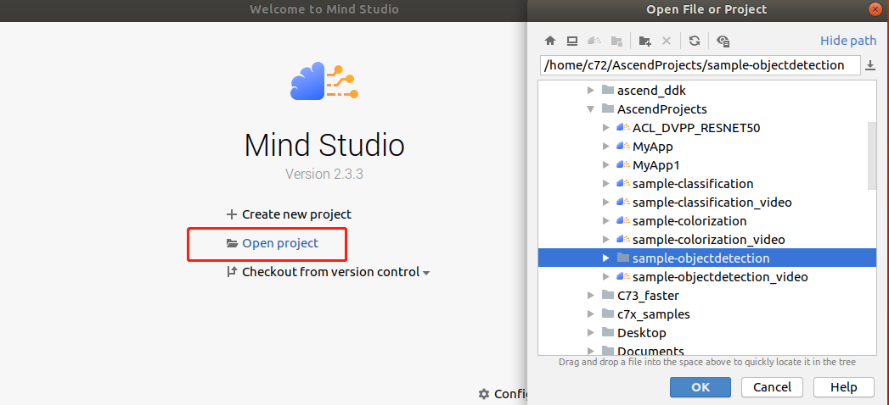
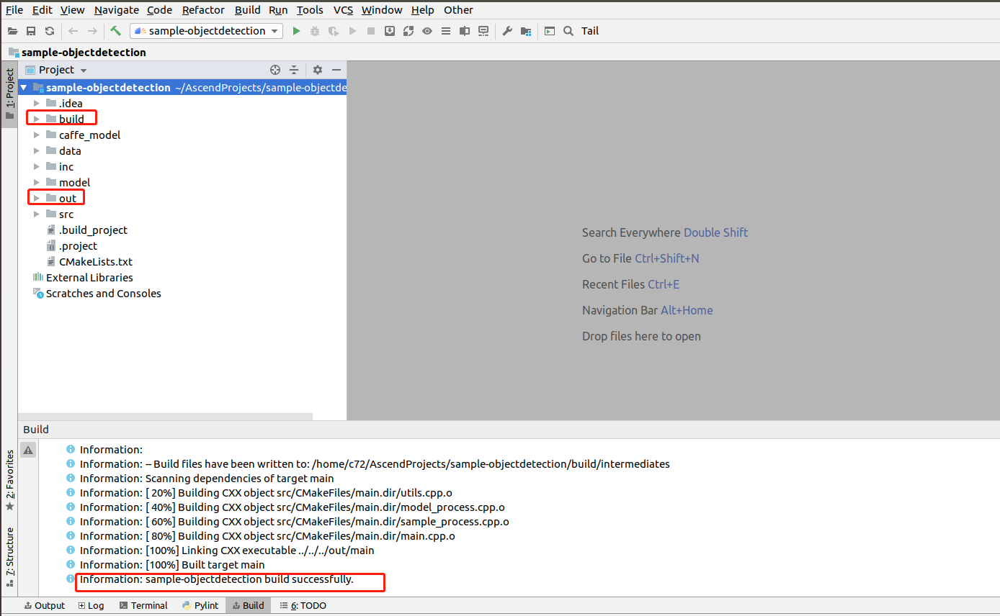
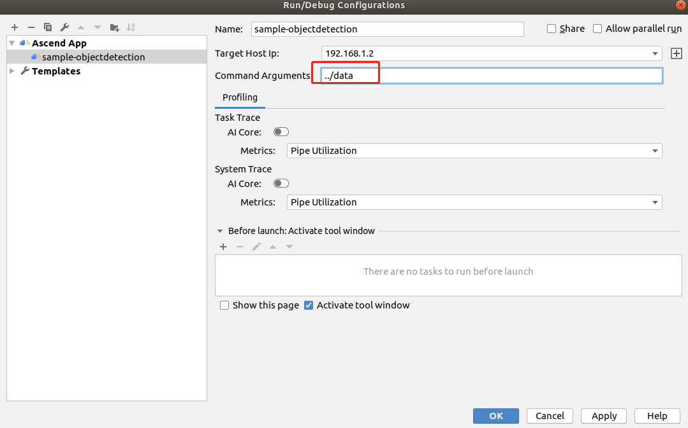
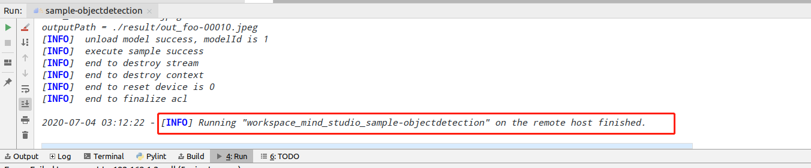

中文|[English](Readme_EN.md)

#  检测网络应用（C++）
本应用支持运行在Atlas 200 DK上，实现了对yolov3目标检测网络的推理功能。 

## 软件准备

运行此Sample前，需要按照此章节获取源码包。

1.  获取源码包。

    **cd $HOME/AscendProjects**  

    **wget https://c7xcode.obs.cn-north-4.myhuaweicloud.com/200dk/sample-objectdetection.zip** 
              
    **unzip sample-objectdetection.zip**  
    
    > **说明：**   
    >- 如果使用wget下载失败，可使用如下命令下载代码。  
    **curl -OL https://c7xcode.obs.cn-north-4.myhuaweicloud.com/200dk/sample-objectdetection.zip** 
    >- 如果curl也下载失败，可复制下载链接到浏览器，手动上传至服务器。
    
2.  获取此应用中所需要的原始网络模型。    
    1.  切换目录。  
        **cd $HOME/AscendProjects/sample-objectdetection/caffe_model**     
    2.  下载原始网络模型及权重文件。  
        **wget https://c7xcode.obs.cn-north-4.myhuaweicloud.com/models/yolov3/yolov3.caffemodel**  
        **wget https://c7xcode.obs.cn-north-4.myhuaweicloud.com/models/yolov3/yolov3.prototxt**  

3.  设置环境变量。

    **vim \~/.bashrc**

    执行如下命令在最后一行添加DDK\_HOME及LD\_LIBRARY\_PATH的环境变量。  

    **export install_path=\$HOME/Ascend/ascend-toolkit/20.0.0.B002/x86_64-linux_gcc7.3.0**  

    **export PATH=/usr/local/python3.7.5/bin:\${install_path}/atc/ccec_compiler/bin:\\${install_path}/atc/bin:\\$PATH**  

    **export PYTHONPATH=\\${install_path}/atc/python/site-packages/te:\\${install_path}/atc/python/site-    packages/topi:\\$PYTHONPATH**  

    **export LD_LIBRARY_PATH=\\${install_path}/atc/lib64:\$LD_LIBRARY_PATH**  

    **export ASCEND_OPP_PATH=\${install_path}/opp**

    > **说明：**   
    >-   **install_path请替换成软件包的安装路径。**  
    >-   **如果此环境变量已经添加，则此步骤可跳过。**

    输入:wq!保存退出。

    执行如下命令使环境变量生效。

    **source \~/.bashrc**  

4.  将原始网络模型转换为适配昇腾AI处理器的模型。  

    执行模型转换的命令。         
    **atc --model=yolov3.prototxt --weight=yolov3.caffemodel --framework=0 --output=yolov3_BGR --soc_version=Ascend310 --insert_op_conf=aipp_bgr.cfg** 
    
5.  将转换好的模型文件（.om文件）上传到[步骤1](#zh-cn_topic_0219108795_li953280133816)中源码所在路径下的“**sample-objectdetection/model**”目录下。
    
     **cp yolov3_BGR.om $HOME/AscendProjects/sample-objectdetection/model/**  

## 环境配置   

**注：服务器上已安装OpenCV、PresentAgent、交叉编译工具可跳过此步骤。**  
    

- 安装OpenCV和PresentAgent  
      
    请参考 **https://gitee.com/ascend/common/blob/master/200dk_install_opencv/200DK_INSTALL_OPENCV_PRESENTAGENT.md**   

- 安装交叉编译工具  
  **sudo apt-get install -y g++\-5-aarch64-linux-gnu**

## 编译
1.  打开对应的工程。

    以Mind Studio安装用户在命令行进入安装包解压后的“MindStudio-ubuntu/bin”目录，如：$HOME/MindStudio-ubuntu/bin。执行如下命令启动Mind Studio。

    **./MindStudio.sh**

    启动成功后，打开**sample-objectdetection**工程，如[图 打开objectdetection工程](#zh-cn_topic_0228461902_zh-cn_topic_0203223265_fig11106241192810)所示。

    **图 1**  打开objectdetection工程  
    

2.  开始编译，打开Mind Studio工具，在工具栏中点击**Build \> Edit Build Configuration**。  
    选择Target OS 为Euleros2.8，如[图 配置编译](#zh-cn_topic_0203223265_fig17414647130)所示。

    **图 2**  配置编译  
      
    
    之后点击**Build \> Build \> Build Configuration**，如[图 编译操作及生成文件](#zh-cn_topic_0203223265_fig1741464713019)所示，会在目录下生成build和out文件夹。

    **图 3**  编译操作及生成文件  
    

    > **须知：**   
    >首次编译工程时，**Build \> Build**为灰色不可点击状态。需要点击**Build \> Edit Build Configuration**，配置编译参数后再进行编译。  
## 运行
1.  在Mind Studio工具的工具栏中找到Run按钮，单击  **Run \> Edit Configurations**。  
    在Command Arguments 中添加运行参数 **../data**（输入图片的路径），之后分别点击Apply、OK。如[图 配置运行](#zh-cn_topic_0203223265_fig93931954162720)所示。   

    **图 4**  配置运行   
    
 
2.  单击  **Run \> Run 'sample-objectdetection'**，如[图 程序已执行示意图](#zh-cn_topic_0203223265_fig93931954162719)所示，可执行程序已经在开发者板执行。  

    **图 5**  程序已执行示意图  
    

3.  查看运行结果。

    推理结果图片保存在工程下的“output \> outputs”目录下以时间戳命名的文件夹内。  

 