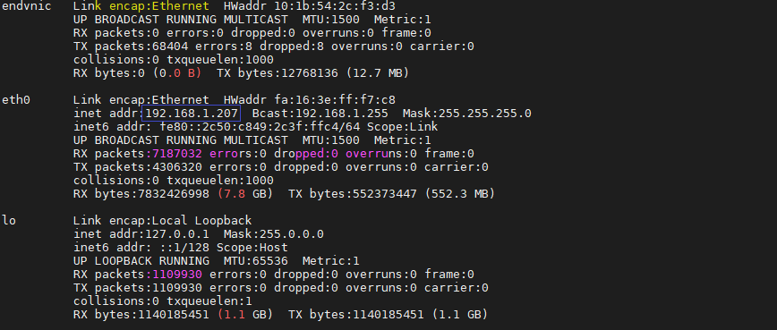
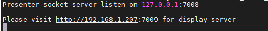
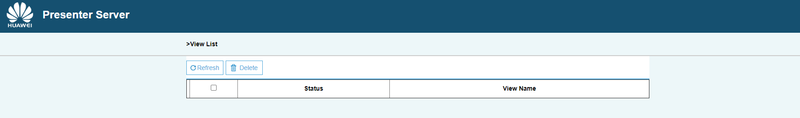

中文|[English](Readme_EN.md)

#  检测网络应用视频版（C++）

本应用支持运行在AI云上加速环境(Atlas300)，实现了对yolov3目标检测网络的推理功能。 

**注：如果centos中无法使用wget，请手动下载包后传入centos中**

## 软件准备

运行此Sample前，需要按照此章节获取源码包。

1.  获取源码包。

    **cd $HOME/AscendProjects**  
    **wget https://c7xcode.obs.cn-north-4.myhuaweicloud.com/ubuntu/sample-objectdetection_video.zip**   
    **unzip sample-objectdetection_video.zip**
    
2.  获取此应用中所需要的原始网络模型。    
    1.  切换目录。  
        **cd $HOME/AscendProjects/sample-objectdetection_video/caffe_model**     
    2.  下载原始网络模型及权重文件。  
        **wget https://c7xcode.obs.cn-north-4.myhuaweicloud.com/models/yolov3/yolov3.caffemodel**  
        **wget https://c7xcode.obs.cn-north-4.myhuaweicloud.com/models/yolov3/yolov3.prototxt**

3.  将原始网络模型转换为适配昇腾AI处理器的模型。  

    执行模型转换的命令。         
    **atc --model=yolov3.prototxt --weight=yolov3.caffemodel --framework=0 --output=yolov3_BGR --soc_version=Ascend310 --insert_op_conf=aipp_bgr.cfg**
    
4.  将转换好的模型文件（.om文件）上传到[步骤1](#zh-cn_topic_0219108795_li953280133816)中源码所在路径下的“**sample-objectdetection_video/model**”目录下。
    
     **cp yolov3_BGR.om $HOME/AscendProjects/sample-objectdetection_video/model/**  

## 环境配置   

**注：服务器上已安装opencv库、ffmpeg库和PresentAgent可跳过此步骤。**      

- 安装opencv和ffmpeg  
    - centos系统：  
    请参考 **https://gitee.com/ascend/common/blob/master/centos_install_opencv/CENTOS_INSTALL_OPENCV.md**  
    - ubuntu系统：  
    请参考 **https://gitee.com/ascend/common/blob/master/ubuntu_install_opencv/UBUNTU_INSTALL_OPENCV.md**
  
- 安装PresentAgent    

  1.  下载PresentAgent到服务器任意目录，如在“$HOME/Downloads/”目录下执行以下命令下载代码。  
 
      **git clone https://gitee.com/ascend/common.git**  
  2.  切换到root用户。      

      **su root**  
  3.  安装tornado包。  
      **python3.7.5 pip install tornado==5.1.0 -i http://mirrors.aliyun.com/pypi/simple/ --trusted-host mirrors.aliyun.com --user**  
  4.  安装protobuf。  
      **git clone https://gitee.com/mirrors/protobufsource.git protobuf**   
      **cd protobuf**   
      **git submodule update --init --recursive**  
      **./autogen.sh**   
      **bash configure**  
      **make**  
      **make install**  
      **ldconfig**  
        
  5.  编译并安装PresentAgent。    

      **cd $HOME/Downloads/common/presenteragent/**   
      **make**  
      **make install**

## 编译

1.  以HwHiAiUser（运行用户）登录开发环境。

2.  设置环境变量。 
   
    执行如下命令。 

     **vim ~/.bashrc** 

    在最后一行添加DDK_PATH及NPU_HOST_LIB的环境变量。

     **export DDK\_PATH=/home/HwHiAiUser/Ascend** 

     **export NPU\_HOST\_LIB=/home/HwHiAiUser/Ascend/acllib/lib64/stub**  

     **export LD\_LIBRARY_PATH=\\$DDK\_PATH/acllib/lib64:/usr/local/Ascend/add-ons:\\$HOME/ascend_ddk/host/lib:\\$DDK_PATH/atc/lib64** 

     > **说明：**   
            **1.请将/home/HwHiAiUser/Ascend替换为ACLlib标准形态安装包的实际安装路径。**  
            **2.注意LD\_LIBRARY_PATH环境变量相较于官网案例增加了\\$HOME/ascend_ddk/host/lib，如果不加则运行时会报错。** 
    

    输入:wq!保存退出。

    执行如下命令使环境变量生效。

     **source ~/.bashrc**   

3.  创建用于存放编译文件的目录。  

    **cd $HOME/AscendProjects/sample-objectdetection_video**  
    
    **mkdir -p build/intermediates/host**  

4.  执行cmake生成编译文件。

     **cd build/intermediates/host**   

    **cmake ../../../src -DCMAKE_CXX_COMPILER=g++ -DCMAKE_SKIP_RPATH=TRUE**  

5.  执行make命令，生成的可执行文件main在“$HOME/AscendProjects/sample-objectdetection_video/out”目录下。 

    **make**
6. 修改配置文件。

   **vim $HOME/AscendProjects/sample-objectdetection_video/script/presenterserver/display/config/config.conf**

   将web_server_ip后的ip修改为对应服务器的内网ip，如下图的192.168.1.207

   

7. 给公网ip开端口。  

   请参考 **https://bbs.huaweicloud.com/forum/thread-61588-1-1.html** 。

8. 启动Presenter Server。  
   **cd $HOME/AscendProjects/sample-objectdetection_video/script/presenterserver/**  

   **python3 presenter_server.py  --app=display**  
   
   
   
   出现下图代表启动成功。
   
   
   
     
   
   将192.168.1.207换成公网ip，如http://***:7009 在浏览器中输入该URL，打开Presenter Server。
   
   
## 运行

1.  将需要分类的视频上传至“i$HOME/AscendProjects/sample-objectdetection_video/data/”目录下。  

2.  切换到可执行文件main所在的目录，给该目录下的main文件加执行权限。  
   
    **cd $HOME/AscendProjects/sample-objectdetection_video/out**  
    
    **chmod +x main**   

3.  运行可执行文件。  
    **./main  ../data/tbhdqx128046m.h265**

4.  查看运行结果。 

    返回浏览器，查看运行结果。

