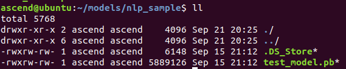
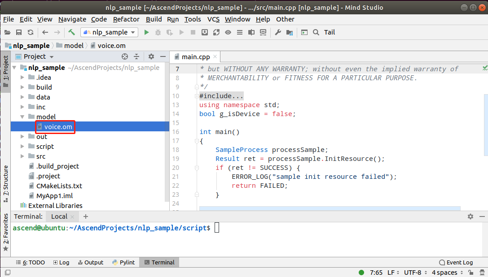
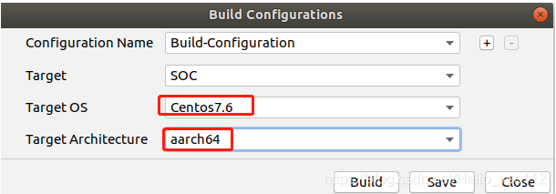
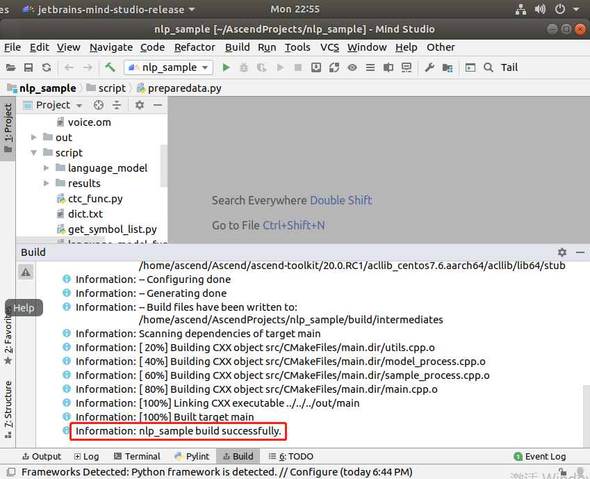
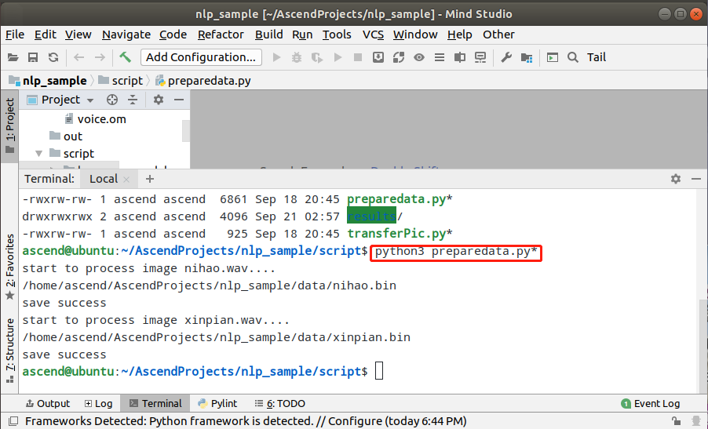
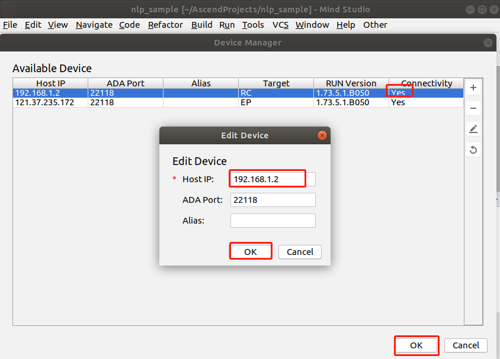
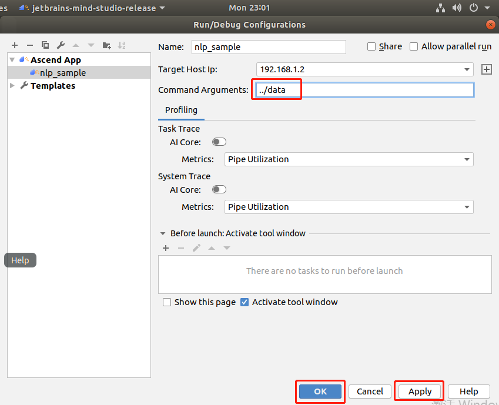
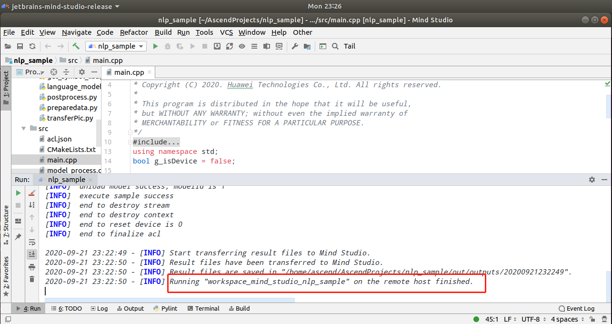
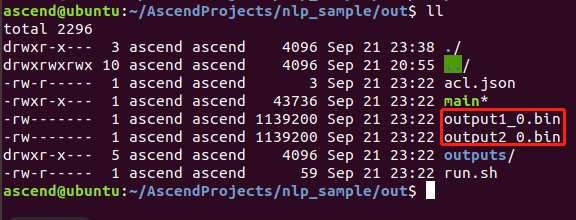
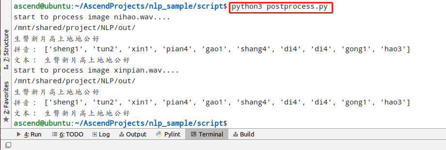

中文

**该案例仅仅用于学习，打通流程，不对效果负责，不支持商用。**

# 语音转文本样例运行指导

### 环境准备

按照 https://gitee.com/lovingascend/quick_start/tree/master/Atlas200DK_separate_MD 的内容，大家已经搭建好了开发环境（本地Mindstudio环境）和运行环境（开发者板）。

### 软件准备

运行此Sample前，需要执行以下步骤获取源码包并转换模型。

1. 普通用户在开发环境中下载样例源码包放到nlp_sample目录下：

   **cd $HOME/AscendProjects**

   **mkdir nlp_sample**

   **cd nlp_sample**

   下载源码：https://gitee.com/atlasdevelop/c7x_samples/tree/master/nlp_sample

2. 获取此应用中所需要的原始网络模型。

   获取此应用中所用到的原始网络模型，并将其存放到Ubuntu服务器的任意目录，例如：$HOME/models/nlp_sample。

   下载原始网络模型文件：

   https://gitee.com/li_jian_jlu/smartvoice_classnotes_c73/tree/master/code/train/mic_train/pb_model

   **mkdir -p ./models/nlp_sample**

   **cd ./models/nlp_sample**

   将原始网络模型存放到$HOME/models/nlp_sample目录下：
      

3. 将原始网络模型转换为适配昇腾AI处理器的模型。

   1.设置环境变量

   命令行中输入以下命令设置环境变量。（仅在当前窗口生效）

   **export install_path=\$HOME/Ascend/ascend-toolkit/20.0.RC1/x86_64-linux_gcc7.3.0**  

   **export PATH=/usr/local/python3.7.5/bin:\\${install_path}/atc/ccec_compiler/bin:\\${install_path}/atc/bin:\\$PATH**  

   **export PYTHONPATH=\\${install_path}/atc/python/site-packages/te:\\${install_path}/atc/python/site-packages/topi:\\$PYTHONPATH**  

   **export LD_LIBRARY_PATH=\\${install_path}/atc/lib64:\\$LD_LIBRARY_PATH**  

   **export ASCEND_OPP_PATH=\\${install_path}/opp**  
      
   
2.执行atc命令转换成离线模型
   
**atc --model=./models/nlp_sample/test_model.pb --framework=3 --output=./AscendProjects/nlp_sample/model/voice --soc_version=Ascend310 --input_format=NHWC --input_shape="the_input:1,1600,200,1"**
   
转换好的模型文件（**voice.om**）位于$HOME/AscendProjects/nlp_sample/model目录下。

##  样例运行

1.打开Mindstudio。

执行以下命令，打开Mindstduio，并选择nlp_sample工程。

**cd ~/MindStudio-ubuntu/bin**

**./MindStudio.sh**

打开后，选择“Open project”，打开nlp_sample工程。此时，工程的model文件夹下已经有对应的om模型了。
      

2.编译

在**Mindstudio**的工具栏中点击**Build > Edit Build Configuration**。选择Target OS 为Centos7.6。
      

之后点击**Build > Build > Build Configuration**，会在目录下生成build和out文件夹。
      

3.音频预处理：

打开Mind Studio工具的Terminal，在预处理代码存放路径下，执行如下命令将.wav文件转换成.bin文件。

**cd ./AscendProjects/nlp_sample/script**

**python3 preparedata.py**

如下图所示。
      

4.运行
Mindstudio配置开发板RC连接。
**注：此时默认开发板已经连接到开发环境了**
在Mind Studio工具的工具栏中找到**Tools**按钮，单机**Device Manager**。
点击Device Manager界面右上方的 **“+”** 按钮，填写**Host IP**为开发者板ip（USB连接默认为192.168.1.2），点击OK。

看到Device Manager界面**Connetctivity**为**Yes**即为连接成功，点击**OK**即可。
      

在Mind Studio工具的工具栏中找到**Run**按钮，单击 **Run > Edit Configurations**。
在Command Arguments 中添加运行参数 ../data（输入图片的路径），之后分别点击Apply、OK。
      

单击 **Run > Run 'nlp_sample'**，如下图，可执行程序已经在开发者板执行,在/home/ascend/AscendProjects/nlp_sample/out/outputs目录下以时间命名的文件夹里可以看到生成的.bin文件。
      

5.后处理：
将上一步骤生成的.bin文件移动到/home/ascend/AscendProjects/nlp_sample/out目录下，
      

打开Mind Studio工具的Terminal，执行如下命令将.bin文件转换成文本。

**cd ./AscendProjects/nlp_sample/script**

**python3 postprocess.py**

转换结果如下图所示。
      